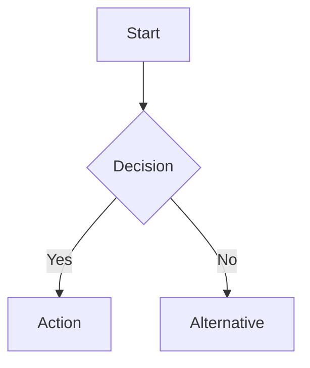

# Visual Rendering Skill

## When to Use

- Creating PNG charts/diagrams for blog posts or slides
- Generating SVG graphics for web embedding
- Building Mermaid flowcharts or timelines
- Rebuilding or updating existing visual assets

## Prerequisites

- Python 3.x with matplotlib installed
- Virtual environment at `.venv/` in workspace root

## Design Token System

All visuals MUST use the shared design token palette. See [token reference](./references/design-tokens.md) for the full color map.

## Procedure

### 1. Plan Visual Assets

Identify what's needed from the content outline:
- **PNGs** (320 DPI): comparison matrices, 2x2 tradeoff charts, timelines, frameworks, checklists
- **SVGs**: interactive/collapsible web graphics (tradeoff charts, decision funnels, checklist cards)
- **Mermaid** (`.mmd`): flowcharts, decision trees, process timelines
- **Comic/storyboard panels**: programmatic panel sequences, symbolic characters, speech bubbles, captions
- **Infographics/one-pagers**: metric cards, source lines, saveable summaries, LinkedIn cards

### 2. Generate PNGs with the right renderer

Use **Pillow (PIL)** for blog infographics, comparison panels, matrices, workflows, callout cards, and any visual with more than one text block. Use matplotlib only for true quantitative charts with axes.

For text-heavy blog visuals, create a Python renderer script at `content/visuals/render_<topic>.py` with measured text helpers (`textbbox`, wrapping, font fitting). Do not place text into a box unless it has been measured against that box first.

For new text-heavy or panel-based visuals, prefer reusable helpers from `scripts/visuals/`:
- `tokens.py` for palette and platform sizes
- `text_layout.py` for wrapping and font fitting
- `panels.py` for panel layouts
- `comic.py` for comic/storyboard primitives
- `infographic.py` for one-pager primitives
- `export.py` for DPI-safe PNG output

Mandatory for every renderer:
- Generate every `` image referenced by the blog, not just the first few visuals.
- Use body labels >= 34 px for 320 DPI output, and bold all primary claims, labels, values, and section headers.
- Use a distinct composition pattern for adjacent visuals (split-screen, timeline, flow, scorecard, matrix, annotated scene, radial, dashboard). Reusing the same card grid/table pattern across a post is a review failure.
- Use high-contrast token combinations by default. Pale backgrounds are allowed only when paired with bold dark labels and strong borders.
- Keep one canonical series renderer when a multi-part series shares visuals. Per-part renderer files may exist only as compatibility wrappers that call the canonical renderer.
- Comic/storyboard visuals must be programmatic only. Use simple shapes, panels, captions, callouts, and speech bubbles; do not require external image generation.

### 3. Matplotlib template for quantitative charts only

Create a Python renderer script at `content/visuals/render_<topic>.py`:

```python
import matplotlib
matplotlib.use('Agg')
import matplotlib.pyplot as plt
import matplotlib.patches as mpatches

# Base tokens (constant across all themes)
BASE_TOKENS = {
    'BG': '#ffffff', 'TEXT': '#1e293b', 'TEXT_2': '#475569',
    'MUTED': '#94a3b8', 'GRID': '#e5e7eb', 'LIGHT_BG': '#f8fafc',
}

# Theme palettes (cycle round-robin per visual)
THEMES = {
    'default':  {'ACCENT': '#1f6feb', 'ACCENT_2': '#0d9488', 'ACCENT_3': '#7c3aed',
                 'WARN': '#dc2626', 'SUCCESS': '#16a34a',
                 'BLUE_BG': '#dbeafe', 'TEAL_BG': '#ccfbf1', 'PURPLE_BG': '#ede9fe', 'RED_BG': '#fee2e2'},
    'ocean':    {'ACCENT': '#0ea5e9', 'ACCENT_2': '#06b6d4', 'ACCENT_3': '#155e75',
                 'WARN': '#f97316', 'SUCCESS': '#14b8a6',
                 'BLUE_BG': '#e0f2fe', 'TEAL_BG': '#ccfbf1', 'PURPLE_BG': '#cffafe', 'RED_BG': '#ffedd5'},
    'sunset':   {'ACCENT': '#f97316', 'ACCENT_2': '#ef4444', 'ACCENT_3': '#b91c1c',
                 'WARN': '#dc2626', 'SUCCESS': '#eab308',
                 'BLUE_BG': '#fff7ed', 'TEAL_BG': '#fef3c7', 'PURPLE_BG': '#fee2e2', 'RED_BG': '#fef2f2'},
    'forest':   {'ACCENT': '#16a34a', 'ACCENT_2': '#65a30d', 'ACCENT_3': '#a16207',
                 'WARN': '#ca8a04', 'SUCCESS': '#15803d',
                 'BLUE_BG': '#f0fdf4', 'TEAL_BG': '#ecfccb', 'PURPLE_BG': '#fefce8', 'RED_BG': '#fef9c3'},
    'midnight': {'ACCENT': '#7c3aed', 'ACCENT_2': '#6366f1', 'ACCENT_3': '#8b5cf6',
                 'WARN': '#ec4899', 'SUCCESS': '#a78bfa',
                 'BLUE_BG': '#ede9fe', 'TEAL_BG': '#e0e7ff', 'PURPLE_BG': '#fae8ff', 'RED_BG': '#fce7f3'},
}

FONT = 'Helvetica Neue'
DPI = 320

def get_tokens(theme_name):
    return {**BASE_TOKENS, **THEMES[theme_name]}

# Each visual function accepts a tokens dict:
# def render_my_chart(tokens):
#     fig, ax = plt.subplots(...)
#     ax.set_facecolor(tokens['BG'])
#     ...
#     plt.savefig(path, dpi=DPI, bbox_inches='tight', facecolor=tokens['BG'])

# Round-robin theme assignment:
# theme_names = list(THEMES.keys())
# for i, func in enumerate(visual_functions):
#     func(get_tokens(theme_names[i % len(theme_names)]))
```

Each visual gets its own function. Save with `plt.savefig(path, dpi=DPI, bbox_inches='tight', facecolor=TOKENS['BG'])`.

### 4. Generate SVGs via Python

Create `content/visuals/write_svgs.py` — never use terminal heredoc for SVGs. Write SVG XML strings from Python using `with open(path, 'w') as f: f.write(svg_content)`.

### 5. Generate Mermaid Diagrams

Write `.mmd` files in `content/visuals/` using standard Mermaid syntax. Example:



### 6. Run and Verify

```bash
cd content/visuals
python render_<topic>.py
python write_svgs.py
```

Verify:
- Every Markdown image reference resolves to an existing file.
- Every PNG is 320 DPI.
- Every referenced image was opened/inspected after rendering.
- No visible text overflow, clipping, overlap, tiny labels, or unbold primary labels.
- Adjacent visuals vary in theme and composition pattern.
- No Unicode glyph warnings.

## Critical Rules

- **No Unicode glyphs in matplotlib**: use `->` not `→`, `[x]` not `✓`
- **SVGs via Python only**: heredoc causes encoding corruption
- **Consistent palette**: every visual must use the shared tokens
- **320 DPI**: non-negotiable for all PNG output
- **Ask before assuming style**: if the user criticizes visual aesthetics or asks for creative improvement, ask for rebuild scope, design direction, color policy, diagram-pattern preferences, and typography density before rendering.
- **Text-heavy visuals use Pillow**: use `textbbox()`/font fitting for cards, tables, workflows, matrices, scorecards, and infographics. Do not approve matplotlib or unmeasured text placement for these.
- **Review is blocking**: visual review must fail on text overflow, clipped elements, small/unbold typography, excessive whitespace, or repetitive shape/color patterns.
