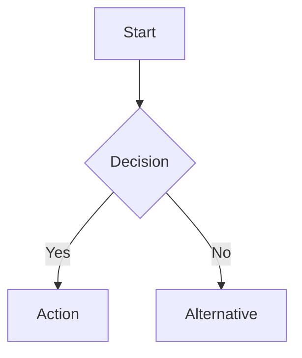

# Visual Rendering Skill

## When to Use

- Creating PNG charts/diagrams for blog posts or slides
- Generating SVG graphics for web embedding
- Building Mermaid flowcharts or timelines
- Rebuilding or updating existing visual assets

## Prerequisites

- Python 3.x with matplotlib installed
- Virtual environment at `.venv/` in workspace root

## Design Token System

All visuals MUST use the shared design token palette. See [token reference](./references/design-tokens.md) for the full color map.

## Procedure

### 1. Plan Visual Assets

Identify what's needed from the content outline:
- **PNGs** (320 DPI): comparison matrices, 2x2 tradeoff charts, timelines, frameworks, checklists
- **SVGs**: interactive/collapsible web graphics (tradeoff charts, decision funnels, checklist cards)
- **Mermaid** (`.mmd`): flowcharts, decision trees, process timelines

### 2. Generate PNGs via matplotlib

Create a Python renderer script at `content/visuals/render_<topic>.py`:

```python
import matplotlib
matplotlib.use('Agg')
import matplotlib.pyplot as plt
import matplotlib.patches as mpatches

# Load design tokens
TOKENS = {
    'BG': '#ffffff', 'ACCENT': '#1f6feb', 'ACCENT_2': '#0d9488',
    'ACCENT_3': '#7c3aed', 'WARN': '#dc2626', 'SUCCESS': '#16a34a',
    'TEXT': '#1e293b', 'TEXT_2': '#475569', 'MUTED': '#94a3b8',
    'GRID': '#e5e7eb', 'LIGHT_BG': '#f8fafc', 'BLUE_BG': '#dbeafe',
    'TEAL_BG': '#ccfbf1', 'PURPLE_BG': '#ede9fe', 'RED_BG': '#fee2e2',
}
FONT = 'Helvetica Neue'
DPI = 320
```

Each visual gets its own function. Save with `plt.savefig(path, dpi=DPI, bbox_inches='tight', facecolor=TOKENS['BG'])`.

### 3. Generate SVGs via Python

Create `content/visuals/write_svgs.py` — never use terminal heredoc for SVGs. Write SVG XML strings from Python using `with open(path, 'w') as f: f.write(svg_content)`.

### 4. Generate Mermaid Diagrams

Write `.mmd` files in `content/visuals/` using standard Mermaid syntax. Example:



### 5. Run and Verify

```bash
cd content/visuals
python render_<topic>.py
python write_svgs.py
```

Verify: all PNGs at 320 DPI, colors match tokens, no Unicode glyph warnings.

## Critical Rules

- **No Unicode glyphs in matplotlib**: use `->` not `→`, `[x]` not `✓`
- **SVGs via Python only**: heredoc causes encoding corruption
- **Consistent palette**: every visual must use the shared tokens
- **320 DPI**: non-negotiable for all PNG output
