# Content Pipeline — End-to-End Run Flow

> Companion to [automation-architecture.md](automation-architecture.md) (file structure) and
> [content-strategy-pipeline.md](content-strategy-pipeline.md) (step inventory). This document is
> the **operational runbook**: it walks a single content run from topic to published post, naming
> every agent, skill, input, output, and quality gate at each stage.

The pipeline is orchestrated by the [`content-pipeline`](../.github/agents/content-pipeline.agent.md)
agent. It delegates to specialist agents in sequence, calls skills for repeatable procedures, and
reads/updates the live run-state contract at [`content/pipeline-config.md`](../content/pipeline-config.md)
between every phase.

---

## How a run starts

| Entry point | How | Routes through |
|-------------|-----|----------------|
| Orchestrator agent | Select `@content-pipeline`, give a topic | All phases in order |
| Prompt shortcut | `/new-content-pipeline` + topic | Orchestrator |
| Topic-scoped run | `/topic-pipeline <slug>` | Orchestrator, rooted at `content/topics/<slug>/` |
| Single agent | `@blog-writer`, `@social-linkedin`, etc. | One stage only |
| Idea-first | `@feed-curator` → `/select-idea` | Phase -1 then orchestrator |

Every full run is governed by four cross-cutting rules:

- **Status contract** — the orchestrator reads `pipeline-config.md` first, sets Status to
  `in-progress`, and updates **Current Step** + the Step Checklist after each phase.
- **Quality gates** — no phase advances until the prior gate passes (visual density, visual QA,
  content QA, source freshness, brand compliance).
- **Rollback / redo** — if feedback sends work backward, Status rolls back and downstream
  checklist items are unchecked *before* any content is rebuilt.
- **Topic isolation** — topic-scoped runs never touch repo-root `content/` or other topics.

---

## Full flow diagram

```mermaid
flowchart TD
    Start([User provides topic]) --> Status{Status check\npipeline-config.md}
    Status -->|not-started + no topic| Discovery

    subgraph P_1[Phase -1 — Discovery optional]
        Discovery[feed-curator / reading-list / apple-notes\n→ idea-queue.md] --> Select[/select-idea/]
    end
    Select --> P0
    Status -->|topic set| P0

    subgraph P0[Phase 0 — Reference & Research]
        RefDisc[reference-discovery\n→ pipeline-config URLs] --> RefAnalysis[reference-analysis skill\n→ reference-brief.md]
        RefAnalysis --> Trend[trend-researcher\n→ trend-research.md]
    end
    Trend --> P1

    subgraph P1[Phase 1 — Planning]
        Brief[content-strategist + creative-brief skill\n→ creative-brief.md] --> Research[content-researcher + content-research skill\n→ content-research-map.md]
        Research -->|bias gate| Strategy[content-strategist\n→ strategy + outline]
        Strategy --> Scope[content-scope-assessment skill\nsingle vs series]
        Scope --> Dim[multi-dimensional-analysis skill\npersona / practice / WAF]
        Dim --> VisMap[visual-strategist + visual-content-planning\n→ visual-opportunity-map.md]
        VisMap --> ArtDir[infographic-art-director + infographic-design-system\n→ art-direction briefs]
    end
    ArtDir --> Confirm{User confirms}

    subgraph P2[Phase 2 — Content Creation]
        Blog[blog-writer\n→ blog .md] --> Visuals[visual-renderer\n→ PNG / SVG / Mermaid]
        Visuals --> Hero[image-content-agent\nhero imagery optional]
        Hero --> Density[Phase 2b: visual density\n>400 words needs a visual]
        Density --> VisQA{Phase 2c: visual QA\nrubber-duck + visual-reviewer}
    end
    Confirm --> Blog
    VisQA -->|fail ≤3 cycles| Visuals

    subgraph P3[Phase 3 — Quality + SEO]
        ContentQA[rubber-duck → quality-reviewer] --> Fresh[grounded-content-reviewer\nsource freshness]
        Fresh --> SEO[seo-optimizer]
    end
    VisQA -->|pass| ContentQA

    subgraph P4[Phase 4 — Distribution]
        SocialStrat[social-strategist\n→ social-strategy.md] --> StandVis[visual-strategist + visual-renderer\nstandalone visual pack]
        StandVis --> LI[social-linkedin\nalways]
        LI --> Menu{Pick platforms}
        Menu --> TW[social-twitter]
        Menu --> RD[social-reddit]
        Menu --> RL[reel-video]
        Menu --> YT[video-scriptwriter]
        Menu --> DK[deck-builder\nPPTX + PDF optional]
    end
    SEO --> SocialStrat

    subgraph P5[Phase 5 — Brand + Final Review]
        Brand{brand-guardian\ngated audit} --> FinalQA[quality-reviewer on social]
    end
    TW --> Brand
    RD --> Brand
    RL --> Brand
    YT --> Brand
    DK --> Brand
    LI --> Brand

    FinalQA --> Repurpose[Phase 6 — content-repurposer optional]
    Repurpose --> Publish[Phase 7 — web-publisher\n→ GitHub Pages]
    Publish --> Distill[platform-distiller\nMedium / Substack / LI Article]
    Distill --> SocialPub[social-publisher\npreview + approval]
    SocialPub --> Done([Status: completed])
```



---

## Phase-by-phase detail

Each row lists the **agent or skill**, what it **reads**, what it **writes**, and the **gate** that
must pass before moving on.

### Phase -1 — Content Discovery (optional)

| Step | Agent / Skill | Reads | Writes | Gate |
|------|---------------|-------|--------|------|
| -1 | `feed-curator` (`feed-curation` skill) | `feed-sources.md`, RSS/newsletters | `idea-queue.md` | — |
| -1 | `reading-list-curator` / `apple-notes-curator` | Chrome list / Apple Notes | `idea-queue.md` | — |

Skipped when the user provides a topic directly.

### Phase 0 — Reference Discovery & Research

| Step | Agent / Skill | Reads | Writes | Gate |
|------|---------------|-------|--------|------|
| 0a | `reference-discovery` | Topic | Reference URLs in `pipeline-config.md` | User curates select/reject |
| 0a | `reference-analysis` skill | Reference URLs | `reference-brief.md` (with `[VOLATILE]` tags) | — |
| 0b | `trend-researcher` | Topic, market sources | `trend-research.md` | — |

### Phase 1 — Planning

| Step | Agent / Skill | Reads | Writes | Gate |
|------|---------------|-------|--------|------|
| 1 | `content-strategist` + `creative-brief` skill | Topic, clarifying answers | `creative-brief.md` | §7 Visual guidelines must be filled |
| 1b | `content-researcher` + `content-research` skill | Creative + reference briefs | `content-research-map.md` (thesis, contradiction map, ranked args, self-review, outline tree) | **Bias/dominance check** must PASS |
| 1-2 | `content-strategist` | Brief, research map, trend research | Strategy doc + outline | — |
| 2b | `content-scope-assessment` skill | Strategy doc | Single-post vs 2-5 part series decision | Single-post feasibility + required-series gates |
| 2c | `multi-dimensional-analysis` skill | Strategy doc | `## Dimension Analysis` (persona / practice / WAF pillars + platform matrix) | — |
| 2d | `visual-strategist` + `visual-content-planning` | Strategy doc | `visual-opportunity-map.md` (`[VISUAL:]` markers) | **Mandatory** — no blog without it |
| 2e | `infographic-art-director` + `infographic-design-system` | Opportunity map | Art-direction briefs per P0/P1 visual | **Mandatory** before rendering infographics |

Phase 1 ends with an explicit **user confirmation** before any content is written.

### Phase 2 — Content Creation

| Step | Agent / Skill | Reads | Writes | Gate |
|------|---------------|-------|--------|------|
| 3 | `blog-writer` | Strategy/outline, opportunity map | Blog `.md` (preserves + inserts `[VISUAL:]` markers) | — |
| 3b | `visual-renderer` (`visual-rendering` skill) | Blog, opportunity map, art briefs | PNG / SVG / Mermaid at 320 DPI | Design-token compliance |
| 3b-img | `image-content-agent` (`vision-grounding` skill) | Brief, hero slots | Hero/illustrative PNGs in `visuals/generated/` | Deterministic inspect pre-screen; optional, only if `image_generation` on |
| 2b | Visual density pass | Blog section word counts | Added `[VISUAL:]` markers + renders | **Mandatory** — every section >400 words gets a visual |
| 2c | Rubber-duck + `visual-reviewer` | Rendered visuals | Findings report | **Gate** — PASS required; up to 3 fix cycles |

### Phase 3 — Quality Gate + SEO

| Step | Agent / Skill | Reads | Writes | Gate |
|------|---------------|-------|--------|------|
| 3c | Rubber-duck → `quality-reviewer` | Blog + visuals | In-place fixes | Quality checklist PASS |
| 3e | `grounded-content-reviewer` | Blog, live source URLs | Corrected `[VOLATILE]` claims | Source freshness verified |
| 3d | `seo-optimizer` | Blog | Meta, keywords, heading structure | — |

### Phase 4 — Distribution

| Step | Agent / Skill | Reads | Writes | Gate |
|------|---------------|-------|--------|------|
| 4a | `social-strategist` | Blog, dimension matrix | `social-strategy.md` | — |
| 4a-visual-plus | `visual-strategist` + `visual-renderer` | Opportunity map | Standalone pack in `visuals/distilled/` | Programmatic renderers only |
| 4b | `social-linkedin` (`unicode-formatting` skill) | Blog, visual pack | Plain + Unicode LinkedIn posts | **Always generated** |
| 4c | (user choice) | — | Platform selection | — |
| 5 | `social-twitter` | Blog, x-card visuals | Single tweet | If selected |
| 6 | `social-reddit` | Blog, subreddits | Markdown Reddit post | If selected |
| 6b | `reel-video` | Blog, visuals | 60-90s reel script | If selected |
| 8 | `video-scriptwriter` | Blog, visuals | YouTube script + slide map | If selected |
| 6c | `deck-builder` (`deck-builder` skill) | **Finalized** blog + LinkedIn | `deck/<topic>-deck.{md,pptx,pdf}` with humor + intellectual speaker notes | **Optional**, after blog + LinkedIn finalized; user finalizes deck before export; never blocks publishing |

### Phase 5 — Brand Audit + Final Review

| Step | Agent / Skill | Reads | Writes | Gate |
|------|---------------|-------|--------|------|
| 7 | `brand-guardian` | All content + visuals | Severity-gated audit (Error/Warning/Info) | **Any Error blocks publishing** |
| 7 | `quality-reviewer` | All social posts | In-place fixes | — |

### Phase 6 — Repurposing (optional)

| Step | Agent / Skill | Reads | Writes | Gate |
|------|---------------|-------|--------|------|
| 9 | `content-repurposer` | Published blog | Newsletter, slides, podcast, one-pager, infographic briefs in `repurposed/` | Mandatory only if P0/P1 distribution visuals incomplete |
| 9b | `content-repurposer` + `visual-renderer` | Visual briefs | Rendered repurposing pack | Routed through `visual-reviewer` |

### Phase 7 — Publish

| Step | Agent / Skill | Reads | Writes | Gate |
|------|---------------|-------|--------|------|
| 10 | `web-publisher` | Blog `.md`, visuals | `blog/<slug>.html` + linked index in Pages repo | User commits/pushes Pages repo |
| 12 | `platform-distiller` | Blog, canonical URL | Unified Medium/Substack/LinkedIn-Article excerpt | After web-publisher |
| 11 | `social-publisher` | All social content | Posts via MCP to LinkedIn/X/Reddit/YouTube | **Preview + explicit human approval** |

---

## Quality gates summary

| Gate | When | Blocks | Pass criteria |
|------|------|--------|---------------|
| Bias/dominance | Phase 1b | Strategy outline | Self peer-review balanced, no single source/persona dominates |
| Scope feasibility | Phase 2b | Single vs series choice | Feasibility + required-series gates resolved |
| Visual mapping | Phase 2d | Blog writing | `visual-opportunity-map.md` exists |
| Visual density | Phase 2b | Quality review | Every section >400 words has a linked visual |
| Visual QA | Phase 2c | Content QA | Rubber-duck PASS (≤3 fix cycles) |
| Content QA | Phase 3 | Distribution | Quality checklist PASS |
| Source freshness | Phase 3e | Distribution | `[VOLATILE]` claims verified against live sources |
| Brand compliance | Phase 5 | Publishing | Zero Error findings |
| Publish approval | Phase 7 | Live posting | Explicit human approval in `social-publisher` |

---

## Output inventory

A completed run produces (topic-scoped runs nest these under `content/topics/<slug>/`):

```text
content/
├── creative-brief.md             # Phase 1 — front door for all agents
├── content-research-map.md       # Phase 1b — STORM thesis + outline tree
├── reference-brief.md            # Phase 0 — synthesized sources
├── trend-research.md             # Phase 0 — market data
├── <topic>-strategy.md           # Phase 1 — strategy + dimension analysis
├── visual-opportunity-map.md     # Phase 2d — visual backlog
├── <topic>.md                    # Phase 2 — blog (single post OR Part 1)
├── <topic>-part-N.md             # series parts (if series)
├── social-strategy.md            # Phase 4 — distribution plan
├── linkedin-post.md              # Phase 4 — always
├── x-twitter-thread.md           # (if selected)
├── reddit-post.md                # (if selected)
├── reel-script.md                # (if selected)
├── youtube-script.md             # (if selected)
├── deck/                         # (if selected — optional)
│   ├── <topic>-deck.md           #   Marp source + speaker notes
│   ├── <topic>-deck.pptx
│   └── <topic>-deck.pdf
├── repurposed/                   # Phase 6 (optional)
└── visuals/
    ├── *.png, *.svg, *.mmd       # blog companion visuals (320 DPI)
    ├── distilled/                # standalone social/long-form pack
    └── generated/                # hero imagery (optional)
```

---

## Worked example

A run for *"AI code assistant cost optimization"*:

1. **Discovery** skipped — topic given directly.
2. **Phase 0** — `reference-discovery` curates pricing pages and benchmarks; `reference-analysis`
   tags live pricing as `[VOLATILE]`; `trend-researcher` adds adoption data.
3. **Phase 1** — `creative-brief` sets a practitioner audience; `content-researcher` builds a
   thesis and passes the bias gate; `content-scope-assessment` scores 12 → recommends a 3-part
   series; `multi-dimensional-analysis` maps personas to parts; `visual-strategist` plans 8
   visuals; `infographic-art-director` writes briefs. User confirms.
4. **Phase 2** — `blog-writer` drafts Part 1; `visual-renderer` produces charts; the density pass
   adds two more visuals; visual QA passes on cycle 2.
5. **Phase 3** — `quality-reviewer` fixes vague claims; `grounded-content-reviewer` corrects a
   changed price; `seo-optimizer` adds metadata.
6. **Phase 4** — `social-strategist` plans sequencing; `social-linkedin` leads with a carousel;
   user picks LinkedIn + Reel + **Slide deck**; `deck-builder` builds a topic-organized deck with
   humor + intellectual speaker notes, the user finalizes it, then it exports PPTX + PDF.
7. **Phase 5** — `brand-guardian` returns zero Errors.
8. **Phase 7** — `web-publisher` ships the HTML page; `platform-distiller` writes the cross-platform
   excerpt; `social-publisher` posts after the user approves the preview.
9. Status set to `completed`; user asked whether to start Part 2.
