# Which AI Model Should You Use, and When? A Field Guide for Product Teams

Recently, while working with one of my customers, I saw their team burn through $140K in inference costs in 60 days — then scramble to rewrite their entire AI pipeline. Their mistake was not picking the wrong model. Their mistake was treating model selection as a one-time technical choice instead of an ongoing product decision.

They are not alone. According to a16z's 2025 AI survey, **over 60% of teams using LLMs in production have switched their primary model at least once**, and the median time-to-switch is just 4.5 months. The era of "pick GPT-4 and forget about it" is over.

This guide is the playbook I wish those teams had before they started.

It is designed for **product teams** — engineers, product managers, and leadership — who need to answer one question with confidence:

> **Which model should we use for each task, and when should we switch?**

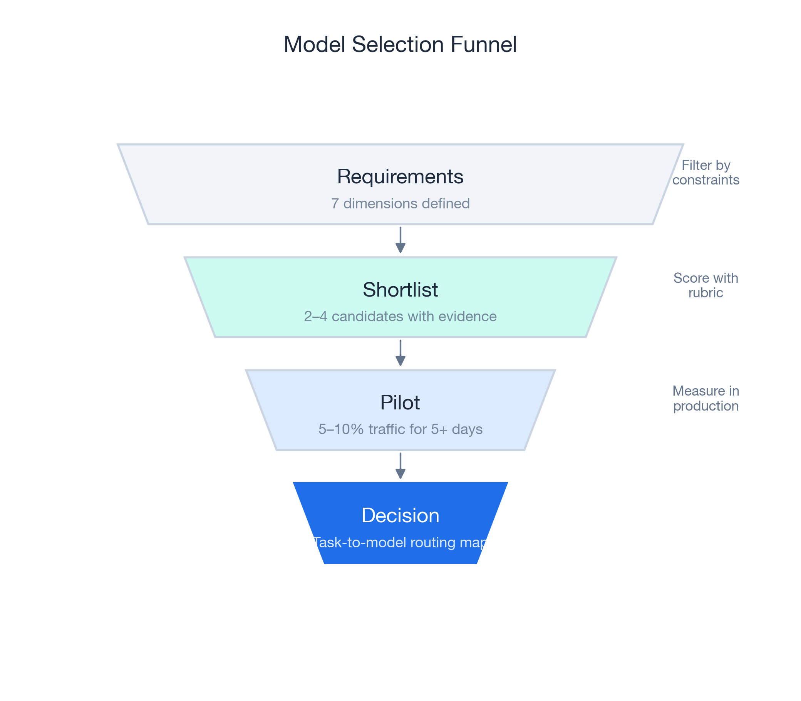

View as SVG (scalable vector)

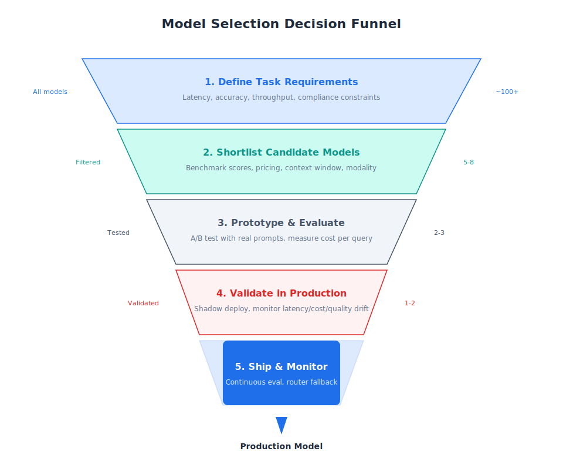

---

## Why Model Choice Is a Product Decision, Not Just a Technical One

A model decision usually starts in engineering ("let's just use Claude"), but it ends up shaping four things that leadership cares about deeply:

| Business Dimension | What the Model Decision Controls |
|---|---|
| **User experience** | Response speed, output quality, perceived intelligence |
| **Unit economics** | Cost per interaction — which directly affects gross margin |
| **Risk profile** | Data residency, compliance exposure, vendor lock-in |
| **Team velocity** | API maturity, debugging difficulty, swap cost |

When someone says "just use model X," they are compressing a multi-dimensional business trade-off into a single technical preference. That compression is where expensive mistakes hide.

### A story most teams will recognize

One of my customers was building an AI writing assistant and chose GPT-4 Turbo across all features: autocomplete, long-form drafting, and grammar correction. Demos looked fantastic. Early dogfooding was promising.

Then real usage hit at scale:

- **p95 latency jumped to 4.2 seconds** on autocomplete — users started typing over AI suggestions
- **Monthly inference cost reached $47K** — 3× the projected budget, mostly from grammar corrections that a $0.15/M-token model could handle
- **No fallback path** — when OpenAI had a 40-minute degradation, the entire product went down

Nothing "catastrophically failed." But the product became impossible to scale confidently.

The lesson: **they didn't need the most capable model everywhere. They needed the right model mix for each task path.**

That realization — from "best model" to "best-fit model portfolio" — is what separates teams that scale AI from teams that stall.

---

## The 7-Dimension Model Selection Framework

When teams get stuck, it is usually because they optimize for one variable (often quality or hype) and ignore the rest. This framework forces a balanced decision across all dimensions that matter.

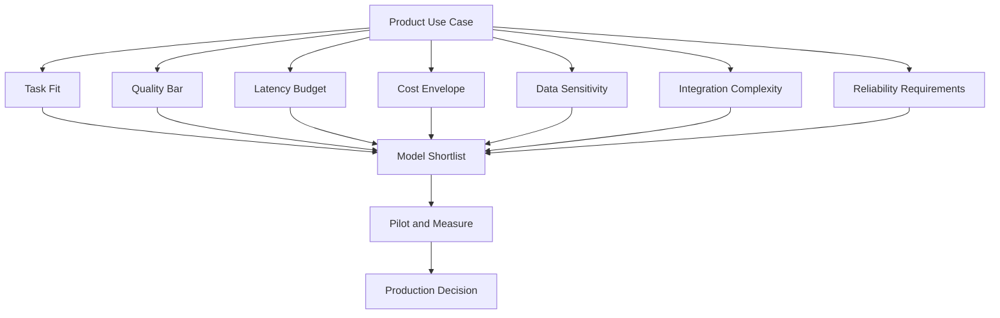

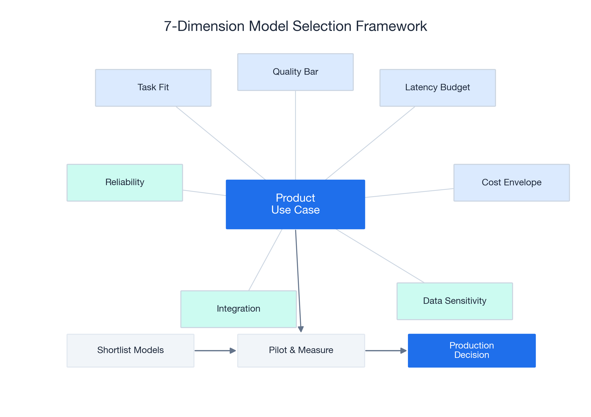

### 1. Task Fit — Start with the job, not the model

This is the most common first mistake: picking a model before defining the task precisely.

| Task Type | What It Needs | Model Tier |
|---|---|---|
| Classification / routing | Speed + consistency | Lightweight (Haiku, Gemini Flash, GPT-4o mini) |
| Extraction / parsing | Structure + reliability | Lightweight to mid-tier |
| General drafting | Fluency + instruction following | Mid-tier (Sonnet, GPT-4o, Gemini Pro) |
| Complex reasoning / planning | Deep coherence + multi-step logic | Frontier (Opus, o1/o3, Gemini Ultra) |
| Code generation | Precision + context length | Mid-tier to frontier depending on complexity |
| Multimodal interpretation | Vision + language grounding | Specialized (GPT-4o, Gemini, Claude with vision) |

**Key insight:** A single product often contains 4–6 distinct task types. Using one model for all of them is like using a chef's knife for every kitchen task — technically possible, practically expensive.

### 2. Quality Requirements — Define "good enough" in business terms

Avoid vague criteria like "pretty good output." Instead, define quality per task:

- **Customer-facing support responses** → Error tolerance near zero; hallucination is a liability
- **Internal draft suggestions** → Minor imprecision is acceptable if speed is high
- **Data extraction from documents** → Structural accuracy > prose quality

**Pro tip:** Create a 10-prompt evaluation set per task. Score outputs 1–5 across accuracy, completeness, tone, and format. This takes 2 hours and saves weeks of debate later.

### 3. Latency and UX Tolerance

Users feel delay long before your monitoring dashboards alert you.

| Interaction Pattern | Target Latency | If Exceeded |
|---|---|---|
| Inline autocomplete | < 300ms | Users type over suggestions |
| Chat-style response | < 2s to first token | "Feels broken" |
| Long-form generation | < 8s total | Acceptable if streaming |
| Background batch processing | Minutes | No user-facing impact |

**The hidden cost of over-capability:** A frontier model averaging 3.8s on a 300ms task is not "higher quality" — it's a UX regression.

### 4. Cost Envelope — Model the real bill, not the demo bill

Approximate cost ranges per 1M tokens (as of early 2026, input/output blended):

| Tier | Examples | Cost Range |
|---|---|---|
| Lightweight | GPT-4o mini, Haiku, Gemini Flash | $0.10 – $0.60 |
| Mid-tier | GPT-4o, Sonnet 3.5, Gemini Pro | $2 – $15 |
| Frontier | Opus, o1/o3, Gemini Ultra | $15 – $60+ |

But the sticker price is only part of the story. **Hidden cost multipliers** include:

- Verbose system prompts (some teams send 2K+ tokens of instructions per request)
- Retry loops on low-confidence outputs (can 2–3× effective cost)
- Evaluation/guardrail passes (often a second model call)
- Context window bloat from RAG pipelines

**Rule of thumb:** Your real cost is typically 1.5–2.5× the base token cost.

### 5. Data Sensitivity and Compliance

This dimension often eliminates options before you even benchmark.

- Does user PII enter prompts? → Check data processing agreements
- Is the data subject to HIPAA, SOC 2, GDPR? → Narrow to compliant providers
- Can data leave your VPC? → Self-hosted or Azure/GCP private endpoints
- Do you need audit trails? → Check logging and retention policies

**The compliance shortcut:** Map your data to three zones — *public*, *internal*, *regulated* — and pre-approve model providers for each zone. This prevents last-minute compliance blockers.

### 6. Integration Complexity

A model that benchmarks well can still be expensive in engineering time:

- **Structured output reliability** — Does it consistently return valid JSON? (Claude and GPT-4o are strong here; open models vary)
- **Tool/function calling** — Critical for agentic workflows. Test with your actual tool schemas.
- **Streaming support** — Required for responsive UX but not all providers handle it equally
- **SDK maturity** — Affects debugging speed and developer experience
- **Model versioning** — Can you pin a version, or does the provider silently update?

### 7. Operational Reliability

You are selecting for day-2 operations, not demo quality.

- What is the provider's historical uptime? (Check status pages + community reports)
- What does degradation look like? (Slower responses? Lower quality? Outright 503s?)
- Can you route to a backup model transparently?
- Do you have circuit breakers for cascading failure?

**The reliability test most teams skip:** Run your eval suite at 2 AM and 2 PM on the same day. If quality variance exceeds 10%, you have a reliability problem.

---

## The Trade-Off Matrix: No Free Lunches

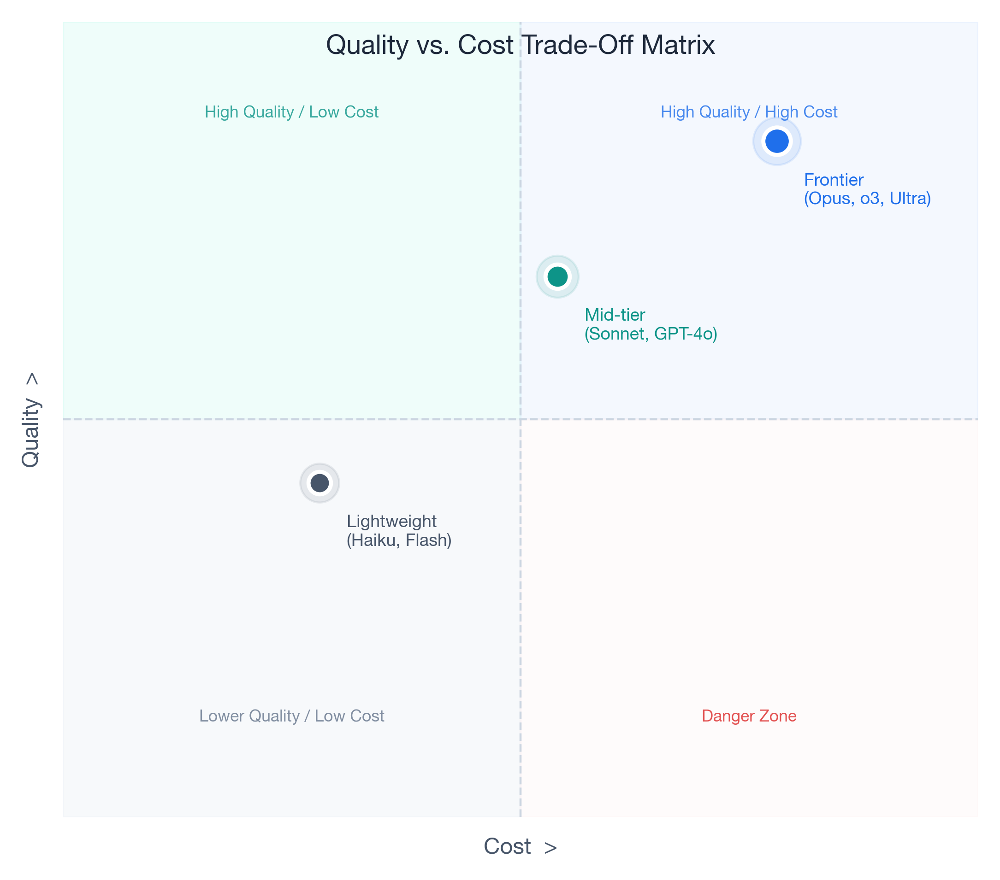

View as SVG (scalable vector)

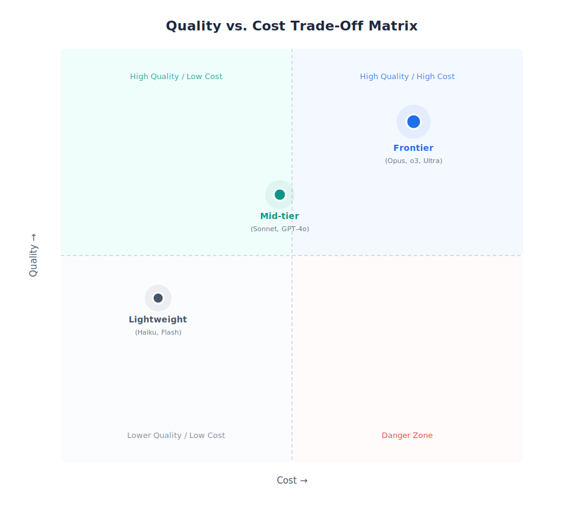

Every model choice is a trade-off. The teams that succeed are the ones who make those trade-offs explicit.

The 2×2 above is simple by design. Its purpose is to force a conversation:
- **Top-right (Frontier):** Maximum capability, maximum cost. Reserve for high-stakes tasks.
- **Center (Mid-tier):** The workhorse zone. Best balance for most product features.
- **Bottom-left (Lightweight):** High efficiency, limited ceiling. Ideal for classification, extraction, triage.
- **Bottom-right (danger zone):** Low quality AND high cost — usually a sign of model misfit or prompt engineering debt.

---

## Comparison Matrix: Which Model Family Fits Which Job

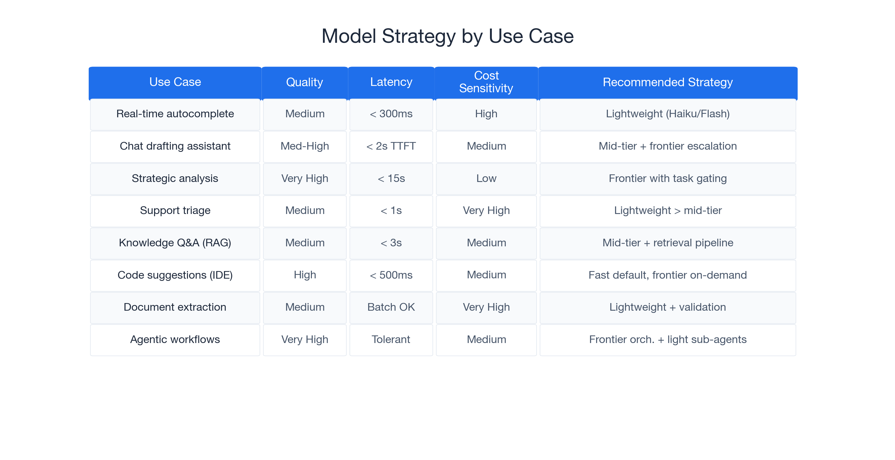

| Use Case | Quality Need | Latency Budget | Cost Sensitivity | Recommended Strategy |
|---|---|---|---|---|
| Real-time autocomplete | Medium | < 300ms | High | Lightweight model (Haiku/Flash), streaming |
| Chat drafting assistant | Medium-High | < 2s TTFT | Medium | Mid-tier default + frontier escalation for complex prompts |
| Long-form strategic analysis | Very High | < 15s total | Low | Frontier with strict task gating |
| Customer support triage | Medium | < 1s | Very High | Lightweight classifier → mid-tier generator |
| Internal knowledge Q&A | Medium | < 3s | Medium | Mid-tier + strong retrieval/RAG pipeline |
| Code suggestions (IDE) | High | < 500ms | Medium | Fast model default, frontier on-demand for complex refactors |
| Document extraction at scale | Medium | Batch OK | Very High | Lightweight extraction + structured output validation |
| Agentic multi-step workflows | Very High | Tolerant | Medium | Frontier orchestrator + lightweight sub-agents for tools |

### Open vs. closed, hosted vs. self-hosted

There is no universal winner. Use this decision logic:

- **Closed/hosted** (OpenAI, Anthropic, Google) → When speed-to-market, managed ops, and API reliability are top priorities. Trade-off: less control, vendor dependency.
- **Open/self-hosted** (Llama 3, Mistral, Qwen) → When data sovereignty, customization potential, or regulatory constraints justify the operational overhead. Trade-off: you own uptime.
- **Hybrid** → Route sensitive data through self-hosted models, commodity tasks through hosted APIs. Increasingly common in regulated industries.

---

## Case Narrative: From "Best Model" to "Best-Fit Model Portfolio"

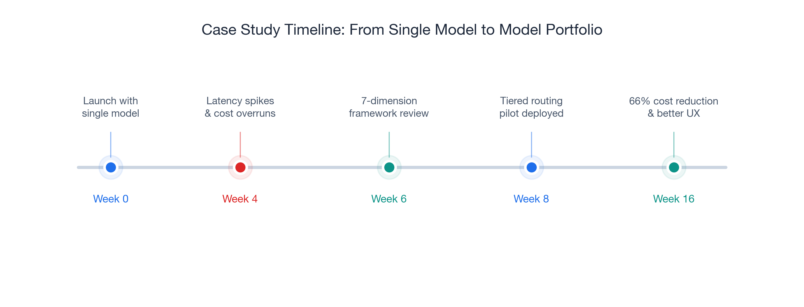

### The setup

One of my customers — a B2B SaaS company — launched an AI copilot for sales account teams. Three core features:

1. **Meeting summary generation** — process call transcripts into structured notes
2. **Draft email generation** — compose follow-ups matching account context
3. **Deal-risk signal analysis** — flag at-risk deals from CRM + conversation patterns

Leadership wanted a strong first impression. The team standardized on Claude 3 Opus for everything.

### What broke (weeks 4–6)

| Feature | Problem | Root Cause |
|---|---|---|
| Email drafting | p95 latency hit 5.1s during peak hours | Opus throughput limits under load |
| Meeting summaries | $28K/month for a feature users rated "nice to have" | Overkill model for extractive summarization |
| Deal-risk analysis | Cost unpredictable; spikes on quarter-end | Long context windows + complex prompts |

The model itself performed well. **The single-model-for-everything strategy was the failure.**

### Applying the 7-dimension framework

The team scored each feature against the framework:

| Feature | Quality Need | Latency Need | Cost Sensitivity | Complexity |
|---|---|---|---|---|
| Meeting summaries | Medium | Low | High | Low |
| Email drafting | Medium-High | High | Medium | Medium |
| Deal-risk analysis | Very High | Low | Low | High |

### The tiered architecture

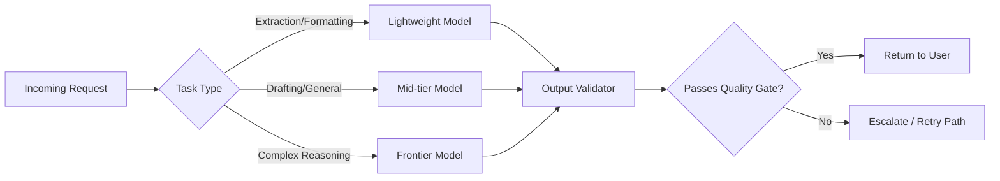

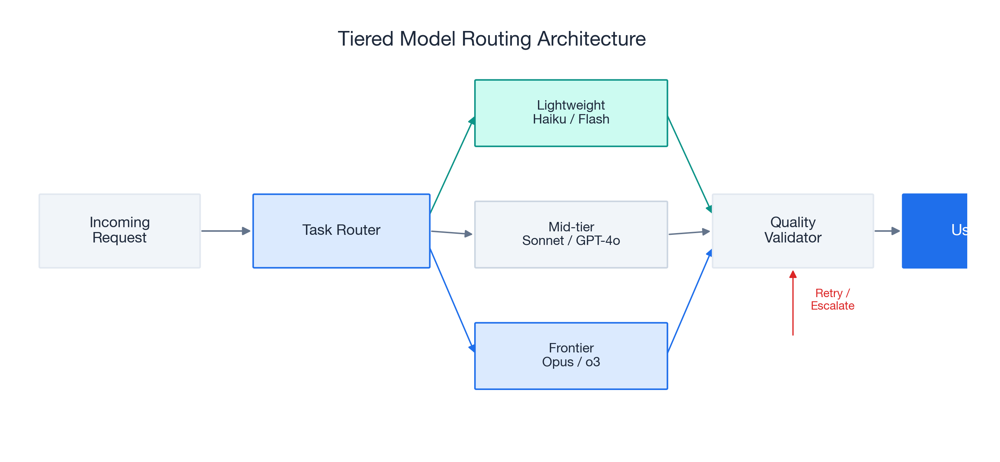

They shifted to:

- **Haiku** for meeting summary extraction and formatting
- **Sonnet 3.5** for email drafting (default) with escalation to Opus for complex threads
- **Opus** only for deal-risk analysis and edge cases

Plus operational improvements:

- Confidence-based escalation (low-confidence Sonnet outputs auto-route to Opus)
- Graceful degradation (if Opus is slow, Sonnet handles with a quality flag)
- Weekly cost-quality-latency review with product + engineering

### The results (8 weeks later)

| Metric | Before | After | Change |
|---|---|---|---|
| Monthly inference cost | $41K | $14K | –66% |
| Email draft p95 latency | 5.1s | 1.8s | –65% |
| Meeting summary user satisfaction | 3.8/5 | 4.1/5 | +8% (faster delivery) |
| Deal-risk accuracy | 82% | 84% | +2% (Opus focused on what matters) |

**The core pattern: mature teams don't chase "best model." They build a model portfolio with explicit routing rules.**

---

## Pitfalls and Mistakes to Avoid

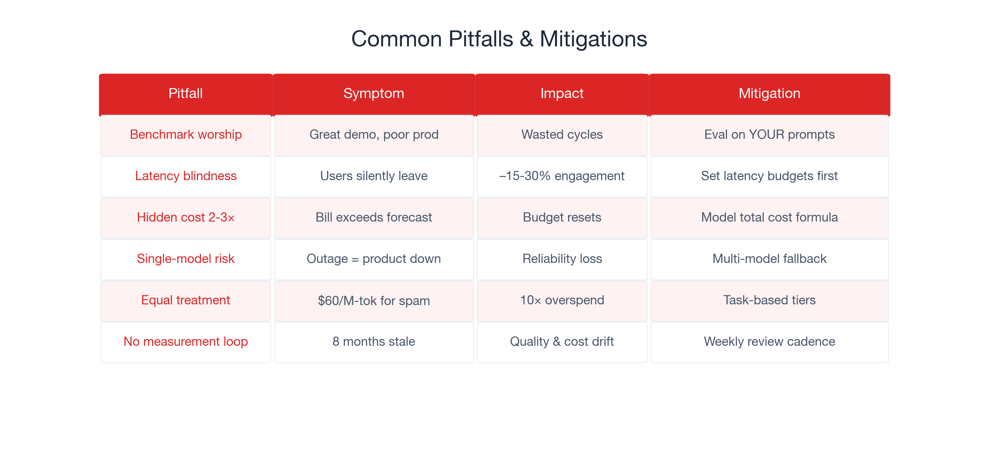

| Pitfall | Real-World Symptom | Business Impact | Mitigation |
|---|---|---|---|
| **Benchmark worship** | "It scored #1 on MMLU!" → uneven production quality | Wasted eval cycles, poor UX | Evaluate on YOUR prompts with YOUR quality rubric |
| **Latency blindness** | Users abandon features without telling you | Engagement drops 15–30% | Set latency budgets BEFORE model selection |
| **Hidden cost compounding** | Monthly bill is 2–3× projected | Budget resets, trust erosion | Model: base cost × retry rate × prompt overhead × eval passes |
| **Single-model dependency** | Provider outage = product outage | Reliability and reputational risk | Multi-model routing with automatic fallback |
| **Treating all requests equally** | $60/M-token model classifies spam | 10× overspend on commodity tasks | Task-based routing with escalation tiers |
| **No measurement loop** | "We picked this 8 months ago, it's probably still fine" | Quality drift, cost creep, missed alternatives | Weekly review: quality score + p95 latency + cost/request |

### The readiness test

If your model strategy has no explicit **downgrade path** (for when you're overspending) and no explicit **escalation path** (for when quality falls short), it is not ready for production scale.

---

## The 30-Day Model Selection Playbook

A practical, time-boxed process you can run with any cross-functional team.

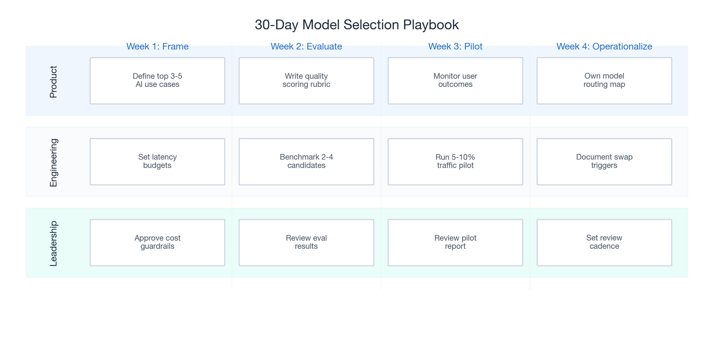

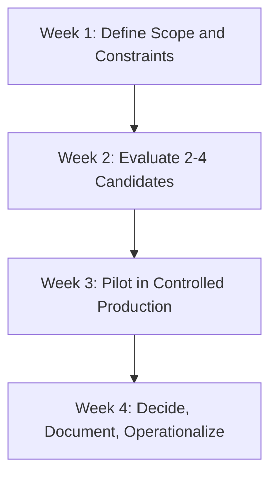

### Week 1: Define the decision frame

| Activity | Owner | Deliverable |
|---|---|---|
| List top 3–5 user-critical AI tasks | Product | Task inventory with priority ranking |
| Write quality acceptance criteria per task | Product + Eng | Scoring rubric (1–5 scale, 10 test prompts) |
| Set latency budgets by interaction type | Engineering | Target latency table |
| Define cost guardrails and risk boundaries | Leadership + Eng | Cost ceiling per feature per month |
| Map data sensitivity zones | Security/Legal | Approved provider list per zone |

**Exit criteria:** A one-page decision brief that product, engineering, and leadership have signed off on.

### Week 2: Run controlled evaluations

- Evaluate **2–4 candidates** (not 10+ — that's analysis paralysis)
- Use the **same prompt set** and **same scoring rubric** across all candidates
- Measure three things per task: quality score, p95 latency, cost per 100 requests
- Document scoring in a shared spreadsheet, not Slack threads

**Exit criteria:** A ranked shortlist with data, not opinions.

### Week 3: Pilot with guardrails

- Route **5–10% of real traffic** to the candidate model
- Monitor user-facing outcomes, not just API metrics (completion rates, edit rates, satisfaction)
- Keep fallback active — if the pilot degrades, traffic auto-routes back
- Run the pilot for **at least 5 business days** to capture variance

**Exit criteria:** A pilot report with go/no-go recommendation and confidence intervals.

### Week 4: Operationalize the decision

- Finalize task-to-model routing map
- Define ownership: who monitors quality? Who approves model swaps?
- Document **swap triggers** — the specific conditions under which you'd re-evaluate
- Set the review cadence (weekly for first month, biweekly after)

**Exit criteria:** A production playbook that a new team member could follow on day 1.

---

## Final Decision Checklist

Use this before locking any model into production. If you can't answer "yes" to at least 7 of these, your decision is likely premature.

- [ ] Have we defined task-specific quality thresholds with a scoring rubric?
- [ ] Have we set maximum acceptable latency for each interaction pattern?
- [ ] Do we understand expected cost under baseline, peak, and growth scenarios?
- [ ] Have we validated data handling requirements per compliance zone?
- [ ] Do we have fallback and escalation paths that activate automatically?
- [ ] Have we tested with representative prompts AND adversarial edge cases?
- [ ] Is there clear ownership for monitoring, tuning, and periodic re-evaluation?
- [ ] Do we know the specific trigger points for model replacement or rerouting?

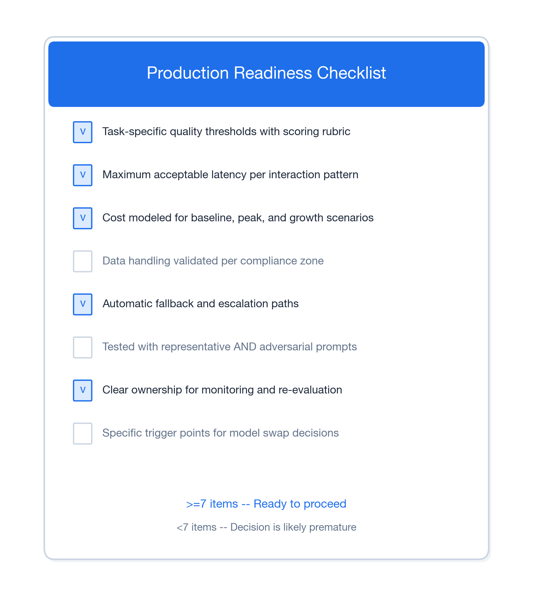

View as SVG (scalable vector)

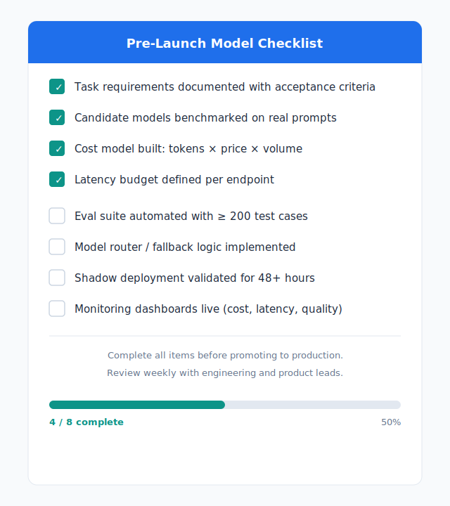

---

## Conclusion: Build the System, Not Just the Selection

Model selection is no longer a one-time technical pick. It is an **ongoing product capability** — as important as your deployment pipeline or your monitoring stack.

The teams that win at AI in production share three traits:

1. **They treat model choice as a structured, repeatable decision** — not a gut call
2. **They build model portfolios, not model monogamy** — matching capability to task
3. **They measure continuously** — because the model landscape shifts every quarter

The best time to build this system was before you launched. The second-best time is this week.

**Start with the 30-day playbook. Run one focused comparison cycle. Document your first routing strategy. Your second decision will be sharper than your first, and by the third, you'll have a genuine competitive advantage.**

---

*Originally published on Medium. Found this useful? Connect with me on LinkedIn for more practical AI engineering content.*
