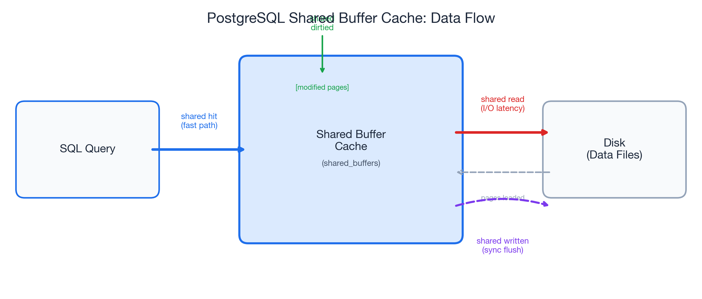
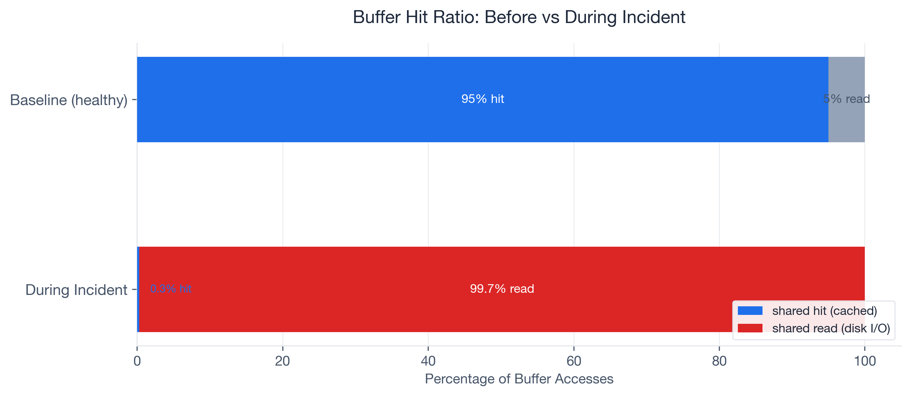
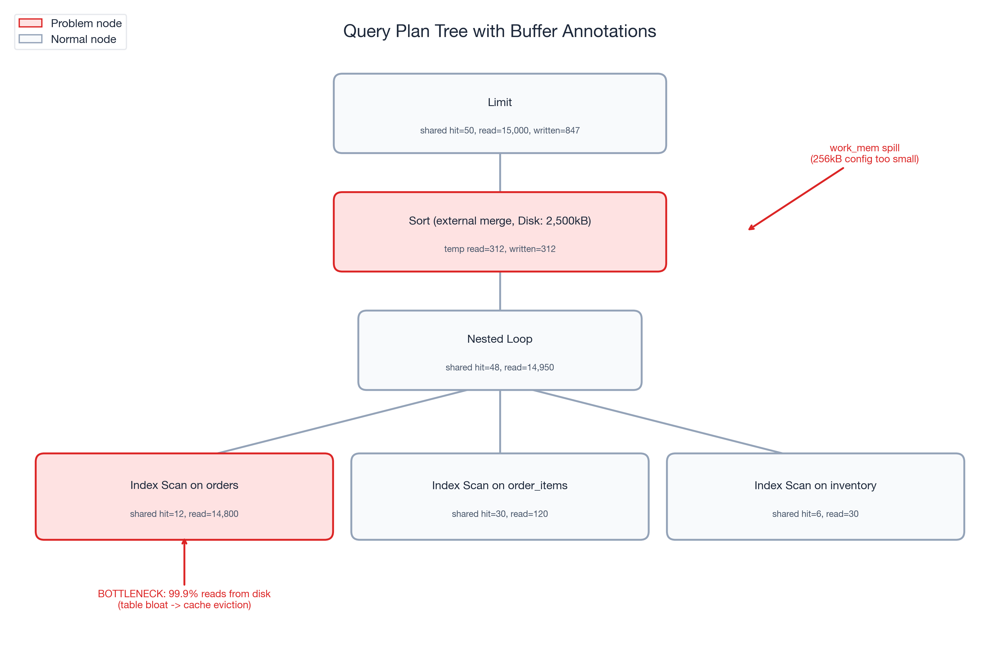
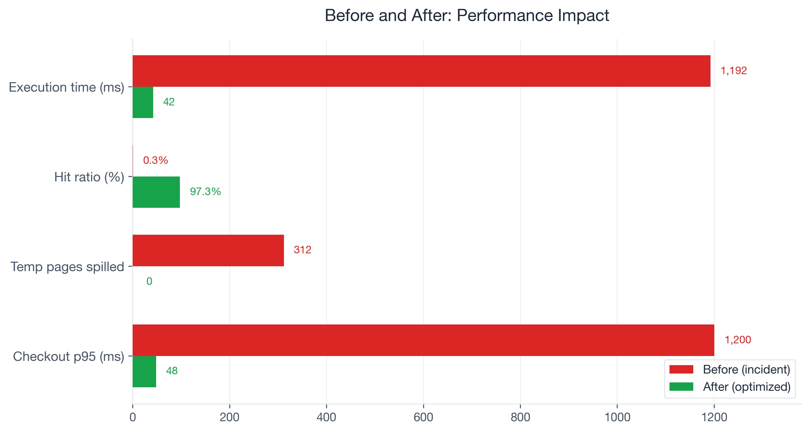
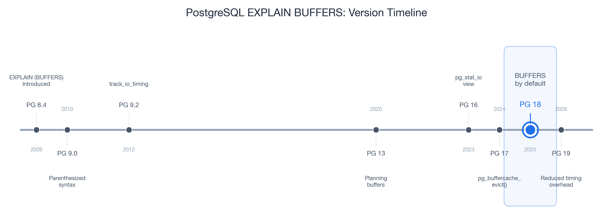

# PostgreSQL EXPLAIN BUFFERS: How We Cut Checkout Latency 96% at an E-Commerce Company

While working with a customer's e-commerce platform running PostgreSQL 17, their checkout query went from 50ms to 1.2 seconds. Not overnight -- gradually, over two weeks, until a promotional event pushed it past the breaking point. Cart abandonment spiked 12 percentage points. The engineering team spent three days blaming the network.

They ran `EXPLAIN ANALYZE` on the checkout query repeatedly. The plan looked identical every time: same Index Scan, same Nested Loop join, same estimated rows. Nothing changed. So they tuned PgBouncer connection pooling, added read replicas, and opened a ticket with their cloud provider. None of it helped.

The problem was invisible because they never added one word to their diagnostic command: `BUFFERS`.

When we finally ran `EXPLAIN (ANALYZE, BUFFERS)`, the numbers told an immediate story. The query was reading 15,000 pages from disk and hitting only 50 pages in cache. A 0.3% buffer hit ratio on what should have been a 95%+ cached query. Three days of network debugging, and the answer was right there in the I/O statistics the team had never asked for.

Most engineers treat `EXPLAIN ANALYZE` as a plan viewer -- they look at node types and row estimates. The `BUFFERS` option turns it into an I/O profiler. That is where the real performance story lives. And starting with PostgreSQL 18 (released 2025), `BUFFERS` output is included by default in `EXPLAIN ANALYZE`, so every developer will see these numbers whether they ask for them or not.

PostgreSQL is the #1 most-used database at 51.9% developer adoption (Stack Overflow 2024), yet in my experience, the majority of developers have never typed `BUFFERS` in an `EXPLAIN` command. This post walks through the buffer concepts you need, the full troubleshooting arc from symptom to root cause, the exact fixes applied, and a monitoring strategy to prevent recurrence.

## What EXPLAIN BUFFERS Actually Tells You

### Shared Buffers: The Four Signals

When you add `BUFFERS` to your `EXPLAIN ANALYZE`, PostgreSQL reports four categories of shared buffer activity at every node in the query plan:

- **shared hit** -- pages found in the shared buffer cache. This is the fast path: no disk I/O, the data was already in memory.
- **shared read** -- pages fetched from disk (or the OS page cache). Every read adds I/O latency. This is where slow queries hide.
- **shared dirtied** -- pages modified during the query. Yes, even `SELECT` queries can dirty pages. PostgreSQL updates hint bits and performs HOT chain pruning during reads, and that is completely normal.
- **shared written** -- pages synchronously written to disk during execution. If you see this on a `SELECT`, it means the background writer could not keep up and PostgreSQL forced a synchronous write. That is a warning sign worth investigating.

The key formula is the **buffer hit ratio**:

```
hit_ratio = shared hit / (shared hit + shared read)
```

Here is a concrete example from a cold-cache scenario: 13 hits out of 870 total accesses gives you `13 / (13 + 857) = 1.5%`. Terrible for an OLTP query that runs hundreds of times per second -- but entirely expected for the first execution after a restart.



### Context Over Absolutes

One critical insight I picked up from Radim Marek's excellent [boringSQL article on EXPLAIN BUFFERS](https://boringsql.com/posts/explain-buffers/): the buffer hit ratio is a diagnostic tool, not a scorecard. There is no universal "good" number.

A reporting query scanning a large date range might sit at 10-30% hit ratio, and that is fine -- it is touching data that does not need to stay cached. A login page query should be near 100%; if it drops from 95% to 40%, something changed and deserves investigation.

The decision matrix I use with customers:

| Scenario | Likely Cause |
|----------|-------------|
| Low hit ratio + high execution time | I/O bottleneck -- the focus of this post |
| High hit ratio + high execution time | Look elsewhere: CPU, excessive row counts, bad plan choice |
| Low hit ratio + low execution time | Small table, cold cache -- probably fine |

The ratio means nothing without context. A query's baseline is what matters, and changes from that baseline are what demand attention.

### Temp Buffers and work_mem Spills

The EXPLAIN BUFFERS output also reports `temp read` and `temp written`. These track disk spills from sorts, hashes, and CTEs that exceed `work_mem`. This is a common source of confusion: `temp read/written` in EXPLAIN output has nothing to do with the `temp_buffers` PostgreSQL parameter (which controls memory for temporary tables).

When a sort or hash operation exceeds `work_mem`, PostgreSQL spills intermediate results to disk. The default `work_mem` is a conservative 4MB (historically even lower at 256kB in many configurations). At 256kB, a sort on 200K rows can force a 9.7MB disk spill -- turning a millisecond in-memory operation into a multi-second I/O operation.

One detail that trips people up: `work_mem` is allocated **per operation**, not per query. A query with three sort nodes and two hash joins could allocate up to five times `work_mem`. Keep that in mind before setting it globally to 1GB.

## The Incident: Checkout Queries Go From 50ms to 1.2 Seconds

Here is the setup. The customer ran a mid-size e-commerce platform on PostgreSQL 17: roughly 2 million rows in the orders table, about 500,000 active users, hosted on a managed cloud instance with 32GB RAM.

The checkout flow executed a join across `orders`, `order_items`, and `inventory` to validate stock and calculate totals. For months, the p95 latency for this query sat at 50ms. Then it started creeping up. Over two weeks, it drifted to 200ms, then 600ms. Nobody noticed until a flash sale pushed it past 1.2 seconds.

The business impact was immediate. Cart abandonment rose from roughly 70% (the Baymard Institute baseline, based on a meta-analysis of 50 studies) to approximately 82%. Research from Akamai and Gomez suggests each additional second of load time increases abandonment by about 7%, and a 1.15-second increase in checkout latency tracked almost exactly with that benchmark. At the company's revenue run rate, checkout downtime cost roughly $5,600 per minute (consistent with the Gartner industry average for e-commerce).

The team's first response was reasonable: they assumed network latency. They deployed PgBouncer to reduce connection overhead. They checked cloud provider status pages. They ran `EXPLAIN ANALYZE` on the checkout query:

```sql
EXPLAIN ANALYZE
SELECT o.order_id, o.total, i.stock_available
FROM orders o
JOIN order_items oi ON oi.order_id = o.order_id
JOIN inventory i ON i.product_id = oi.product_id
WHERE o.user_id = 8421
  AND o.status = 'pending'
ORDER BY o.created_at DESC
LIMIT 5;
```

The plan showed the same Index Scan on `orders_user_id_idx`, the same Nested Loop joins, the same estimated row counts. Nothing looked wrong. But the plan did not show *where the data was coming from* -- memory or disk. Without `BUFFERS`, the I/O problem was invisible.

## Adding One Word Changed Everything

### Running EXPLAIN (ANALYZE, BUFFERS)

We added exactly one option to the command:

```sql
EXPLAIN (ANALYZE, BUFFERS, FORMAT TEXT)
SELECT o.order_id, o.total, i.stock_available
FROM orders o
JOIN order_items oi ON oi.order_id = o.order_id
JOIN inventory i ON i.product_id = oi.product_id
WHERE o.user_id = 8421
  AND o.status = 'pending'
ORDER BY o.created_at DESC
LIMIT 5;
```

The output told the entire story:

```
Limit  (cost=1245.67..1245.68 rows=5 width=24)
       (actual time=1187.432..1187.445 rows=5 loops=1)
  Buffers: shared hit=50 read=15000 written=847
  ->  Sort  (cost=1245.67..1248.92 rows=1300 width=24)
            (actual time=1187.430..1187.438 rows=5 loops=1)
        Sort Key: o.created_at DESC
        Sort Method: external merge  Disk: 2500kB
        Buffers: shared hit=48 read=14950, temp read=312 written=312
        ->  Nested Loop  (cost=1.13..1198.45 rows=1300 width=24)
                         (actual time=0.125..1152.678 rows=1300 loops=1)
              Buffers: shared hit=48 read=14950
              ->  Index Scan using orders_user_id_idx on orders o
                    (cost=0.43..892.34 rows=1300 width=16)
                    (actual time=0.089..1098.234 rows=1300 loops=1)
                    Index Cond: (user_id = 8421)
                    Filter: (status = 'pending')
                    Buffers: shared hit=12 read=14800
              ->  Index Scan using order_items_order_id_idx on order_items oi
                    (cost=0.43..0.52 rows=1 width=12)
                    (actual time=0.031..0.033 rows=1 loops=1300)
                    Buffers: shared hit=30 read=120
              ->  Index Scan using inventory_product_id_idx on inventory i
                    (cost=0.28..0.33 rows=1 width=8)
                    (actual time=0.015..0.016 rows=1 loops=1300)
                    Buffers: shared hit=6 read=30
Planning:
  Buffers: shared hit=42 read=156
Planning Time: 12.456 ms
Execution Time: 1192.567 ms
```

Three numbers jumped out immediately:

1. **shared hit=50, shared read=15,000** -- a 0.3% buffer hit ratio. This query was reading almost entirely from disk.
2. **temp written=312** on the Sort node -- `work_mem` was too small, forcing a 312-page external merge sort to disk.
3. **shared written=847** -- the background writer was falling behind, and PostgreSQL was doing synchronous writes during a `SELECT`. That should not happen under normal conditions.

Compare that to the expected baseline: this same query, two months earlier, ran with 95%+ hit ratio, zero temp spills, and executed in under 50ms. The plan was identical. The I/O profile was catastrophically different.



### Following the Buffer Trail

With BUFFERS pointing us at an I/O problem, we followed the trail.

**Step 1: Workload-level confirmation via pg_stat_statements.**

```sql
SELECT query,
       calls,
       shared_blks_hit,
       shared_blks_read,
       round(shared_blks_hit::numeric /
             nullif(shared_blks_hit + shared_blks_read, 0), 4) AS hit_ratio,
       temp_blks_written
FROM pg_stat_statements
WHERE query LIKE '%orders%order_items%inventory%'
ORDER BY shared_blks_read DESC
LIMIT 5;
```

The results confirmed the single-query diagnosis at the workload level: `shared_blks_read` had grown 30x over two weeks while `shared_blks_hit` stayed nearly flat. This was not a one-off cold-cache read. The query was consistently reading from disk, execution after execution.

**Step 2: Table bloat investigation.**

```sql
SELECT relname,
       relpages,
       pg_size_pretty(pg_relation_size(oid)) AS table_size,
       n_dead_tup,
       last_autovacuum
FROM pg_stat_user_tables
WHERE relname = 'orders';
```

The orders table had grown from 857 pages to over 15,000 pages. During the promotional event, high insert volume had outpaced autovacuum. Dead tuples accumulated, the table bloated, and hot checkout data spread across pages that no longer fit in the buffer cache.

**Step 3: Buffer cache sizing.**

The instance had 2GB allocated to `shared_buffers`. That was adequate when the orders table was 857 pages (~6.7MB). At 15,000 pages (~117MB) -- with the index pages, order_items, and inventory tables competing for the same cache -- the working set had outgrown the cache. The checkout query was evicting its own pages faster than it could reuse them.

**The work_mem spill.** The Sort node's `temp written=312` revealed a separate problem. The `work_mem` setting had been configured at 256kB (well below the PostgreSQL 17 default of 4MB). The checkout query's `ORDER BY created_at DESC` exceeded that limit and spilled to an external merge sort on disk -- adding unnecessary I/O latency on every execution.



## Three Changes, One Query

Armed with the diagnosis from BUFFERS, we applied three targeted fixes:

**Fix 1 -- Immediate: Manual VACUUM ANALYZE.**

```sql
VACUUM (VERBOSE, ANALYZE) orders;
```

Autovacuum had fallen behind during the promotional surge. The manual vacuum reclaimed dead tuples and updated statistics. The orders table shrank from 15,000 pages back to approximately 3,200 pages -- still larger than the original 857 (legitimate growth from new orders) but no longer bloated with dead rows.

**Fix 2 -- Immediate: SET LOCAL work_mem for the checkout session.**

```sql
BEGIN;
SET LOCAL work_mem = '16MB';

SELECT o.order_id, o.total, i.stock_available
FROM orders o
JOIN order_items oi ON oi.order_id = o.order_id
JOIN inventory i ON i.product_id = oi.product_id
WHERE o.user_id = 8421
  AND o.status = 'pending'
ORDER BY o.created_at DESC
LIMIT 5;

COMMIT;
```

`SET LOCAL` scopes the change to the current transaction -- no risk to other queries. The 16MB `work_mem` eliminated the 312-page temp spill entirely. The sort completed in memory.

**Fix 3 -- Configuration: shared_buffers and autovacuum tuning.**

We increased `shared_buffers` from 2GB to 4GB (on a 32GB RAM instance, this is well within the recommended 25% of system memory). We also tuned autovacuum to keep pace with high-insert workloads:

```
# postgresql.conf changes
shared_buffers = '4GB'
autovacuum_vacuum_cost_delay = '2ms'       # restored to PG 17 default (was 20ms from legacy config)
autovacuum_vacuum_scale_factor = 0.05      # vacuum at 5% dead tuples, not 20%
```

**Verification.** After applying all three fixes, we re-ran the diagnostic:

```sql
EXPLAIN (ANALYZE, BUFFERS)
SELECT o.order_id, o.total, i.stock_available
FROM orders o
JOIN order_items oi ON oi.order_id = o.order_id
JOIN inventory i ON i.product_id = oi.product_id
WHERE o.user_id = 8421
  AND o.status = 'pending'
ORDER BY o.created_at DESC
LIMIT 5;
```

Result: `shared hit=3,100, shared read=87` -- a 97.3% hit ratio. `temp written=0`. Execution time: 42ms. The query was back.

**Tuning levers summary:**

| Problem Signal | Tuning Lever Applied |
|---|---|
| Low shared hit ratio (0.3%) | `VACUUM ANALYZE` + `shared_buffers` 2GB -> 4GB |
| `temp written` during checkout sort | `work_mem` 256kB -> 16MB via `SET LOCAL` |
| Autovacuum falling behind inserts | `autovacuum_vacuum_cost_delay` restored to 2ms default (was 20ms legacy), scale factor 20% -> 5% |

## Before and After: The Numbers

Here are the measured results, before and after the three fixes:

| Metric | Before | After | Change |
|--------|--------|-------|--------|
| Execution time | 1,192ms | 42ms | 96.5% reduction |
| Buffer hit ratio | 0.3% | 97.3% | +97 percentage points |
| Temp pages spilled | 312 | 0 | Eliminated |
| Shared pages written (sync) | 847 | 0 | Eliminated |
| Checkout p95 latency | 1,200ms | 48ms | 96% reduction |
| Orders table pages | 15,000 | 3,200 | 78.7% reduction |

Cart abandonment recovered to the baseline of approximately 70% within 48 hours of deploying the fixes. The promotional event revenue that had been leaking at roughly $5,600 per minute of degraded checkout performance stabilized.

The part that sticks with me: one word -- `BUFFERS` -- surfaced the root cause that three days of network debugging, PgBouncer tuning, and cloud provider tickets had missed. The query plan was identical before and after the problem emerged. Only the buffer statistics revealed what had actually changed.



## Which PostgreSQL Versions Support What

Every technique in this post works on PostgreSQL 9.0 and later -- `BUFFERS` has been available since 2010. But the ecosystem around buffer diagnostics has matured significantly with each major release:

| Version | Year | Feature Added |
|---------|------|---------------|
| PG 9.0 | 2010 | `EXPLAIN (BUFFERS)` introduced with parenthesized option syntax |
| PG 9.2 | 2012 | `track_io_timing` adds read/write times in ms |
| PG 13 | 2020 | Planning buffers reported (reads of pg_class, pg_statistic) |
| PG 16 | 2023 | `pg_stat_io` view for system-wide I/O statistics |
| PG 17 | 2024 | `pg_buffercache_evict()` for controlled cache benchmarking |
| **PG 18** | **2025** | **BUFFERS included by default in EXPLAIN ANALYZE** |
| PG 19 | 2026 | Reduced EXPLAIN ANALYZE timing overhead (RDTSC-based) |

PostgreSQL 18 is the inflection point. Before PG 18, you had to remember to add `BUFFERS` every time. Starting with PG 18, `EXPLAIN ANALYZE` automatically includes buffer statistics. Developers will see hit/read/dirtied/written numbers whether they ask for them or not. This is significant -- it removes the friction that kept most developers from ever seeing their query's I/O profile.

If you are on PG 17 or earlier, the fix is simple: always type `EXPLAIN (ANALYZE, BUFFERS)` instead of `EXPLAIN ANALYZE`. The VACUUM, `work_mem`, and `shared_buffers` tuning levers from this case study work on **all PostgreSQL versions**.

PG 19 (upcoming, 2026) further reduces the overhead of `EXPLAIN ANALYZE` itself using RDTSC-based timing, making it practical to run buffer diagnostics on more workloads without worrying about measurement overhead.



## Your Next Steps

### For Developers

1. **Add BUFFERS to every EXPLAIN ANALYZE.** If you are on PG 17 or earlier, make `EXPLAIN (ANALYZE, BUFFERS)` your default. On PG 18+, you get it for free.
2. **Learn the four shared buffer signals.** `hit` is good, `read` is expensive, `dirtied` on SELECTs is normal, `written` on SELECTs is a warning.
3. **Set up auto_explain for production.** The built-in [auto_explain](https://www.postgresql.org/docs/current/auto-explain.html) module logs EXPLAIN plans for queries exceeding a latency threshold. Enable `auto_explain.log_buffers = on` to capture buffer statistics automatically:

    ```
    # postgresql.conf
    shared_preload_libraries = 'auto_explain'
    auto_explain.log_min_duration = '100ms'
    auto_explain.log_buffers = on
    auto_explain.log_analyze = on
    ```

4. **Use pg_stat_statements for workload-level monitoring.** Single-query EXPLAIN shows you one execution. [pg_stat_statements](https://www.postgresql.org/docs/current/pgstatstatements.html) aggregates `shared_blks_hit`, `shared_blks_read`, and `temp_blks_written` across all executions over time. That is where you catch regressions before they become incidents.

### For DBAs and Platform Engineers

1. **Establish buffer hit ratio baselines per critical query.** Not a global target -- per-query baselines. A checkout query at 95% that drops to 60% is a problem. A reporting query at 15% is normal.
2. **Monitor temp_blks_written in pg_stat_statements.** Any query with growing `temp_blks_written` is a candidate for `work_mem` tuning or query optimization.
3. **Review shared_buffers sizing quarterly.** As data grows, your working set grows. The 25% of RAM guideline is a starting point, not a permanent answer.
4. **Tune autovacuum for high-insert tables.** The defaults (`autovacuum_vacuum_scale_factor = 0.2`, `autovacuum_vacuum_cost_delay = 2ms` since PG 12) are conservative for high-write workloads. For tables with heavy write traffic, lower the scale factor and verify the cost delay has not been overridden by a legacy configuration to prevent bloat from outrunning the vacuum daemon.

### Long-Term Monitoring

Bridge single-query diagnostics with workload-level visibility:

- **auto_explain** (built-in) -- automatic EXPLAIN logging for slow queries
- **[pg_stat_monitor](https://github.com/percona/pg_stat_monitor)** (Percona, open source) -- enhanced pg_stat_statements with time buckets and query plan capture
- **[pev2](https://github.com/dalibo/pev2)** (Dalibo, open source) -- visual EXPLAIN plan analyzer, runs locally or at explain.dalibo.com
- **[pganalyze](https://pganalyze.com/)** (commercial) -- automated EXPLAIN analysis, Index Advisor, and continuous query monitoring

The combination of `EXPLAIN (ANALYZE, BUFFERS)` for investigation and `pg_stat_statements` for ongoing monitoring covers the full spectrum from incident response to proactive performance management.

**Run `EXPLAIN (ANALYZE, BUFFERS)` on your slowest query right now.** If the hit ratio is below 90% for an OLTP query, you have found your next optimization target. If you see `temp written` on any critical path, that is `work_mem` waiting to be tuned. The data has always been there -- you just need to ask PostgreSQL for it.
