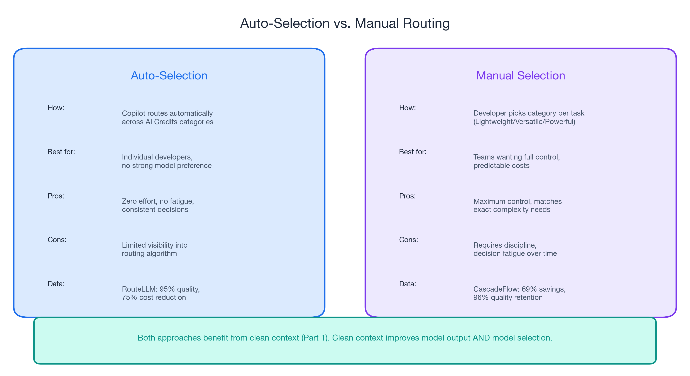
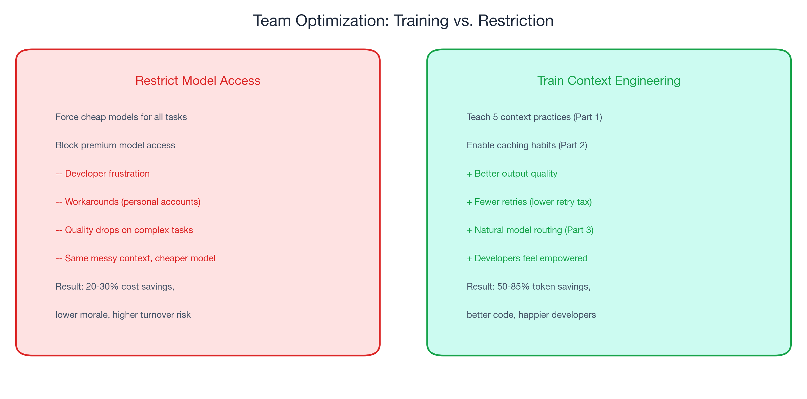
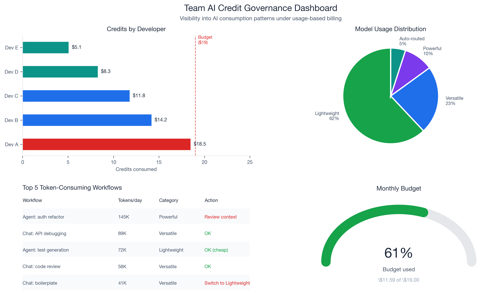
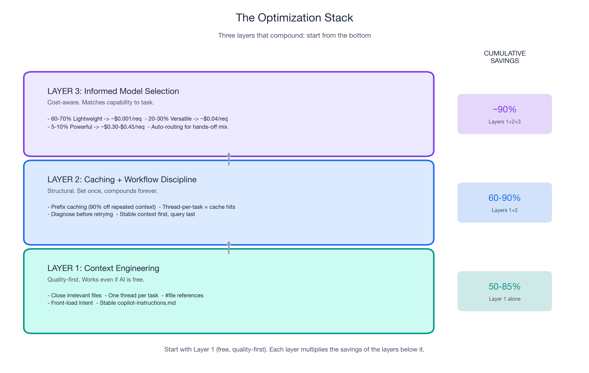

# From PRUs to AI Credits: The Token-Based Bill Is Already Here

*Part 3 of 3 in the "Engineering Better AI Code Assistant Interactions" series*

*Previously: [Part 1](context-engineering-part-1.md) covered context engineering — five practices that improve output quality while cutting tokens by 50-85%. [Part 2](ai-code-assistant-cost-part-2.md) covered prompt caching (75-90% reduced rate on repeated context) and workflow discipline (eliminating the retry tax).*

---

## What Changes on June 1, 2026: PRUs Are Gone, Tokens Are In

If you have been navigating GitHub Copilot using the model-multiplier mental model (a lightweight model costs 0.25x, a heavy reasoning model costs 3x, a flagship fast-mode tier costs 30x), [that system is being retired](https://github.blog/news-insights/company-news/github-copilot-is-moving-to-usage-based-billing/). On **June 1, 2026**, GitHub Copilot replaces Premium Request Units (PRUs) with **GitHub AI Credits** — a token-metered system where every request is billed by the actual tokens consumed.

The headline numbers from [GitHub's official announcement](https://github.blog/news-insights/company-news/github-copilot-is-moving-to-usage-based-billing/):

- **1 AI Credit = $0.01 USD.** Token consumption is converted into credits using each model's published per-token rate.
- **Plan prices do not change.** Copilot Pro stays at $10/month and now includes $10 in monthly AI Credits. Pro+ stays at $39/month with $39 in credits. Business stays at $19/user/month with $19/user in credits (plus a $30/user promotional bump June-Aug). Enterprise stays at $39/user/month with $39/user in credits (plus a $70/user promotional bump June-Aug).
- **Code completions and Next Edit suggestions remain unmetered** on all paid plans. Chat, agent mode, multi-step coding, Spaces/Spark, code review, and any feature where you pick a model do consume credits.
- **The fallback experience is going away.** When PRUs ran out you were silently routed to a cheaper model and could keep working. Under AI Credits, when your pool is exhausted you either authorize additional usage at published rates or stop — admin budget controls govern overages.
- **Annual Pro/Pro+ subscribers stay on PRU multipliers** until their existing plan expires. [The multipliers will actually *increase* for that group on June 1](https://docs.github.com/copilot/reference/copilot-billing/models-and-pricing#model-multipliers-for-annual-copilot-pro-and-copilot-pro-subscribers). Everyone else moves to AI Credits automatically.
- **Copilot code review consumes GitHub Actions minutes** on top of AI Credits, billed at standard Actions runner rates.

Why GitHub made this change: Copilot has evolved from in-editor completions to agentic platforms that run multi-step coding sessions across whole repos. A quick chat and a multi-hour autonomous coding session used to cost a user the same single PRU. That subsidy is no longer financially sustainable, and the token model makes the cost surface visible — which is exactly what you need to make sensible model-selection decisions.

## Not All Tokens Are Priced Equal: The New Per-Request Cost Spread

Under the new model, the cost of an interaction is `tokens_consumed × rate_per_token` — and both factors vary by an order of magnitude depending on the model and the task. Here is GitHub's [published pricing](https://docs.github.com/en/copilot/reference/copilot-billing/models-and-pricing) (per 1 million tokens, as of May 26, 2026):

| Provider | Model | Category | Input | Cached input | Output |
|----------|-------|----------|-------|--------------|--------|
| OpenAI | GPT-5 mini | Lightweight | $0.25 | $0.025 | $2.00 |
| OpenAI | GPT-5.4 nano | Lightweight | $0.20 | $0.02 | $1.25 |
| OpenAI | GPT-5.4 mini | Lightweight | $0.75 | $0.075 | $4.50 |
| OpenAI | GPT-4.1 | Versatile | $2.00 | $0.50 | $8.00 |
| OpenAI | GPT-5.4 | Versatile | $2.50 | $0.25 | $15.00 |
| OpenAI | GPT-5.2 / 5.2-Codex / 5.3-Codex | Versatile / Powerful | $1.75 | $0.175 | $14.00 |
| OpenAI | GPT-5.5 | Powerful | $5.00 | $0.50 | $30.00 |
| Anthropic | Claude Haiku 4.5 | Versatile | $1.00 | $0.10 | $5.00 |
| Anthropic | Claude Sonnet 4.x | Versatile | $3.00 | $0.30 | $15.00 |
| Anthropic | Claude Opus 4.5 / 4.6 / 4.7 | Powerful | $5.00 | $0.50 | $25.00 |
| Google | Gemini 3 Flash (preview) | Lightweight | $0.50 | $0.05 | $3.00 |
| Google | Gemini 3.5 Flash | Lightweight | $1.50 | $0.15 | $9.00 |
| Google | Gemini 2.5 Pro | Powerful | $1.25 | $0.125 | $10.00 |
| Google | Gemini 3.1 Pro (preview) | Powerful | $2.00 | $0.20 | $12.00 |

*(Anthropic models also charge a cache-write cost. The full table including Raptor mini and Goldeneye fine-tuned GitHub models lives in [the docs](https://docs.github.com/en/copilot/reference/copilot-billing/models-and-pricing). Specific model lineups rotate; the three categories — **Lightweight / Versatile / Powerful** — are GitHub's durable taxonomy.)*

Translate that into per-request cost by multiplying the rate by a realistic token count. A short chat reply (~2K input + 500 output) on GPT-5.4 nano costs $(2 \times \$0.20 + 0.5 \times \$1.25) / 1{,}000 \approx \mathbf{\$0.001}$. A deep agent-mode session with rich context (~40K input + 10K output) on Claude Opus 4.7 costs $(40 \times \$5 + 10 \times \$25) / 1{,}000 = \mathbf{\$0.45}$. **That is a ~450x per-request cost spread between the cheapest and most expensive realistic interaction patterns — and the gap widens with longer agent sessions.**

This is not a "use cheap models" story. This is a "understand when expensive models add genuine value" story.

[Apple ML Research](https://machinelearning.apple.com/research/illusion-of-thinking) found that reasoning models burn thousands of extra tokens on simple tasks — with **zero quality improvement**. Standard models actually provided better accuracy on low-complexity items. The expensive model is not always the better choice, even if money is no object. And under token-based billing, those extra reasoning tokens hit your bill directly.

In Part 1, you learned to give AI better input (context engineering). In Part 2, you learned to avoid paying repeatedly for that input (caching) and to stop wasting tokens on retries (workflow discipline). This post teaches you the third layer: **match the model to the task** so the credits you spend buy quality you can measure.

The context is clean. The clean context is cached. Now, which model processes it?

---

## Matching Model Capability to Task Complexity

GitHub categorizes every Copilot model into three durable buckets: **Lightweight**, **Versatile**, and **Powerful**. Pair each bucket with a task profile and the credit math takes care of itself.

### Lightweight (60-70% of daily interactions)

Variable renaming. Boilerplate generation. Test scaffolding. Docstring writing. Import fixing. Linting explanations. Simple chat questions about syntax or API usage.

These tasks require pattern matching and recall, not multi-step reasoning. Powerful models add no measurable value here. [Apple ML Research](https://machinelearning.apple.com/research/illusion-of-thinking) found that lighter models provide better accuracy on low-complexity items without the token overhead of reasoning chains.

**What to pick from the Lightweight category** *(as of May 26, 2026)*: GPT-5 mini, GPT-5.4 nano, GPT-5.4 mini from OpenAI; Gemini 3 Flash (public preview) and Gemini 3.5 Flash from Google. The named lineup rotates as providers ship new models — but GitHub's "Lightweight" category is the durable signal, and Lightweight models will remain dramatically cheaper than Powerful regardless of which specific models populate the category.

**Concrete cost**: a typical lightweight request (~2K input + 500 output) on GPT-5.4 nano is **~$0.001** — about a tenth of one AI Credit. A Pro plan's $10/month credit allowance covers roughly 10,000 such interactions.

The key insight: **60-70% of your daily AI interactions can use Lightweight models with no loss in output quality**. This is not a compromise. Using a Powerful reasoning model for variable renaming is like hiring a senior architect to move a button three pixels to the left — except now you can see the line item.

### Versatile (20-30% of daily interactions)

Code review with contextual understanding. Refactoring suggestions that span multiple functions. Debugging assistance that requires reading stack traces and correlating them with code. Architecture questions. Multi-file understanding where the model needs to reason about relationships between components.

These tasks benefit from stronger reasoning but do not require frontier capability. The Versatile category offers the best quality-per-credit ratio for this workload.

**What to pick from the Versatile category** *(as of May 26, 2026)*: GPT-4.1, GPT-5.4 from OpenAI; Claude Haiku 4.5, Claude Sonnet 4.x family from Anthropic. Most teams should set their default here unless they have measured a need to go higher.

**Concrete cost**: a typical versatile request (~5K input + 1.5K output) on Claude Sonnet 4.6 is $(5 \times \$3 + 1.5 \times \$15) / 1{,}000 = \mathbf{\$0.0375}$ — roughly 4 AI Credits, or ~265 such interactions per $10 of credit allowance. With caching enabled (Part 2), the cached-input portion drops the cost 10x.

### Powerful (5-10% of daily interactions)

Multi-file refactoring with complex dependency chains. Novel algorithm implementation where no obvious pattern exists. System design with constraint satisfaction across performance, security, and maintainability. Deep architectural reasoning where the model must hold multiple competing concerns in context simultaneously.

These are the only tasks where Powerful models demonstrably outperform Versatile ones. Use them deliberately.

**What to pick from the Powerful category** *(as of May 26, 2026)*: Claude Opus 4.5 / 4.6 / 4.7 from Anthropic; GPT-5.5, GPT-5.2-Codex, GPT-5.3-Codex from OpenAI; Gemini 2.5 Pro and Gemini 3.1 Pro (public preview) from Google.

**Concrete cost**: a deep agent-mode session on Claude Opus 4.7 (~40K input + 10K output) is **~$0.45** — about 45 AI Credits, or ~22 such sessions per $10 of credit allowance. Reserve this category for tasks where the answer quality genuinely warrants the cost.

### The cost math, in dollars

If a developer makes 100 AI requests per day and routes by task complexity, here is what a realistic credit consumption looks like:

| Category | % of requests | Daily requests | Typical cost / request | Daily $ |
|----------|--------------|---------------|------------------------|--------|
| Lightweight | 65% | 65 | $0.001 | $0.065 |
| Versatile | 25% | 25 | $0.04 | $1.00 |
| Powerful | 10% | 10 | $0.30 | $3.00 |
| **Total** | | 100 | | **~$4.07 / day** |

Compared to the same 100 requests all routed to a Powerful model at ~$0.30 each ($30/day), task-aware routing cuts the bill by **~86%** — while still using the Powerful category for the hardest tasks. You are not downgrading. You are matching capability to need.

Apply caching from Part 2 on top: cached input is roughly 10x cheaper than fresh input (Anthropic also adds a small cache-write cost). With a stable copilot-instructions file and disciplined thread-per-task workflow, the effective daily cost drops further to **~$1.50-2.00/day per developer** — comfortably inside the Pro plan's $10/month allowance.

[RouteLLM](https://lmsys.org/blog/2024-07-01-routellm/) demonstrated this at scale: **95% of the flagship-model quality using only 14% flagship calls**. *(In the RouteLLM paper, "flagship" = GPT-4 as the 2024 LMSYS baseline; the principle generalizes to whatever the current Powerful-category leader is.)* [CascadeFlow](https://arxiv.org/abs/2406.00073) achieved **69% savings with 96% quality retention**. The [production case study](https://towardsdatascience.com/inference-scaling-test-time-compute-why-reasoning-models-raise-your-compute-bill/) from Towards Data Science showed a coding team dropping from **$3,000/day to $970/day (68% reduction, $740K/year annualized)** through routing alone.

The router does not sacrifice quality. It eliminates waste.

---

## Let the Router Do the Work

For developers who do not want to manually switch models for every request, [Copilot's auto model selection](https://docs.github.com/en/copilot/reference/copilot-billing/models-and-pricing) algorithmically routes tasks to appropriate models inside the AI Credits framework. The routing decision is made on a per-request basis using signals about the task.

The research supports routing over manual selection for most developers. [RouteLLM's](https://lmsys.org/blog/2024-07-01-routellm/) matrix factorization router achieved 95% quality at 75% cost reduction — better than most humans would achieve switching models manually, because the router makes the decision instantly on every request without fatigue or habit bias.

[CascadeFlow](https://arxiv.org/abs/2406.00073) took a different approach — trying a cheaper model first and escalating only if confidence is low — and delivered **69% savings with 96% quality retention**. Both strategies converge on the same principle: let the system match complexity to capability instead of paying Powerful-category rates by default.

Honest caveat: there is limited public data on Copilot's specific auto-selection algorithm and its credit-consumption profile compared to manual selection. For teams that want maximum control and predictable per-request cost, manual model selection using the Lightweight / Versatile / Powerful taxonomy above is more transparent. For most individual developers, auto-selection is a reasonable default — especially under AI Credits where the bill is itemized and easy to audit after the fact.

The combination of auto-selection and the context engineering practices from Part 1 is particularly powerful. When your context is clean, the router gets better signal about what you are asking — which means better routing decisions. Clean context does not just improve model output. It improves model *selection*.

---

## Budget Visibility for AI Team Leads: GitHub Copilot AI Credits Governance

If you are an AI team lead or decision-maker responsible for 5-20 developers on GitHub Copilot Business or Enterprise, AI Credits introduces governance tools that did not exist under the PRU model.

### New capabilities under AI Credits

[Per GitHub's announcement](https://github.blog/news-insights/company-news/github-copilot-is-moving-to-usage-based-billing/):

- **Pooled included usage** across a business — instead of each user's unused credits being siloed, allowances can be pooled across the organization to eliminate stranded capacity.
- **Budget controls** at the enterprise, cost center, and user levels — admins set spending limits before they are hit. When the included pool is exhausted, admins choose whether to authorize additional usage at published rates or cap spend.
- **Itemized usage visibility** — see which developers, projects, and models consume the most credits, with the actual dollar cost attached to each.

This is the first time AI team decision-makers have had granular, dollar-denominated visibility into AI tool consumption. Under flat-rate billing, a developer who made 300 requests per day and one who made 30 looked identical on the bill. Under AI Credits, the cost difference is visible — and so are the optimization opportunities.

### Recommended team standards

**1. Establish default model guidelines by task category.** Document your team's task taxonomy (which work is Lightweight, Versatile, or Powerful) and the recommended model category for each. Add this to your team wiki or, better yet, to your `.github/copilot-instructions.md` — where it serves as both human reference and AI context.

**2. Set budget alerts before June 1.** Do not wait for the first bill. Configure budget alerts at 50%, 75%, and 90% of your team's credit allocation. Business plans include $19/user in credits ($30/user promotional June-Aug). Enterprise plans include $39/user in credits ($70/user promotional June-Aug). Set alerts relative to your expected post-September usage, not the promotional ceiling — otherwise you will get a sticker shock in October.

**3. Review top-consuming projects monthly.** Identify which repositories and workflows generate the most credits. The highest consumption typically comes from agent-mode sessions (multi-step autonomous coding) and Copilot code review (which also consumes GitHub Actions minutes). These features are valuable but expensive. Ensure they are running with clean context (Part 1) and caching-friendly structure (Part 2).

**4. Invest in context engineering training, not model restrictions.** AI team leads who restrict model access create frustration and workarounds. AI team leads who teach context engineering get the same cost reduction — or better — with happier developers.

Consider the math: a team of 10 developers where each applies context engineering (50-85% token reduction from Part 1) and caching (75-90% reduced rate on repeated prefixes from Part 2) will spend dramatically less than a team of 10 developers restricted to Lightweight-only models but writing vague prompts with 15 files open.

If 70% of your team's tasks use the Lightweight category with proper context engineering and caching, the effective monthly cost per developer drops well below the credit allocation — even without promotional pricing.

**The framing matters for decision-makers.** This is "investing in developer effectiveness," not "policing AI usage." The goal is developers who produce better code with AI assistance, not developers who use less AI.

---

## The Complete Playbook: Three Layers, One Page

This is the synthesis of the entire series. Three layers of optimization that stack multiplicatively.

### Layer 1: Context Engineering (Part 1)

Five practices. Quality improvement is the primary benefit. Token reduction: **50-85%**.

- Close irrelevant files before prompting
- One thread per task
- Use `#file` references for targeted context
- Front-load intent in every prompt
- Maintain a stable copilot-instructions.md

**"Would I do this even if AI were free?"** Yes. Every practice improves output quality independently of cost.

### Layer 2: Caching and Workflow Discipline (Part 2)

Structural savings that compound invisibly. Token reduction on repeated context: **75-90%**. Retry elimination: **20-50% fewer wasted requests**.

- Stable copilot-instructions enable automatic prefix caching
- One thread per task maximizes cache hits
- Diagnose before retrying (eliminate the retry tax)
- Structure prompts: stable context first, specific query last

**"Would I do this even if AI were free?"** Mostly. Workflow discipline improves quality regardless. Caching mechanics are billing-specific but cost nothing to enable.

### Layer 3: Informed Model Selection (Part 3)

Task-aware routing across GitHub's Lightweight / Versatile / Powerful categories. Cost reduction through matching: **~85% on model costs** in our worked example, with consistent quality.

- 60-70% of tasks: Lightweight category (no quality loss)
- 20-30% of tasks: Versatile category (best quality-per-credit)
- 5-10% of tasks: Powerful category (deliberate, justified use)
- Auto-selection when you have no strong preference

**"Would I do this even if AI were free?"** This layer is billing-specific. It exists because token cost varies by an order of magnitude across categories, and it is the right optimization only after Layers 1 and 2 are in place.

### The combined effect

A developer applying all three layers could achieve **~90% effective cost reduction** compared to an unoptimized workflow — while getting **better output quality** than someone using Powerful-category models with messy context. With AI Credits, that compounding effect is now visible in dollars on the bill rather than hidden behind a flat subscription fee.

The hierarchy matters. **Start with context engineering** (Layer 1). It has the highest quality impact and costs nothing. **Add caching** (Layer 2). It is structural and automatic once your context habits are right. **Then optimize model selection** (Layer 3). It is the final multiplier, applied to an already-efficient workflow.

Each layer multiplies the savings of the previous layers. Clean context (Layer 1) produces fewer tokens for caching to discount (Layer 2), and the cached, clean context gets routed to the right model category (Layer 3). The stack compounds.

---

## Start With Context, Not Cost

The developers who will thrive under usage-based billing are not the ones who switched to the cheapest model. They are the ones who learned to give AI better input.

Context engineering is the skill. Everything else follows.

If you have read all three parts, you have the complete playbook. If you are going to start with just one thing, make it this:

**1. Apply the five context engineering practices from [Part 1](context-engineering-part-1.md) this week.**
Close irrelevant files. One thread per task. Targeted `#file` references. Front-load intent. Create a copilot-instructions file. These five changes take five minutes each and improve every AI interaction you have from that point forward.

**2. Stabilize your copilot-instructions file to enable caching ([Part 2](ai-code-assistant-cost-part-2.md)).**
Write it once. Update it when your stack changes. Let the caching infrastructure do the rest. No ongoing effort required.

**3. Review the task taxonomy and match your default model category to your actual task mix.**
If 65% of your requests are Lightweight in nature — and they probably are — you do not need a Versatile model as your default. Lightweight models handle them equally well. Save the Powerful category for the 5-10% of tasks where the answer quality genuinely warrants the cost.

The billing change is real. The urgency is valid. But the advice is durable. Better input produces better output whether you pay per token, per request, or nothing at all. Build your workflow around that principle, and the AI Credit bill takes care of itself.

---

*This is Part 3 of 3 in the "Engineering Better AI Code Assistant Interactions" series. [<-- Part 1: Context Engineering](context-engineering-part-1.md) | [<-- Part 2: Invisible Compound Savings](ai-code-assistant-cost-part-2.md)*

---

## Key Data Points Referenced

| Data Point | Value | Source |
|------------|-------|--------|
| Billing model | PRUs retired June 1, 2026; replaced by token-metered GitHub AI Credits | [GitHub Blog](https://github.blog/news-insights/company-news/github-copilot-is-moving-to-usage-based-billing/) |
| AI Credit conversion | 1 AI Credit = $0.01 USD | [GitHub Docs: Models and Pricing](https://docs.github.com/en/copilot/reference/copilot-billing/models-and-pricing) |
| Plan allowances | Pro $10/mo, Pro+ $39/mo, Business $19/user/mo, Enterprise $39/user/mo (matching subscription fee) | [GitHub Blog](https://github.blog/news-insights/company-news/github-copilot-is-moving-to-usage-based-billing/) |
| Promotional credits Jun-Aug | Business $30/user/mo, Enterprise $70/user/mo | [GitHub Blog](https://github.blog/news-insights/company-news/github-copilot-is-moving-to-usage-based-billing/) |
| Model categories | Lightweight, Versatile, Powerful (replaces PRU multipliers) | [GitHub Docs: Models and Pricing](https://docs.github.com/en/copilot/reference/copilot-billing/models-and-pricing) |
| Lightweight per-token rates (May 2026) | $0.20-$1.50 input / $1.25-$9.00 output per 1M tokens | [GitHub Docs: Models and Pricing](https://docs.github.com/en/copilot/reference/copilot-billing/models-and-pricing) |
| Powerful per-token rates (May 2026) | $1.25-$5.00 input / $10.00-$30.00 output per 1M tokens | [GitHub Docs: Models and Pricing](https://docs.github.com/en/copilot/reference/copilot-billing/models-and-pricing) |
| Per-request cost spread | ~450x between cheapest lightweight chat and a deep agent session on Powerful | Derived from official pricing table |
| Annual Pro/Pro+ subscribers | Stay on PRU multipliers until plan expires; multipliers increase June 1, 2026 | [GitHub Docs](https://docs.github.com/copilot/reference/copilot-billing/models-and-pricing#model-multipliers-for-annual-copilot-pro-and-copilot-pro-subscribers) |
| Code completions / Next Edit | Remain unmetered on all paid plans | [GitHub Blog](https://github.blog/news-insights/company-news/github-copilot-is-moving-to-usage-based-billing/) |
| RouteLLM quality retention | 95% of flagship quality at 75% lower cost *(2024 flagship = GPT-4)* | [LMSYS](https://lmsys.org/blog/2024-07-01-routellm/) |
| RouteLLM flagship call percentage | Only 14% of calls needed the flagship model | [LMSYS](https://lmsys.org/blog/2024-07-01-routellm/) |
| CascadeFlow savings | 69% savings, 96% quality retention | [arXiv](https://arxiv.org/abs/2406.00073) |
| Production routing case study | $3,000/day -> $970/day (68% reduction) | [TDS](https://towardsdatascience.com/inference-scaling-test-time-compute-why-reasoning-models-raise-your-compute-bill/) |
| Lightweight task percentage | 60-70% of coding requests | [TDS](https://towardsdatascience.com/inference-scaling-test-time-compute-why-reasoning-models-raise-your-compute-bill/) |
| Apple ML Research (reasoning models) | No gain on simple tasks; sometimes worse | [Apple ML Research](https://machinelearning.apple.com/research/illusion-of-thinking) |
| Context engineering token reduction | 50-85% (Part 1 data) | [Anthropic Engineering](https://www.anthropic.com/engineering/advanced-tool-use) |
| Cached input discount | ~10x cheaper than fresh input (rates vary by model) | [GitHub Docs: Models and Pricing](https://docs.github.com/en/copilot/reference/copilot-billing/models-and-pricing) |
