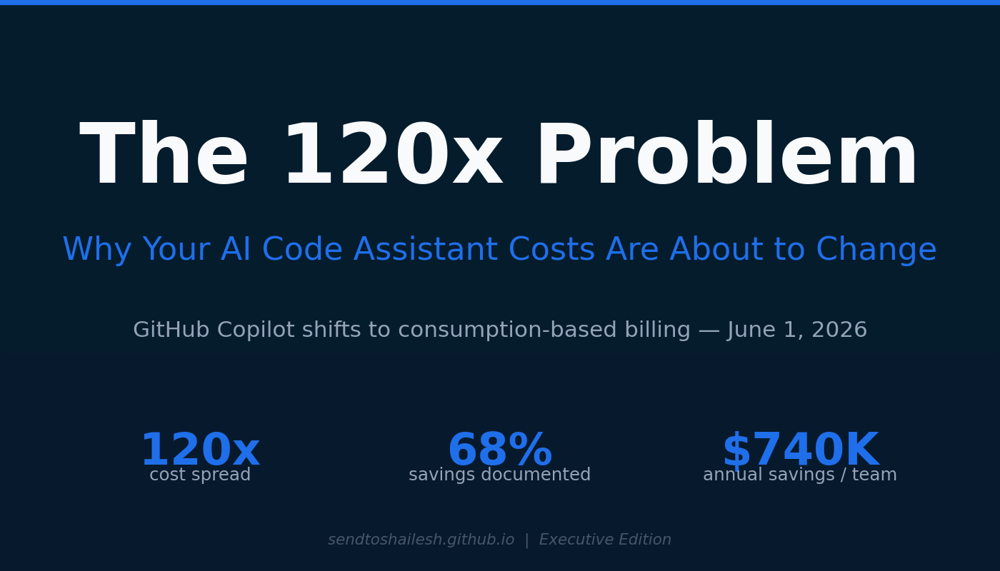
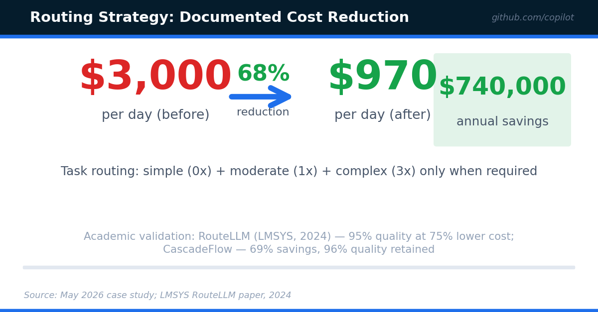
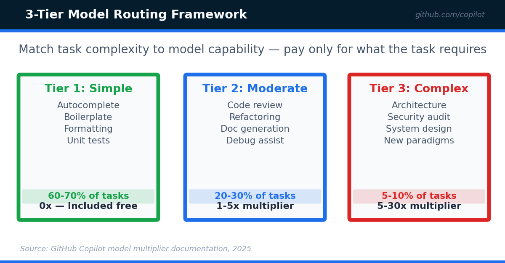

<!-- Medium Post - Part 1 Cost Article (Executive Edition) -->
<!-- Canonical: https://sendtoshailesh.github.io/content-creation/ai-code-assistant-cost-part-1 -->

── START COPY ──

# The Billing Model Change That Belongs in Next Quarter’s Budget Review

The billing model decision is a board-level cost risk. GitHub Copilot moves to consumption pricing June 1, 2026 (as of May 2026 — subject to change): a 120x cost spread between model tiers. A published case study (2026) documented a 100-developer team cutting $3,000/day to $970/day — 68% — through model routing.

The framework, by exhibit:

Full analysis and governance framework →
[https://sendtoshailesh.github.io/content-creation/ai-code-assistant-cost-part-1](https://sendtoshailesh.github.io/content-creation/ai-code-assistant-cost-part-1)

*Sources: GitHub Copilot billing documentation (2025); published case study (2026); LMSYS RouteLLM, 2024; CascadeFlow, 2024; Apple ML Research, 2025.*

── END COPY ──

---

**Import instructions:** Use Medium’s import tool (https://medium.com/p/import) with the GitHub raw URL for this file to preserve image references and set the canonical URL automatically.
