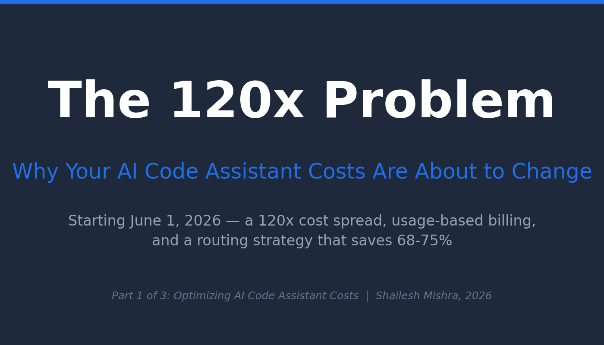
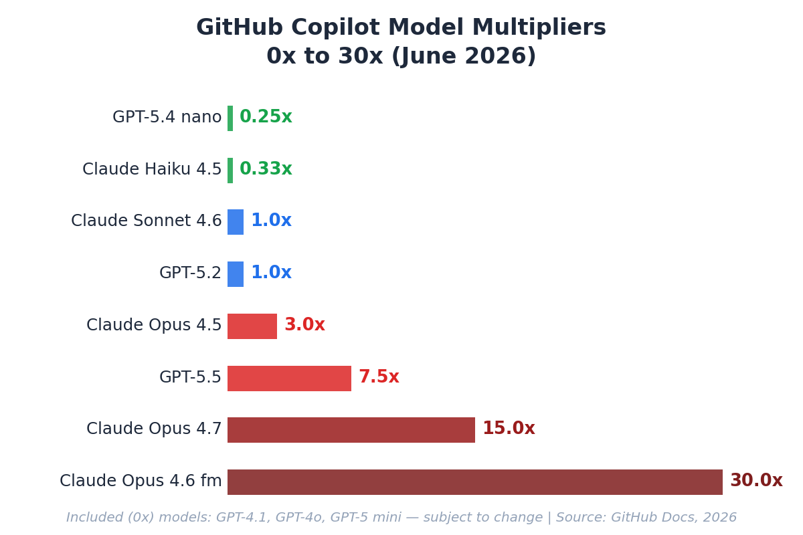
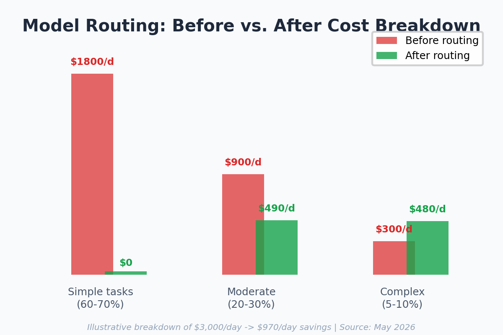

<!-- Medium Post - Part 1 Cost Article (Practitioner Edition) -->
<!-- Canonical: https://sendtoshailesh.github.io/content-creation/ai-code-assistant-cost-part-1 -->

── START COPY ──

# The 120x Problem: GitHub Copilot’s New Cost Model (Visual Guide)

GitHub Copilot moves to consumption billing June 1, 2026 (as of May 2026 — subject to change). The cost spread between models in the same product: 120x. One team cut $3,000/day to $970/day with model routing — a 68% reduction.

The framework, step-by-step:

Full guide with implementation code →
[https://sendtoshailesh.github.io/content-creation/ai-code-assistant-cost-part-1](https://sendtoshailesh.github.io/content-creation/ai-code-assistant-cost-part-1)

*Sources: GitHub Copilot billing documentation (2025); published case study (2026); LMSYS RouteLLM, 2024; CascadeFlow, 2024; Apple ML Research, 2025.*

── END COPY ──

---

**Import instructions:** Use Medium’s import tool (https://medium.com/p/import) with the GitHub raw URL for this file to preserve image references and set the canonical URL automatically.
