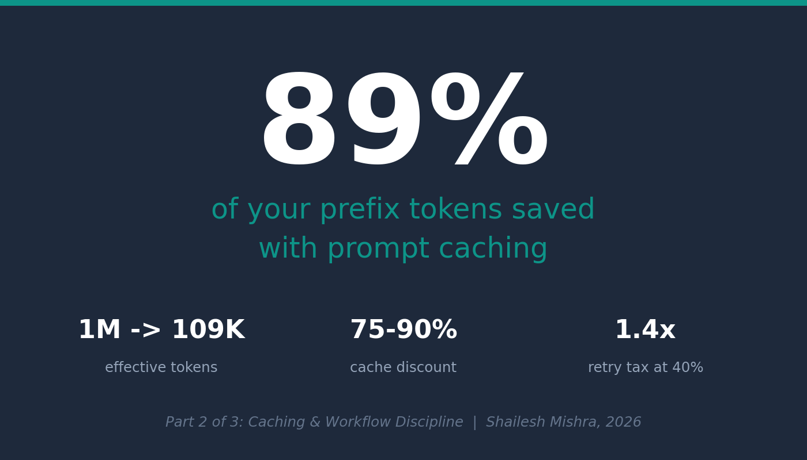
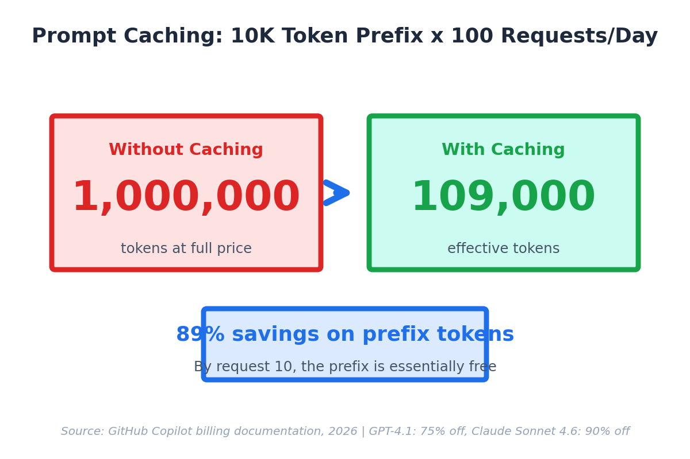
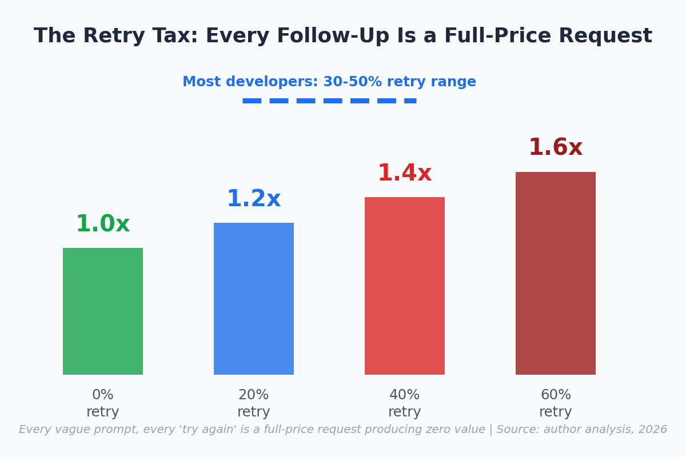

<!-- Medium Post - Part 2 Caching & Workflow (Practitioner Edition) -->
<!-- Canonical: https://sendtoshailesh.github.io/blog/ai-code-assistant-caching-workflow-part-2.html -->

── START COPY ──

# The Invisible Savings: Caching and the Retry Tax (Visual Guide)

90% of your AI prompt context repeats across every request. Under GitHub Copilot's usage-based billing (June 2026), cached tokens cost 75-90% less — and the retry tax silently inflates your spend by 1.4x if 40% of prompts need follow-ups (as of May 2026 — subject to change).

The math, step by step:

Full guide with caching rates, workflow disciplines, and retry reduction framework ->
[https://sendtoshailesh.github.io/blog/ai-code-assistant-caching-workflow-part-2.html](https://sendtoshailesh.github.io/blog/ai-code-assistant-caching-workflow-part-2.html)

*Sources: GitHub Copilot billing documentation (2025); OpenAI and Anthropic published per-token rates; author analysis (2026).*

── END COPY ──

---

**Import instructions:** Use Medium's import tool (https://medium.com/p/import) with the GitHub raw URL for this file to preserve image references and set the canonical URL automatically.
