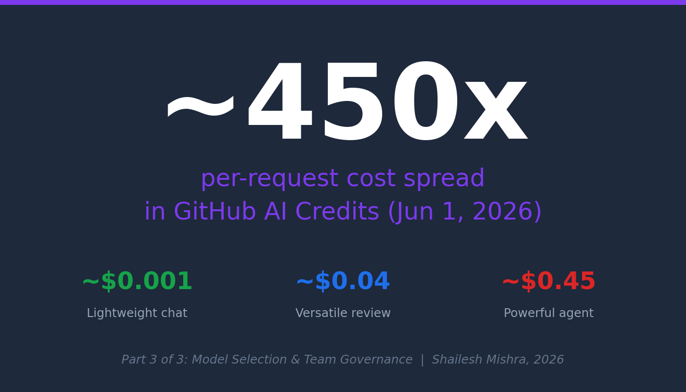
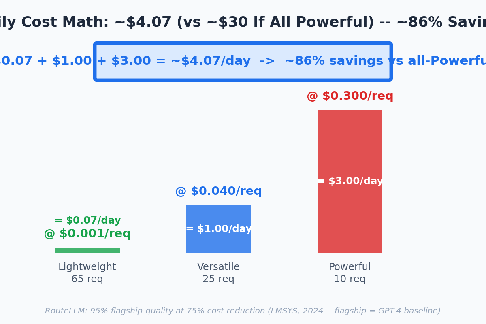

<!-- Medium Post - Part 3 Model Selection (Practitioner Edition) -->
<!-- Canonical: https://sendtoshailesh.github.io/blog/ai-code-assistant-model-selection-part-3.html -->

── START COPY ──

# From PRUs to AI Credits: The Token-Based Bill Is Already Here (Visual Guide)

On June 1, 2026, GitHub Copilot retires Premium Request Units and switches to **[token-metered AI Credits](https://github.blog/news-insights/company-news/github-copilot-is-moving-to-usage-based-billing/)** (1 credit = $0.01). A short Lightweight chat reply costs ~$0.001. A deep Powerful agent session can cost $0.45. That is a ~450x per-request cost spread, now visible on your bill in real dollars.

[Apple ML Research](https://machinelearning.apple.com/research/illusion-of-thinking) found reasoning models burn extra tokens on simple tasks with zero quality gain — the expensive model is not always better. The right question is "which model category fits this task?" *(Specific model examples are as of May 2026; GitHub's [Lightweight / Versatile / Powerful](https://docs.github.com/en/copilot/reference/copilot-billing/models-and-pricing) categories are what stay durable.)*

The 3-category routing framework:

Full guide with per-1M-token pricing table, [RouteLLM](https://lmsys.org/blog/2024-07-01-routellm/) case study, and team governance playbook for AI team leads ->
[https://sendtoshailesh.github.io/blog/ai-code-assistant-model-selection-part-3.html](https://sendtoshailesh.github.io/blog/ai-code-assistant-model-selection-part-3.html)

*Sources (verify directly): [GitHub Blog — usage-based billing](https://github.blog/news-insights/company-news/github-copilot-is-moving-to-usage-based-billing/); [GitHub Docs — Models and Pricing](https://docs.github.com/en/copilot/reference/copilot-billing/models-and-pricing); [Apple ML Research — The Illusion of Thinking](https://machinelearning.apple.com/research/illusion-of-thinking); [LMSYS RouteLLM (2024)](https://lmsys.org/blog/2024-07-01-routellm/); [CascadeFlow (arXiv 2024)](https://arxiv.org/abs/2406.00073); [TDS production case study](https://towardsdatascience.com/inference-scaling-test-time-compute-why-reasoning-models-raise-your-compute-bill/). In RouteLLM's 2024 paper, "GPT-4" refers to the then-current flagship baseline.*

── END COPY ──

---

**Import instructions:** Use Medium's import tool (https://medium.com/p/import) with the GitHub raw URL for this file to preserve image references and set the canonical URL automatically.
