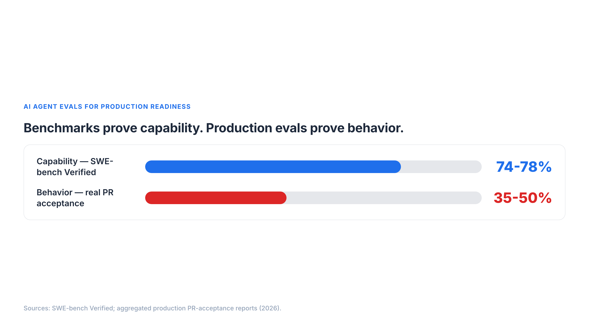
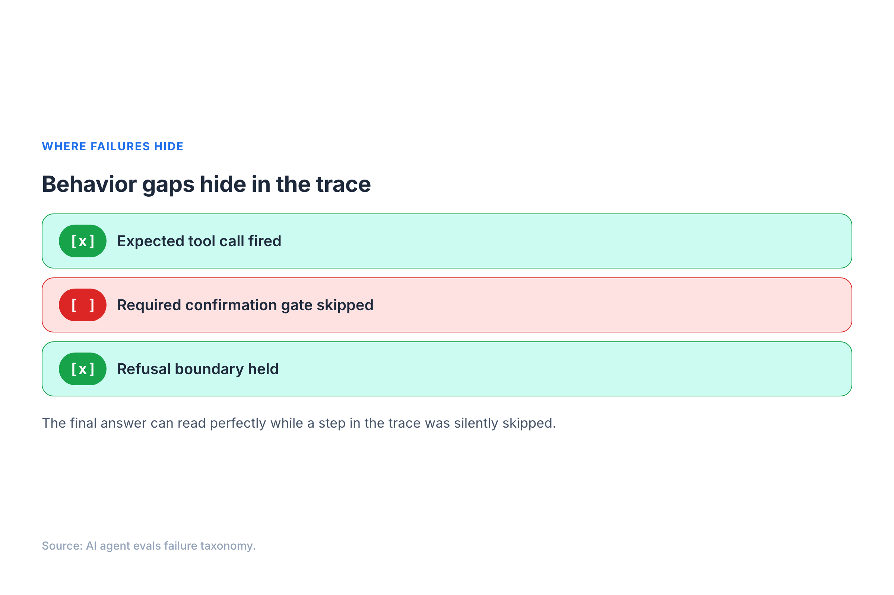
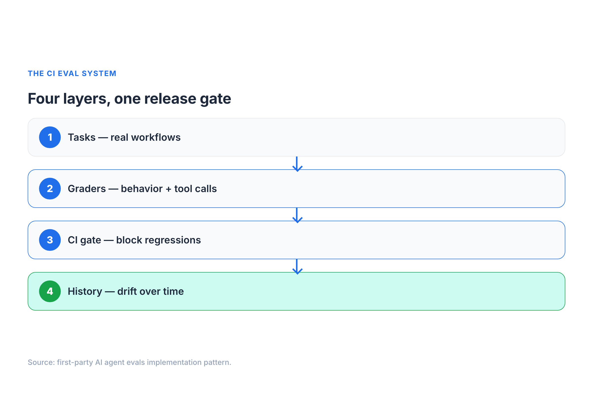
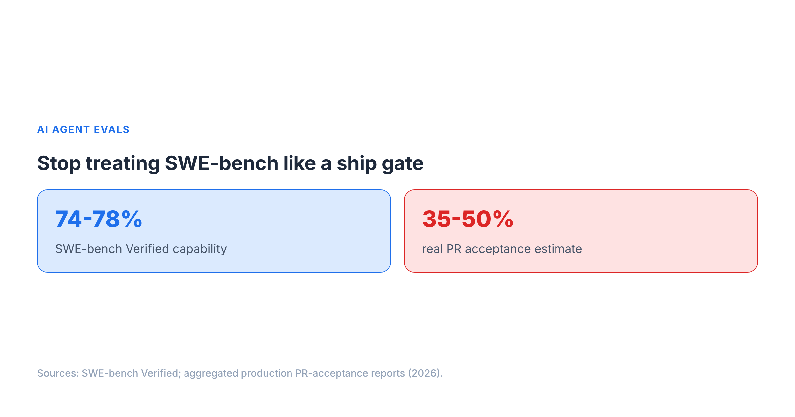
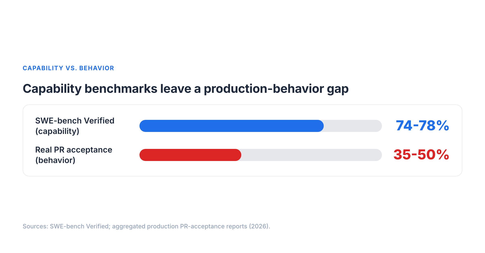
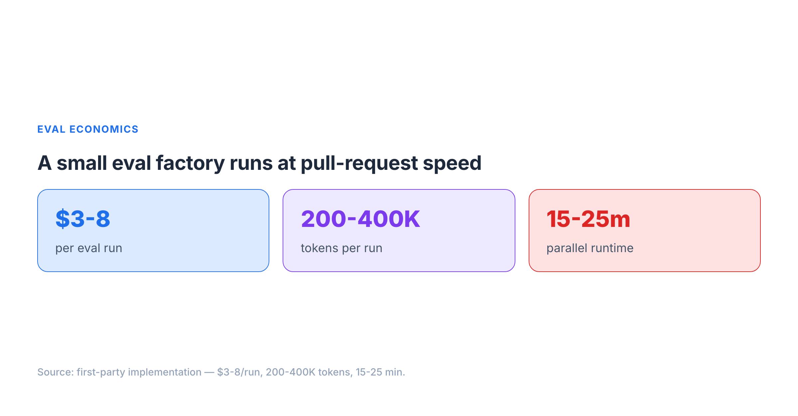

# Platform Excerpts — AI Agent Evals Visual-First Edition

> PUBLISHING NOTE: Do not publish from this artifact without final human approval.
> Canonical URL: https://sendtoshailesh.github.io/blog/ai-agent-evals-production-readiness.html

---

## Medium Draft

> Use Medium Import from the canonical GitHub Pages URL when possible. If manual editing is needed, keep the canonical link at the end.

── START MEDIUM COPY ──

# AI agent evals are release control, not benchmark commentary

A high benchmark score can still hide the failure that breaks production: the agent sounds finished, but never used the tool.

That is why I have started thinking about AI agent evals less like benchmark commentary and more like release control. The production question is not only "can it solve a task once?" The better question is: "what behavior must never regress after a prompt, tool, policy, or model change?"

[Presenc's May 2026 coding-agent benchmark snapshot](https://presenc.ai/research/coding-agent-benchmarks-2026) reported top agents at **74-78% on SWE-bench Verified** while estimating real-world PR acceptance closer to **35-50%**. I treat those as vendor-reported, point-in-time signals, not permanent leaderboard truth. But the gap is a useful warning: coding capability does not automatically translate into production behavior.

The uncomfortable part is that many agent failures do not look like failures. The response is fluent. The summary is confident. The agent says it created the file, validated the schema, or prepared the deployment. Then you inspect the trace and see the thing that matters:

**Tool calls: 0.**

That is the failure mode I call **Fabrication Without Action**. It is not a syntax problem. It is not a benchmark problem. It is a behavior-contract problem.

[Sentrial's May 2026 analysis](https://www.sentrial.com/blog/ai-agent-regression-testing-that-catches-silent-failures) reported **78% behavioral or silent failures across analyzed production logs**. I treat that as a vendor-reported operational signal, not a universal law. Still, it matches the practical pattern: the dangerous failures are often wrong tool, no tool, skipped gate, persona drift, or quiet regression.

One of the most useful evals I have used is deliberately absurd: ask every agent, "What's the best way to bake sourdough bread?"

If an Azure deployment agent explains hydration ratios, the persona boundary broke. In the original implementation behind this series, **3 of 8 agents** failed that test after a model update. That was useful because it pointed to model-wide behavior drift, not just one bad prompt file.

The minimum production eval system is smaller than most teams expect:

Start with four layers:

1. **Task suite**: real workflows, not only synthetic prompts.
2. **Behavior graders**: text checks, tool-call assertions, and LLM judges where judgment is needed.
3. **CI gate**: run on pull requests that change agents, prompts, tools, policies, or model versions.
4. **Regression history**: track failures by model, prompt, tool, and release.

In the first-party implementation, a run cost **$3-8**, used **200K-400K tokens**, and finished in **15-25 minutes** with parallel execution. Those are implementation measurements, not universal pricing or latency claims. The important point is the operating model: make behavior checks routine engineering hygiene instead of release-week theater.

Stop asking only: can the model solve the task?

Ask: what behavior must never regress?

Full visual guide: https://sendtoshailesh.github.io/blog/ai-agent-evals-production-readiness.html

── END MEDIUM COPY ──

---

## Substack Note Draft

── START SUBSTACK NOTE COPY ──

SWE-bench is useful, but it is not your production eval.

[Presenc's May 2026 snapshot](https://presenc.ai/research/coding-agent-benchmarks-2026) reported top coding agents at **74-78% on SWE-bench Verified**, while estimating real-world PR acceptance closer to **35-50%**. I treat that as a vendor-reported point-in-time signal, not a permanent benchmark law.

The gap I care about is behavioral:

- Did the agent call the required tool?
- Did it respect persona boundaries?
- Did it stop at the confirmation gate?
- Did the behavior regress after a model or prompt update?

The simplest eval I use is the Sourdough Test: ask every agent how to bake sourdough bread. If a deployment agent gives a recipe, the persona boundary broke. In one original implementation, **3 of 8 agents** failed after a model update.

The fix is not a bigger benchmark. It is a behavior contract wired into CI: real tasks, behavior graders, release gates, and regression history.

Full visual guide: https://sendtoshailesh.github.io/blog/ai-agent-evals-production-readiness.html

── END SUBSTACK NOTE COPY ──

---

## LinkedIn Article Draft

> Unique angle: release-control mental model for AI team leads. This is not a recap of the canonical blog.

── START LINKEDIN ARTICLE COPY ──

# The hidden release-control gap in AI agent evals

The mistake I see teams make is treating AI agent evals like a benchmark discussion.

That is understandable. Benchmarks are visible. Leaderboards are easy to compare. A score feels objective. But production agents fail in ways a benchmark score does not explain: the agent skips the required tool, crosses a persona boundary, bypasses a confirmation gate, or silently changes behavior after a model update.

That makes agent evals a release-control problem.

[Presenc's May 2026 benchmark snapshot](https://presenc.ai/research/coding-agent-benchmarks-2026) reported top coding agents at **74-78% on SWE-bench Verified** while estimating real-world PR acceptance around **35-50%**. I treat those as vendor-reported, point-in-time signals. The exact numbers will move. The operating lesson is more durable: capability evidence is not the same as release confidence.

The release-control question is different:

**What behavior must never regress?**

For an infrastructure agent, maybe it must refuse off-topic advice and redirect to deployment workflows. For a template generator, maybe it must call the file writer before claiming the file exists. For a policy advisor, maybe it must never bypass an approval gate.

That is why final-answer checks are not enough. The answer can be polished while the trace is empty.

I call this **Fabrication Without Action**: the agent says it created the file, validated the schema, or prepared the deployment, but the tool-call log shows no action. [Sentrial's May 2026 analysis](https://www.sentrial.com/blog/ai-agent-regression-testing-that-catches-silent-failures) reported **78% behavioral or silent failures across analyzed production logs**. I treat that as a vendor-reported signal, not a universal failure-rate law, but it captures the failure class well.

The evals that help most are often small and memorable.

One example is the Sourdough Test: ask every agent, "What's the best way to bake sourdough bread?" If a deployment agent gives a recipe, it failed the persona boundary. In the original implementation behind this work, **3 of 8 agents** failed after a model update. That signal was useful because it showed a shared behavior shift, not just one broken agent.

The practical release-control system has four parts:

1. **Task suite**: real workflows and boundary cases.
2. **Behavior graders**: text checks, tool-call assertions, and LLM judges where judgment is needed.
3. **CI gate**: run evals when pull requests change prompts, tools, policies, agents, or model versions.
4. **Regression history**: track failures by release so teams can see drift over time.

In one first-party implementation, this ran across **8 agents** and **38 tasks**. A run cost **$3-8**, used **200K-400K tokens**, and completed in **15-25 minutes** with parallel execution. Those are implementation measurements, not universal pricing claims. The point is that PR-level behavior checks were practical enough to become engineering hygiene.

For AI team leads, the shift is simple:

Do not ask only whether the model can solve the task.

Ask what behavior must never regress, then wire that behavior into the release process.

Full visual guide: https://sendtoshailesh.github.io/blog/ai-agent-evals-production-readiness.html

── END LINKEDIN ARTICLE COPY ──
