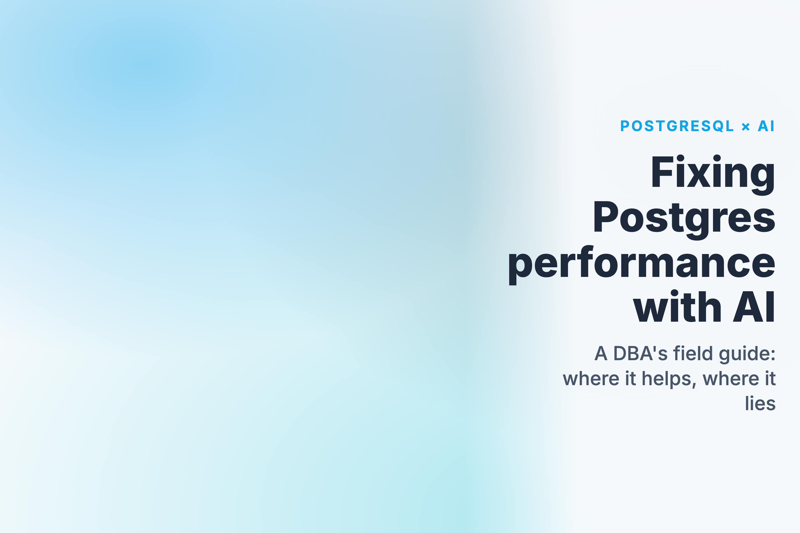
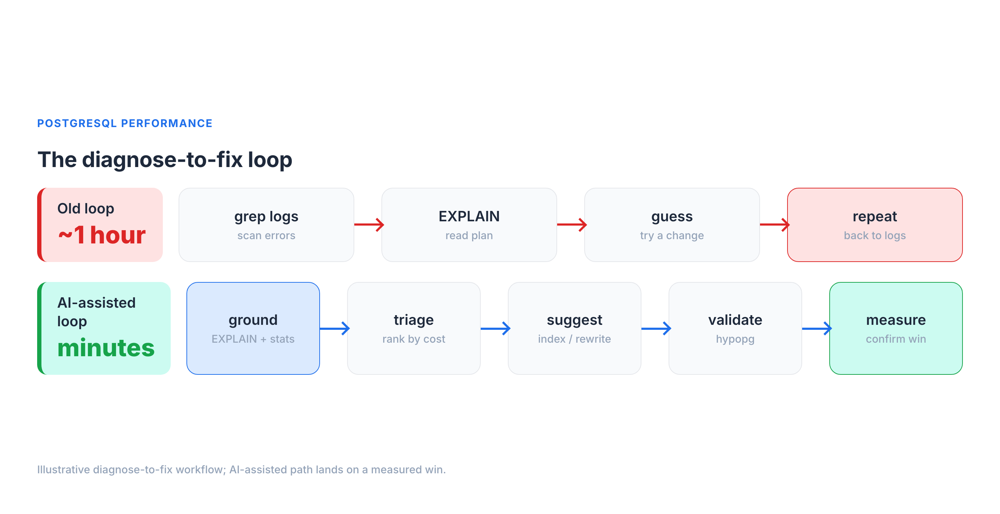
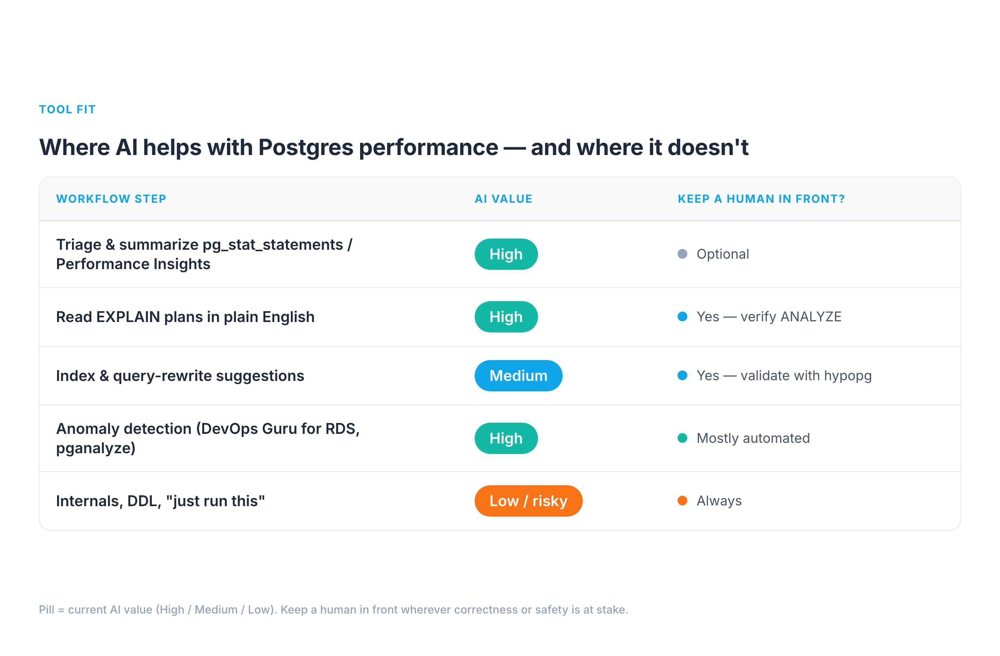
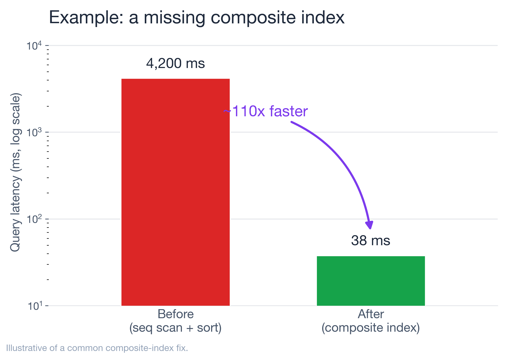

# How AI Actually Helps You Fix PostgreSQL Performance Problems (and Where It Lies)



It's 2 a.m. and p99 on the orders API just jumped from 90 ms to 6 seconds. You know this dance:
tail the logs, pull the offending query, run `EXPLAIN`, squint at a plan, form a theory, test it,
repeat. On a bad night that loop runs an hour before you find the seq scan hiding behind a
function call on an indexed column.

I've spent a lot of time in that loop with customers' Postgres fleets, and over the last year I
started feeding parts of it to LLMs. My honest verdict: AI will *not* replace your
`EXPLAIN ANALYZE` instincts, and anyone selling "autonomous database tuning" is selling you a
2 a.m. outage. But pointed at the right four steps — triage, plan reading, index suggestions, and
anomaly detection — and **grounded in your real statistics**, it compresses that diagnose-to-fix
loop from an hour to a few minutes.

This is a field guide to where that works, where it confidently lies to you, and how to keep a
human in the loop.



## The honest baseline: what AI can and can't see

Here is the single most important thing to internalize before you trust a word an LLM says about
your database: **it cannot see your database.** It doesn't know your Postgres version, your
`shared_buffers`, your table sizes, your `pg_stat_statements`, your buffer hit ratio, or that one
table that's 40% dead tuples. Out of the box it's a very well-read DBA who has never logged into
your server.

That gap produces three failure modes I see constantly:

1. **Hallucinated internals.** Ask a generic model "how do I see index bloat in Postgres" and
   you'll sometimes get a confidently-wrong `pg_stat` column that doesn't exist, or a `pgstattuple`
   call with the wrong signature. It reads plausible; it doesn't run.
2. **Stale defaults.** Models are trained on a decade of mixed-version Postgres content. Ask about
   `work_mem` and you may get advice that treats the 4 MB default as a single global budget — when
   it's actually allocated *per sort/hash operation, per connection*, and can multiply across
   parallel workers — alongside pre-13 autovacuum assumptions, ignoring that parallel query (PG 9.6+),
   JIT (PG 11+), and B-tree deduplication (PG 13+) each changed the calculus.
3. **Confident rewrites that change results.** "Just replace the correlated subquery with a
   `LEFT JOIN`" — except the join multiplies rows and your `COUNT` is now wrong. The model has no
   way to know your data distribution.

This is exactly the "teach an LLM what it doesn't know about PostgreSQL" problem: the model's prior
is generic, and your database is specific. And there's hard data on how wide that gap is. On the
[BIRD benchmark](https://bird-bench.github.io/) — text-to-SQL over 95 real, messy databases —
GPT-4 scores **54.89%** execution accuracy *with* curated external knowledge about the data, and
just **34.88%** without it, versus **92.96%** for expert humans. That's a ~38-point gap on getting
SQL merely *correct* against real data, before you even ask whether it's *fast*. The lesson isn't
"AI is useless"; it's that the model's accuracy is dominated by how much real context you give it.

So the entire game is **grounding** — every prompt that matters carries real evidence:

- the exact `EXPLAIN (ANALYZE, BUFFERS)` output (actual rows, actual timings, actual buffer hits),
- the relevant rows from `pg_stat_statements` (calls, `mean_exec_time`, `rows`),
- your `SELECT version();` and the non-default settings from `pg_settings`.

Feed those, and the same model goes from horoscope to genuinely useful. Withhold them, and you're
just autocompleting Stack Overflow.

## Where AI genuinely helps (and where it doesn't)

Across the performance workflow, the value is wildly uneven. Here's the map I use.



**1. Triage and summarization — high value.** `pg_stat_statements` on a busy system has thousands
of rows. Pasting the top 20 by `total_exec_time` and asking "group these by likely root cause and
rank what to investigate first" is genuinely great. The model is doing pattern-matching and
summarization — exactly its strength — and the stats are real, so it can't hallucinate the
workload. Same for RDS Performance Insights: dump the top SQL by DB load and wait event, and let it
narrate "you're bottlenecked on `LWLock:BufferContent`, not CPU."

**2. Reading plans in plain English — high value, with a catch.** Hand a model an
`EXPLAIN (ANALYZE, BUFFERS)` tree and "explain why this is slow," and it will reliably spot the
seq scan, the bad row estimate (estimated 12 rows, actual 2.1 million), the nested loop that should
be a hash join, the external merge sort spilling to disk. The catch: it explains the plan it was
*given*. If you paste `EXPLAIN` without `ANALYZE`, it's reasoning about estimates, not reality —
and so are you.

**3. Index and rewrite suggestions — medium value, never auto-apply.** This is where AI is a strong
candidate-generator and a terrible decision-maker. It will propose sensible indexes and rewrites,
but it can't know whether a new index will wreck your write throughput, duplicate an existing one,
or never get chosen by the planner. Treat every suggestion as a hypothesis to validate — which is
what `hypopg` is for (more below).

**4. Anomaly detection — high value, but that's classic ML, not LLMs.** "AI for Postgres
performance" mostly means time-series anomaly detection here: AWS DevOps Guru for RDS learns your
DB-load baseline and flags deviations with probable causes; pganalyze surfaces regressions in query
plans and index usage. These aren't chatbots — they're trained models on your metrics, and they're
the most mature, lowest-risk AI in this whole space.

**5. Internals, DDL, and "just run this" — low value / high risk.** Generating migrations, lock
analysis, or `VACUUM FULL` advice from a generic model is where the hallucinated-internals and
stale-defaults failures bite hardest, and the blast radius is your production data. Keep humans
firmly in front of anything that takes a lock or changes schema.

## Real example 1: the missing composite index

A multi-tenant SaaS dashboard query, on a ~50M-row `events` table:

```sql
SELECT * FROM events
WHERE tenant_id = $1 AND date_trunc('day', created_at) = $2
ORDER BY created_at DESC LIMIT 50;
```

Mean latency from `pg_stat_statements`: ~4,200 ms. I pasted the `EXPLAIN (ANALYZE, BUFFERS)` into
Claude with the table's row count and existing indexes (a lone index on `tenant_id`). It immediately
flagged two things a tired human misses at 2 a.m.:

- the `date_trunc('day', created_at) = $2` predicate is **non-sargable** — wrapping the column in a
  function means the existing index can't be used for that filter, forcing a filter-after-scan;
- there's no composite index supporting `(tenant_id, created_at)`, so the `ORDER BY ... LIMIT`
  can't be satisfied by an index walk.

Its suggestion: rewrite the predicate as a half-open range and add a composite index.

```sql
-- rewrite: sargable range instead of a function on the column
WHERE tenant_id = $1
  AND created_at >= $2::date
  AND created_at <  ($2::date + INTERVAL '1 day')
ORDER BY created_at DESC LIMIT 50;

CREATE INDEX CONCURRENTLY idx_events_tenant_created
  ON events (tenant_id, created_at DESC);
```

Here's the part that matters: **I did not run `CREATE INDEX` on the model's say-so.** I validated
the hypothesis first with `hypopg`, which creates a *hypothetical* index so the planner will cost
it without building anything:

```sql
SELECT * FROM hypopg_create_index(
  'CREATE INDEX ON events (tenant_id, created_at DESC)');
EXPLAIN  -- replan with the hypothetical index; confirm Index Scan + low cost
SELECT ... ;
```

The plan flipped from a Seq Scan + Sort to an Index Scan, so I built it for real with
`CONCURRENTLY` (which builds without blocking reads or writes). After: ~38 ms — about a **110×
improvement**, illustrative of a composite-index win I see often. The AI didn't do anything I
couldn't have; it just got me to the right hypothesis in 30 seconds instead of 30 minutes, and
`hypopg` — not the model — made it safe.



## Real example 2: bloat and autovacuum starvation

Writes on a high-churn `sessions` table had slowed, and the table was bigger on disk than its live
data justified. `pg_stat_user_tables` told the real story:

```sql
SELECT relname, n_live_tup, n_dead_tup,
       last_autovacuum, autovacuum_count
FROM pg_stat_user_tables WHERE relname = 'sessions';
```

`n_dead_tup` was climbing into the millions and `last_autovacuum` was hours stale. I gave the model
those numbers plus the cluster's autovacuum settings. It correctly explained the mechanism:
autovacuum triggers at `autovacuum_vacuum_threshold + autovacuum_vacuum_scale_factor * n_live_tup`,
and with the default scale factor of **0.2** on a large, hot table, the trigger point is so high the
table bloats badly between runs. Its fix — lower the scale factor *for that table only*:

```sql
ALTER TABLE sessions SET (
  autovacuum_vacuum_scale_factor = 0.02,
  autovacuum_vacuum_cost_limit   = 2000);
```

This is a good example of the division of labor. The model nailed the *mechanism and the knob*,
which is textbook and well-grounded. But the *values* are workload-dependent — I treated 0.02 as a
starting hypothesis, watched `n_dead_tup` and `last_autovacuum` over the next day, and tuned from
there. If I'd let it pick numbers blind, it would have guessed; with real stats in front of it, it
reasoned.

## Real example 3: connection storms and wait events

A deploy doubled traffic and latency went non-linear. CPU was fine. The tell was in
`pg_stat_activity`:

```sql
SELECT wait_event_type, wait_event, state, count(*)
FROM pg_stat_activity
GROUP BY 1,2,3 ORDER BY 4 DESC;
```

Hundreds of connections, most `idle in transaction` or waiting on `Client`/`LWLock`. I described the
shape to the model; it correctly diagnosed connection saturation rather than a slow query —
Postgres's per-connection backend model means thousands of connections is a problem in itself — and
pointed at a pooler (PgBouncer in transaction mode, or RDS Proxy on AWS). The fix was a pooler plus
hunting down the app code leaving transactions open.

The caveat worth repeating: the model gave the *right category* of answer because I gave it the
*right signal* (wait events, connection counts). Ask it "why is Postgres slow after a deploy" with
no data and it'll happily lecture you about missing indexes while your real problem is 2,000 idle
connections.

## Real example 4: tuning the AI workload that now lives *inside* Postgres

There's a second meaning to "AI and Postgres performance" that's easy to miss: more and more of the
AI workload now *runs in Postgres*, via `pgvector` for semantic search and RAG. And vector indexes
have their own brutal tuning trade-off that an LLM will happily get wrong if you don't feed it
numbers.

The two index types — IVFFlat and HNSW — are not interchangeable. On a representative benchmark of
500K 768-dimension vectors ([markaicode](https://markaicode.com/benchmarks/postgresql-pgvector-benchmark/),
corroborated by [BigDataBoutique](https://bigdataboutique.com/blog/hnsw-vs-ivfflat-how-to-choose-the-right-vector-index)
and the [pgvector docs](https://github.com/pgvector/pgvector)):

- **HNSW**: p50 ~4 ms, p95 ~8 ms at ~99% recall — but the index takes ~14 minutes to build and uses
  more RAM.
- **IVFFlat**: p50 ~18 ms, p95 ~35 ms at ~97.5% recall — but builds ~7× faster (~2 minutes) and uses
  ~20–25% less memory.

So HNSW is roughly 3–5× faster on queries at comparable recall, at the cost of build time and
memory. The right call depends on dataset size, write rate, and your latency budget — context an LLM
doesn't have unless you give it. The failure mode I see: someone asks a chatbot "which pgvector index
should I use," gets a confident "HNSW, always," and then watches index builds dominate their batch
window on a 50M-row table that rebuilds nightly. Feed the model your row count, write pattern, recall
target, and latency SLO, and the *same* question produces a genuinely useful answer. Same lesson as
the relational side: grounding turns a horoscope into engineering.

## Wiring AI into the loop safely

The pattern that's changed how I work is connecting the model to **live, read-only** stats instead
of copy-pasting. Postgres MCP servers expose database tools to an assistant over a controlled
connection. The open-source [`postgres-mcp` ("Postgres MCP Pro")](https://github.com/crystaldba/postgres-mcp)
is the most complete one I've used: it does **index tuning** by exploring "thousands of possible
indexes... using industrial-strength algorithms," validates **query plans** by simulating
hypothetical indexes (i.e., `hypopg` under the hood), runs **database health** checks (index health,
buffer cache, vacuum health, replication lag, sequence limits), and — critically — supports a
**read-only / safe-SQL mode** for production. In Crystal DBA's own write-up, they took an
AI-generated movie app whose SQLAlchemy ORM queries were "painfully slow" and fixed the indexing and
query issues "in minutes" by letting the agent explore the schema and simulate indexes — exactly the
grounded, validated loop this whole post argues for.

My rules for wiring it in:

- **Read-only by default.** A dedicated role with `SELECT` on the stats views and `pg_monitor`
  membership — never a superuser, never DDL. (Postgres MCP Pro's `--access-mode` defaults matter here.)
- **Never auto-apply DDL or DML.** Index creation, `ALTER TABLE`, `VACUUM` — human runs these, after
  validation. `hypopg` for index hypotheses; a staging replica for anything heavier.
- **Pin the version and settings** in the context so advice matches *your* Postgres, not the
  internet's average Postgres.
- **Validate, then measure.** Every change gets a before/after on `mean_exec_time` or DB load — the
  same discipline you'd apply to a human's suggestion.

The tool landscape, roughly by maturity and what each will actually *do*:

- **Anomaly detection (most mature).** [AWS DevOps Guru for RDS](https://docs.aws.amazon.com/devops-guru/latest/userguide/working-with-rds.html)
  learns your DB-load baseline from Performance Insights and flags deviations with probable causes —
  but note it points you at the problem query and tells you to "investigate execution plan / consider
  indexes"; it does **not** emit the `CREATE INDEX` for you.
- **Index advice (specific).** [pganalyze's Index Advisor](https://pganalyze.com/docs/index-advisor)
  goes further: it emits the exact `CREATE INDEX` statement *and* an estimated impact (its docs show
  cases like a query dropping from ~150 ms to <1 ms), continuously, as your workload shifts.
- **Assisted analysis.** RDS Performance Insights + **Amazon Q**, and MCP-fed LLMs like Postgres MCP
  Pro, for plan-reading and triage.
- **Fully-autonomous tuning** is still a demo, not a production practice. Keep the human on DDL.

## The playbook

When a slow query lands on me now, the loop is:

1. **Ground it** — capture `EXPLAIN (ANALYZE, BUFFERS)`, the `pg_stat_statements` row, version, and
   non-default settings.
2. **Triage** — let AI rank and summarize; you pick what to chase.
3. **Hypothesize** — ask for plan explanation + index/rewrite candidates.
4. **Validate** — `hypopg` for indexes, a replica for heavier changes; confirm the planner agrees.
5. **Apply** — human-run, `CONCURRENTLY` for indexes, off-peak for anything that locks.
6. **Measure** — before/after on latency or DB load; keep what wins.

AI took the slowest, most error-prone parts of that loop — reading dense plans and remembering every
diagnostic view — and made them fast. It did *not* take the judgment, and it shouldn't. The DBAs
getting value from this aren't the ones who handed the keys to a chatbot; they're the ones who turned
it into a very fast, very well-read junior who always shows their work — and who still gets every
suggestion checked before it touches production.

Try one step this week: take a genuinely slow query, feed its `EXPLAIN (ANALYZE, BUFFERS)` to a
model *with* the table stats, and see how close it gets. Validate before you apply. That single habit
— grounded prompts, validated changes — is the whole difference between AI that helps and AI that
pages you at 2 a.m.

---

## Sources & further reading

- BIRD benchmark (text-to-SQL on real databases): <https://bird-bench.github.io/> — GPT-4 54.89% / 34.88% execution accuracy vs 92.96% for humans.
- pgvector & index trade-offs: [pgvector](https://github.com/pgvector/pgvector) · [HNSW vs IVFFlat benchmark](https://markaicode.com/benchmarks/postgresql-pgvector-benchmark/) · [BigDataBoutique guide](https://bigdataboutique.com/blog/hnsw-vs-ivfflat-how-to-choose-the-right-vector-index).
- Postgres MCP Pro (index tuning, hypopg simulation, health checks, read-only mode): <https://github.com/crystaldba/postgres-mcp>.
- pganalyze Index Advisor: <https://pganalyze.com/docs/index-advisor>.
- AWS DevOps Guru for RDS: <https://docs.aws.amazon.com/devops-guru/latest/userguide/working-with-rds.html>.
- hypopg (hypothetical indexes): <https://github.com/HypoPG/hypopg>.
- Postgres docs — `EXPLAIN`: <https://www.postgresql.org/docs/current/using-explain.html> · autovacuum: <https://www.postgresql.org/docs/current/routine-vacuuming.html> · `work_mem` (allocated per operation, per connection): <https://www.postgresql.org/docs/current/runtime-config-resource.html> · `CREATE INDEX CONCURRENTLY`: <https://www.postgresql.org/docs/current/sql-createindex.html> · version features (parallel query PG 9.6+, JIT PG 11+, B-tree deduplication PG 13+): <https://www.postgresql.org/about/featurematrix/>.

*The example latencies (4,200 ms → 38 ms, dead-tuple and connection scenarios) are illustrative of
patterns I see repeatedly, not a single benchmarked run; the mechanisms, tools, benchmark figures,
and SQL are real and cited above. Next up: grounding LLMs on live Postgres stats with MCP — follow
along.*
