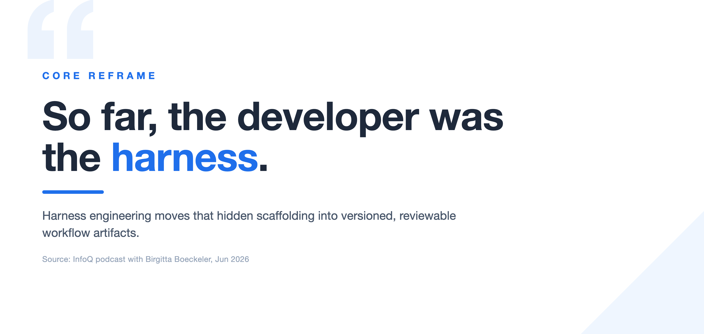
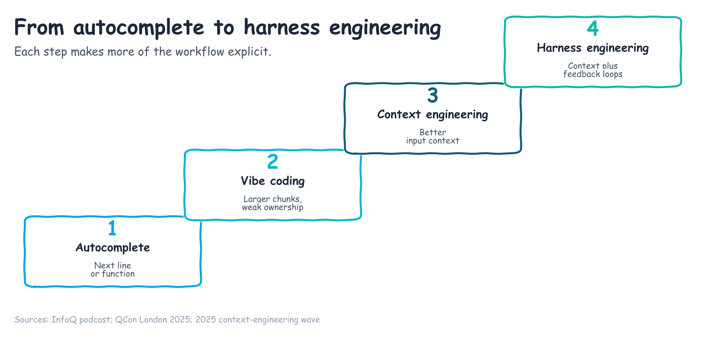
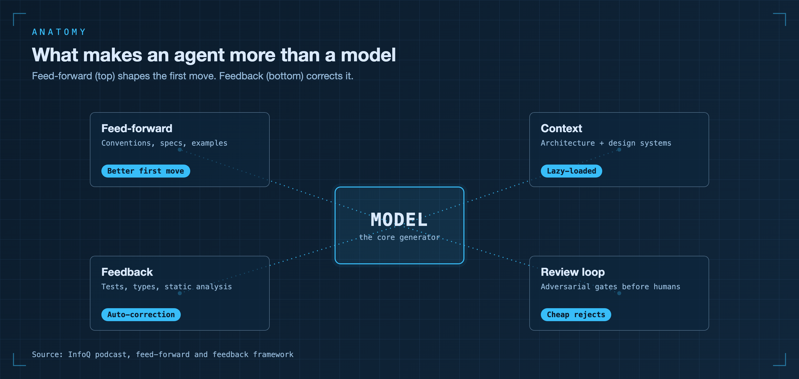
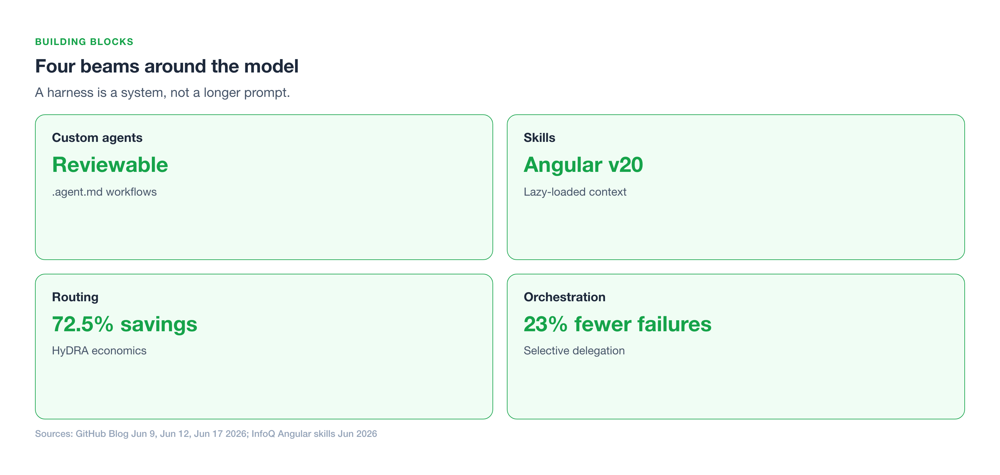
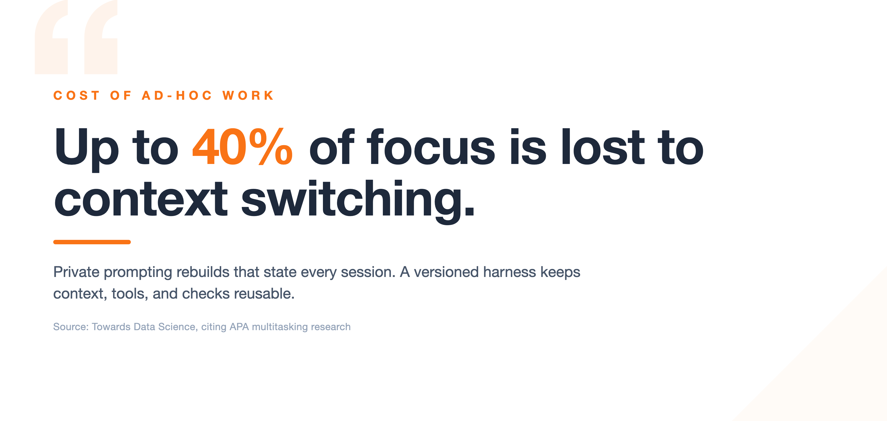
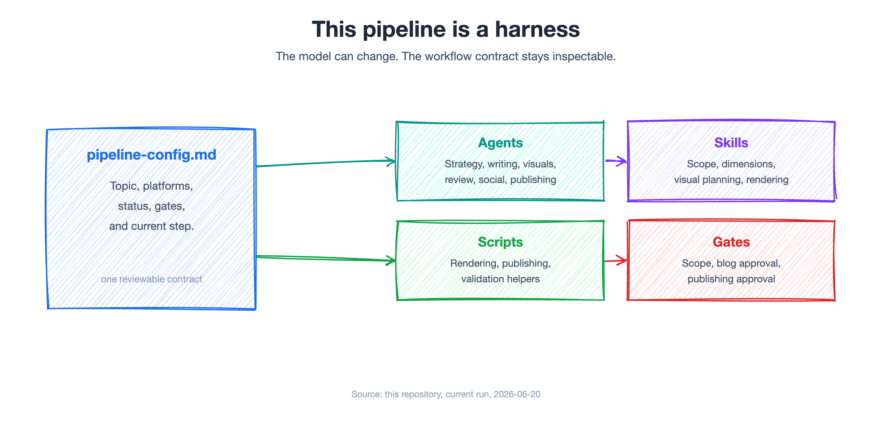
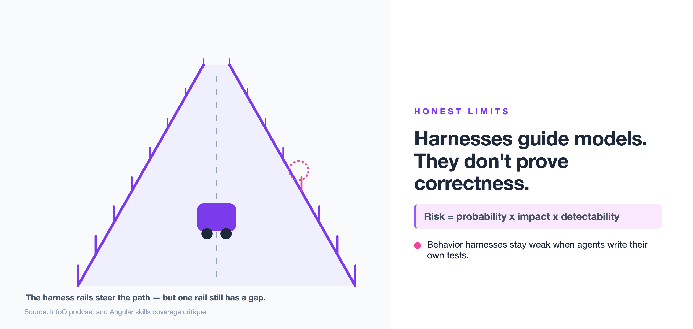
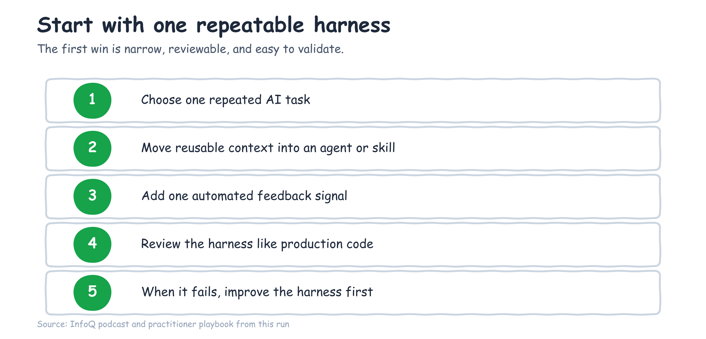

## So far, the developer was the harness

The biggest shift in AI-native development is not another prompt trick. It is
the moment teams stop treating the prompt as the product and start engineering
the system around the model.

I keep seeing the same pattern with customers and in my own content pipeline
work. A developer opens an AI coding assistant, explains the repository,
explains the conventions, explains what counts as done, asks for a change,
watches the model drift, pastes in an error, asks again, then repeats the same
routine tomorrow. The model may be capable, but the work is still fragile
because the scaffolding lives in the developer's head.

Birgitta Boeckeler gave that pattern the cleanest name I have heard on the InfoQ
podcast
[From MCP and Vibe Coding to Harness Engineering](https://www.infoq.com/podcasts/mcp-vibe-coding-harness-engineering/):
"an agent is a model plus a harness." Her sharper line is the one I think will
stick: "So far, the developer was the harness."

That is the workflow shift. The durable skill is no longer writing the perfect
prompt. It is engineering the harness around the model: the versioned
feed-forward context, automated feedback signals, routing decisions, and review
gates that make agentic work repeatable.

## The maturity arc: from autocomplete to harness engineering

The vocabulary changed fast because the practice changed fast.

First came autocomplete. The model predicted the next line or function. It
helped, but the unit of work stayed small.

Then came vibe coding. In the same InfoQ conversation, Boeckeler describes the
term as roughly two months old around QCon London 2025, and frames it as the
stage where developers began asking models for larger chunks of code. That made
demos feel magical, but it often turned into a faster version of copying from
Stack Overflow: useful output, weak ownership, and a lot of cleanup.

Then came context engineering. Around June 2025, the conversation shifted from
"what prompt should I write?" to "what context should the model see?" That was a
real improvement. Repository conventions, architectural notes, issue
descriptions, API docs, and examples all raise the probability that the first
generation lands closer to what the team needs.

Harness engineering is the next step. Context is still part of it, but the
harness also includes feedback, validation, routing, delegation, and review.
Instead of asking the developer to carry those mechanics in working memory, the
team moves them into artifacts that can be inspected, versioned, and improved.

That matters because the cost of carrying workflow state manually is not small.
Manu R. points to an
[APA multitasking overview](https://www.apa.org/topics/research/multitasking)
in
[How to Navigate the Shift from Prompt-Based Tools to Workflow-Driven AI](https://towardsdatascience.com/how-to-navigate-the-shift-from-prompt-based-tools-to-workflow-driven-ai/)
and notes that context switching can cut efficiency by up to 40%. AI tools can
amplify that tax when every tool has its own prompt style, memory model, and
failure mode.

## What a harness actually is

A harness is everything around the model that turns raw generation into a
workflow.

Boeckeler breaks it into two halves in the
[InfoQ podcast](https://www.infoq.com/podcasts/mcp-vibe-coding-harness-engineering/):
feed-forward and feedback.

Feed-forward is the context that helps the model make a better first move. It
includes coding conventions, architectural constraints, design systems, product
requirements, examples, and the task definition. In a software team,
feed-forward is where you encode the things a senior engineer would normally say
before handing work to someone else: here is how this repository is structured,
here is the pattern to follow, here is the thing not to touch, here is what done
means.

Feedback is what lets the agent correct course. It includes static analysis,
type errors, compiler output, tests, custom linters, language-server
refactorings, coverage signals, and adversarial review. Feedback turns an AI
assistant from a one-shot generator into a loop that can notice mismatch and
repair it.

The important point is that feedback is not the same as human supervision. Human
review still matters, especially for risky work. But the harness should catch
cheap, mechanical, local failures before they reach the reviewer. If the
TypeScript compiler already knows the call signature is wrong, or a linter
already knows the import order is invalid, a human should not have to be the
first feedback loop.

Boeckeler also describes the idea of a heads-up display for the agent: a compact
view of static analysis, tests, and coverage. The agent should not need to run
blind. If 50% of tests are failing and coverage dropped 10%, that is not a vibe.
It is a signal.

This is also where the language gets practical for teams. A harness is not a
giant platform project. It can start as one repository file that says what
context matters, one reusable workflow that knows which tools are allowed, and
one validation command that must run before the agent claims success. The shape
is more important than the size: feed-forward before generation, feedback after
generation, and a clear boundary for when human review is required.

That boundary is the part many AI adoption conversations skip. A good harness
does not try to remove judgment. It routes judgment to the right moment. The
model can handle low-risk mechanical correction, the harness can enforce known
checks, and the human can focus on intent, tradeoffs, and behavior that is hard
to detect automatically.

## The four building blocks of a harness

### Custom agents turn prompts into reusable workflows

A prompt is usually private, temporary, and hard to review. A custom agent is
the opposite.

Jacklyn Carroll's GitHub post,
[From one-off prompts to workflows](https://github.blog/ai-and-ml/github-copilot/from-one-off-prompts-to-workflows-how-to-use-custom-agents-in-github-copilot-cli/),
describes custom agents as Markdown files with YAML frontmatter under
`.github/agents/`, using the `.agent.md` extension. That small packaging choice
matters. It makes a workflow reviewable in a pull request, shareable across a
team, and consistent across CLI, IDE, and PR contexts.

The examples in the post, including `security-audit`, `iac-compliance`,
`release-docs`, and `incident-response`, are not better prompts in the old
sense. They are named workflows with role, scope, tool access, and constraints.
They let a team say, "this is how we do this kind of work here."

That is feed-forward becoming code-shaped.

### Skills make context lazy-loaded instead of always-on

The second building block is skills. In the
[InfoQ conversation](https://www.infoq.com/podcasts/mcp-vibe-coding-harness-engineering/),
Boeckeler describes skills as a progressive disclosure pattern: the model sees a
short name and description first, then loads the full skill only when it is
relevant. GitHub's
[agent skills documentation](https://docs.github.com/en/copilot/concepts/agents/about-agent-skills)
frames skills as folders of instructions, resources, and scripts that agents can
use on demand.

That matters because context is not free. Loading every tool schema, instruction
file, and reference document into every turn makes the system noisy and
expensive. Lazy-loaded skills keep the working set smaller until a task actually
needs deeper guidance.

Angular's official Agent Skills are a useful case study. Angular's
[Agent Skills page](https://angular.dev/ai/agent-skills) and
[`angular/skills` repository](https://github.com/angular/skills) list skills such
as `angular-developer` and `angular-new-app`. Daniel Curtis reports in
[Angular's Official Agent Skills Help AI Generate Better Angular Code](https://www.infoq.com/news/2026/06/angular-agent-skills/)
that the skills encode Angular v20 idioms, including using `@if` instead of
`*ngIf`, and include an autonomous verification loop that forces `ng build`.

That is a harness doing something a prompt alone struggles to do: preserving
current framework practice and closing the loop with a real build command.

### Routing and context handling make the harness economical

The third building block is routing: choosing what context and model to use for
a given step.

Joe Binder's GitHub post,
[Getting more from each token](https://github.blog/ai-and-ml/github-copilot/getting-more-from-each-token-how-copilot-improves-context-handling-and-model-routing/),
gives unusually concrete numbers. GitHub describes prompt caching, deferred tool
loading, and HyDRA routing as ways to reduce cost while preserving task
resolution. In the reported results, the Peak configuration exceeds Sonnet
quality at 12.9% savings, the Aggressive configuration reaches 72.5% savings,
and the Conservative configuration ties OpenRouter Auto at a 70.8% resolution
rate with 3.3x the savings.

The lesson is not that everyone needs GitHub's exact router. The lesson is that
model choice belongs inside the harness. Small tasks should not pay for premium
reasoning by default. Tool schemas should not be loaded until the task needs
them. Cache-aware routing should avoid throwing away useful prefix state without
a reason.

That is the harness, not the model, doing the work.

### Orchestration mechanics decide when delegation helps

The fourth building block is orchestration. Agentic systems can call tools,
delegate subtasks, run checks, and split work. But delegation has overhead.

Pingping Lin and Yu Hu show this clearly in GitHub's
[How we made Copilot CLI more selective about delegation](https://github.blog/ai-and-ml/how-we-made-github-copilot-cli-more-selective-about-delegation/).
After smarter delegation rolled out to 100% of Copilot CLI traffic in v1.0.42
and later, GitHub reported 23% fewer tool failures per session, 27% fewer
search-tool failures, 18% fewer edit-tool failures, 5% lower P95 wait, 3% lower
P75 wait, and no quality regression.

That is a before/after case study for harness improvement. The model did not
become magically wiser overnight. The delegation policy changed. The harness
became more selective about when to ask another agent for help, and the system
produced fewer failures.

The practical takeaway for teams is simple: subagents are a parallelism tool,
not a pause button. Delegate when the work can be isolated, when parallel search
helps, or when another role has a sharper instruction set. Stay local when the
next useful action is a narrow read, edit, or validation.

## Why ad-hoc prompting does not scale

Ad-hoc prompting feels fast because it removes ceremony. It scales poorly
because the ceremony was doing work.

A good team workflow usually has contracts: issue templates, design docs, code
review norms, CI checks, release gates, runbooks, and ownership boundaries. When
AI adoption starts with private prompts, those contracts disappear into chat
windows. The team loses the ability to review the workflow itself.

That is why the 40% context-switching number matters. The problem is not only
that developers switch between tools. The problem is that they repeatedly
reconstruct task state: what the assistant should know, what tools it may use,
what checks matter, and what kind of answer is acceptable.

A harness moves that repeatable state out of the developer's head.

It also makes improvement cumulative. A private prompt rarely compounds across a
team. One person learns that the assistant needs a specific file, a specific
lint command, or a specific review rule, but the learning stays trapped in chat
history. A harness gives that learning a place to live. When the next person
runs the workflow, they inherit the lesson without needing the same failure.

That is the same reason software teams write runbooks, test suites, CI jobs, and
design docs. The point is not bureaucracy. The point is memory. Teams become
faster when the repeatable part of judgment becomes shared infrastructure, and
they stay safer when exceptions remain visible.

It also makes the economics visible. The HyDRA numbers from GitHub's
[token handling post](https://github.blog/ai-and-ml/github-copilot/getting-more-from-each-token-how-copilot-improves-context-handling-and-model-routing/)
show that routing can materially change cost: 72.5% savings in one
configuration, or 3.3x the savings while tying a 70.8% resolution rate in
another. Those are harness decisions. A team cannot tune them if every workflow
is an improvised prompt.

## Case study: this content pipeline is a harness

The first-party example is the system producing this post.

This repository is not a single prompt asking for a blog. It is a content
pipeline with a contract, roles, skills, scripts, gates, and outputs.

The contract lives in `content/pipeline-config.md`. It records the topic,
selected platforms, model preference, image mode, current step, series state,
and checklist. That file makes the run resumable. It also prevents the system
from pretending it is at a later stage when earlier artifacts are being rebuilt.

The agent layer lives in `.github/agents/`. The pipeline currently has 27
`.agent.md` files, including specialized agents for content strategy, blog
writing, visual rendering, quality review, social adaptation, and publishing.
The point is not the count. The point is that the roles are named, inspectable,
and reusable.

The skill layer lives in `.github/skills/`. Skills such as `creative-brief`,
`content-scope-assessment`, `multi-dimensional-analysis`,
`visual-content-planning`, and `visual-rendering` are loaded only when the
workflow needs that domain knowledge. That mirrors the progressive disclosure
pattern GitHub describes in its
[agent skills documentation](https://docs.github.com/en/copilot/concepts/agents/about-agent-skills).

The feedback layer includes review gates. The pipeline runs scope assessment
before committing to a series, visual planning before rendering assets, quality
review before publishing, grounded content review for source-backed claims, and
brand review before distribution. It also keeps explicit pause points: scope
decision, blog approval, and publishing.

That makes the pipeline a harness. The selected model can change in the VS Code
picker. The workflow should still know what comes next, which artifacts matter,
and what quality bar must be met.

The current run is a useful example because it has already used the pattern.
Reference analysis produced `content/reference-brief.md`, which became
feed-forward for strategy and drafting. Scope assessment scored the topic 5/14
and kept it as a single post. Multi-dimensional analysis mapped the reader
personas, eight practices, and Well-Architected pillars. Visual planning
converted the outline into a rendering contract before any images were created.
None of those steps require a more charismatic prompt. They require a harness
that remembers the process.

The before/after is easy to feel. Before the harness, the workflow is "ask for a
blog, then remember to check sources, then remember to make visuals, then
remember to adapt LinkedIn." After the harness, the workflow is a sequence of
named artifacts and gates. That does not make the writing automatic. It makes
the process inspectable.

## The honest limits

Harness engineering does not make models strict rule-followers.

The
[Angular skills coverage on InfoQ](https://www.infoq.com/news/2026/06/angular-agent-skills/)
includes a Hacker News critique that these approaches can "pretend LLMs are
strict, perfect rule followers" and calls that a fundamental cognitive lapse.
That criticism is worth taking seriously. A skill or custom agent is not a proof
system. It is a biasing and workflow mechanism.

Boeckeler also points out a harder gap in the
[InfoQ harness engineering podcast](https://www.infoq.com/podcasts/mcp-vibe-coding-harness-engineering/):
behavior harnesses barely exist. Static analysis, compiler output, and tests
help, but tests become weak feedback when the same agent writes them. A green
test suite can mean the system works. It can also mean the agent wrote tests
that confirm its own assumptions.

That is why the governance frame matters. Boeckeler describes supervision as
risk assessment: probability x impact x detectability. Low-impact, highly
detectable work can tolerate more automation. High-impact, hard-to-detect
behavior changes need tighter human review and stronger independent signals.

The next frontier is better behavior feedback: mutation testing,
coverage-as-signal, architectural fitness functions, production trace
comparison, and adversarial review that is genuinely independent from the
generation path.

The practical stance is neither hype nor rejection. Do not pretend the harness
guarantees correctness. Do use it to make the cheap failures cheaper, the
repeatable context reusable, and the review surface visible.

## A build-your-own playbook

Start smaller than you think.

Pick one AI-assisted task you repeat. It might be "review this Terraform
change," "draft release notes," "add a test for this bug," "summarize this PR,"
or "turn these references into a content brief." If you perform the same ritual
more than twice, it is a candidate for a harness.

First, encode the feed-forward. Write the role, repository conventions, input
expectations, output shape, and boundaries into a versioned artifact. In GitHub
Copilot's custom-agent pattern, that might be a `.agent.md` file under
`.github/agents/`, following the structure Carroll describes in
[From one-off prompts to workflows](https://github.blog/ai-and-ml/github-copilot/from-one-off-prompts-to-workflows-how-to-use-custom-agents-in-github-copilot-cli/).

Keep that first artifact boring. The best first harness is not a grand
autonomous engineer. It is a repeatable assistant for a narrow job with clear
inputs and an obvious definition of done. A release-notes agent can require a
diff, a target audience, and a changelog format. A Terraform review agent can
require the changed files, the policy checklist, and a rule that it reports
findings before suggestions. A test-writing agent can require the failing
behavior, nearby tests, and the command it must run before it stops.

Second, wire one feedback signal. Do not start with a grand platform. Start with
one cheap check: a typecheck, linter, build, unit test, markdown validation, or
source-link audit. Angular's official skills are a good model here because the
`angular-new-app` workflow includes an `ng build` verification loop, as reported
by [InfoQ](https://www.infoq.com/news/2026/06/angular-agent-skills/).

Third, version and review the harness like code. If the agent is allowed to edit
deployment files, say so. If it must not touch generated files, say so. If it
needs to stop for approval before publishing, say so. The reviewable artifact is
the difference between a personal prompt habit and a team workflow.

Fourth, watch where it fails. When something goes wrong, improve the harness
before asking for more code. Boeckeler describes an OpenAI team pattern in the
[InfoQ podcast](https://www.infoq.com/podcasts/mcp-vibe-coding-harness-engineering/):
every time something goes wrong, they improve the harness first before new code
gets written. That is the discipline.

Here is the simplest version of the playbook:

1. Choose one repeated AI task.
2. Move the reusable context into a versioned agent or skill.
3. Add one automated feedback signal.
4. Review the harness like production code.
5. When it fails, improve the harness first.

That is the shift from prompt craft to harness engineering. The prompt still
matters, but it is no longer the main artifact. The main artifact is the
repeatable system that lets the model do useful work without asking the
developer to be the hidden scaffold every time.

## References

- [InfoQ podcast: From MCP and Vibe Coding to Harness Engineering](https://www.infoq.com/podcasts/mcp-vibe-coding-harness-engineering/)
- [GitHub Blog: From one-off prompts to workflows](https://github.blog/ai-and-ml/github-copilot/from-one-off-prompts-to-workflows-how-to-use-custom-agents-in-github-copilot-cli/)
- [GitHub Blog: Getting more from each token](https://github.blog/ai-and-ml/github-copilot/getting-more-from-each-token-how-copilot-improves-context-handling-and-model-routing/)
- [GitHub Blog: How we made Copilot CLI more selective about delegation](https://github.blog/ai-and-ml/how-we-made-github-copilot-cli-more-selective-about-delegation/)
- [InfoQ: Angular's Official Agent Skills Help AI Generate Better Angular Code](https://www.infoq.com/news/2026/06/angular-agent-skills/)
- [Angular docs: Agent Skills](https://angular.dev/ai/agent-skills)
- [Angular GitHub repository: angular/skills](https://github.com/angular/skills)
- [APA: Multitasking](https://www.apa.org/topics/research/multitasking)
- [Towards Data Science: How to Navigate the Shift from Prompt-Based Tools to Workflow-Driven AI](https://towardsdatascience.com/how-to-navigate-the-shift-from-prompt-based-tools-to-workflow-driven-ai/)
