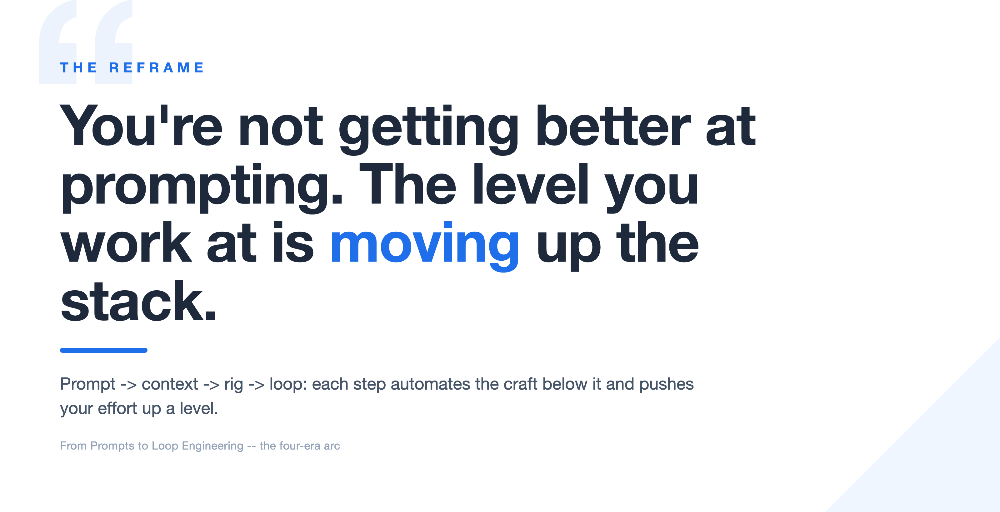
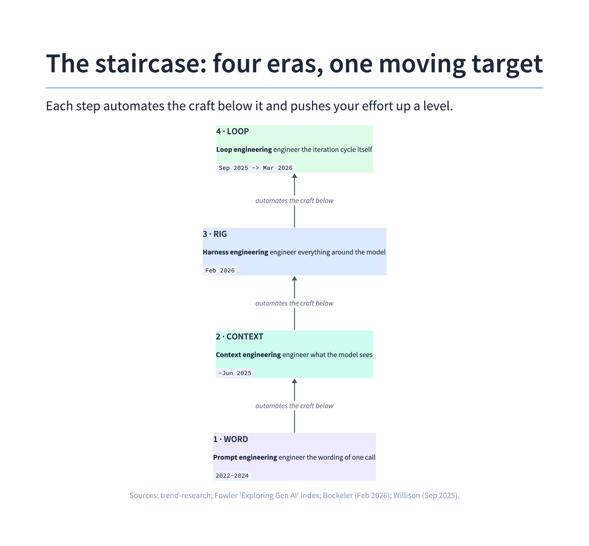
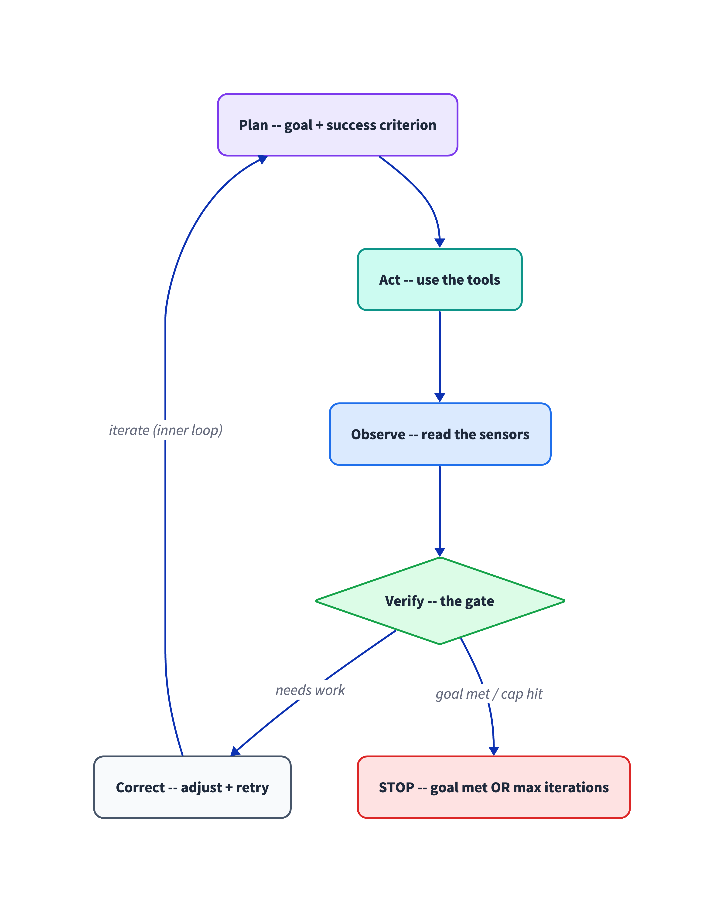
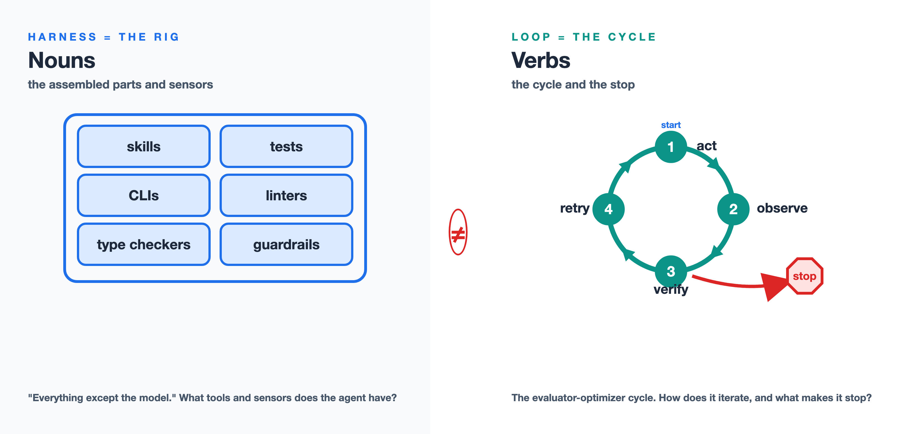
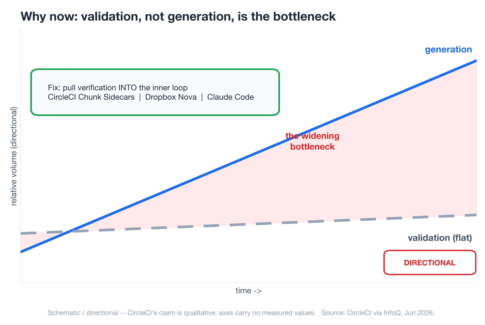
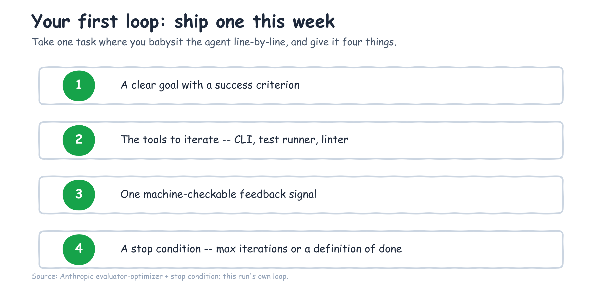
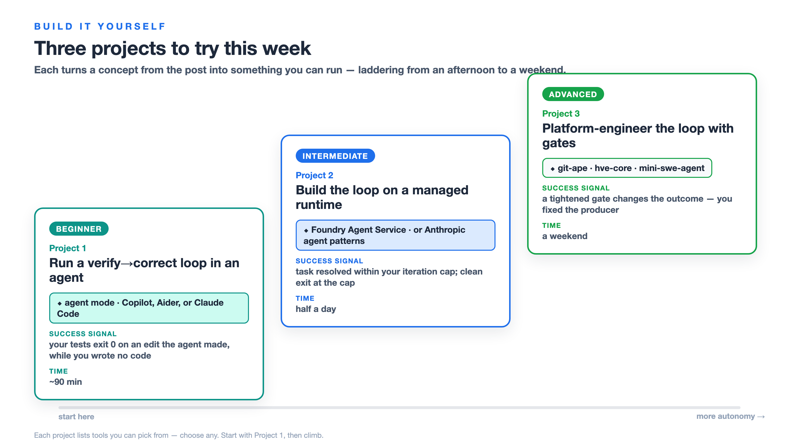

---
seo:
  title: "Loop Engineering: The AI-Native Development Shift"
  description: "Prompt, context, harness, loop engineering: the four-era arc of AI-native development, and why in 2026 the unit of work you own is the iteration loop."
  slug: "loop-engineering-ai-native-development"
  keywords:
    primary: "loop engineering"
    secondary:
      - "harness engineering"
      - "AI-native development"
      - "agentic loops"
      - "context engineering"
      - "prompt engineering"
---

# From Prompts to Loop Engineering: The Workflow Shift in AI-Native Development

*The four-era arc of AI-native development — prompt, context, harness, loop engineering — and why, in 2026, the unit of work you own has moved all the way up to the iteration loop.*

You're not getting better at prompting. I know that sounds backwards, because most of us have spent the last two years collecting prompt tricks like trading cards — "act as a senior engineer," few-shot examples, chain-of-thought, the whole drawer of them. And they worked, for a while. But here is what I keep seeing when I sit with teams shipping real software with agents: the people getting the most out of these tools are not the ones with the cleverest wording. They're the ones who stopped optimizing the sentence and started optimizing everything around it.

The skill didn't get better. The skill moved. And the reason it keeps moving is the quiet inversion underneath all of this: code generation has gotten cheap, so *validation* — not generation — is now the bottleneck. One of the clearest statements of this comes from the VS Code team: in *The Coding Harness Behind GitHub Copilot*, they describe spending most of their engineering time not on the model but on the **harness** around it — the context, the tools, the loop, and the **evaluation** that keeps it honest ([VS Code team, May 2026](https://code.visualstudio.com/blogs/2026/05/15/agent-harnesses-github-copilot-vscode)). CircleCI's production data says the same thing from the CI side ([via InfoQ, Jun 2026](https://www.infoq.com/news/2026/06/circleci-chunk-sidecars/)). That single fact is what pushes the work up the stack, and it's why this post walks the whole arc instead of treating each new buzzword as a separate fad.

Prompt engineering, context engineering, harness engineering, loop engineering — these are not four trends competing for your attention. They're one staircase. Each step automates the craft of the step below it and pushes you up to govern a bigger unit of work. By the end you'll know which step you're standing on, and how to ship your first real loop this week.

## The staircase: four eras of AI-native development, one moving target

Here's the pattern that makes the four eras click into one picture. **As the model absorbs more of the work, the place where your effort actually matters moves up a level.** You used to engineer a word. Then you engineered the context. Then the rig the agent runs inside. Now, increasingly, the loop the agent runs.

| Era | What you engineer | What you're actually doing | Representative moment |
|-----|-------------------|----------------------------|------------------------|
| Prompt engineering | The wording of one request | Crafting the input to a single LLM call | ChatGPT / Copilot autocomplete (2022–2024) |
| Context engineering | What the model *sees* | Curating conventions, architecture, skills, lazy-loaded files | Term gained traction ~June 2025 ([per Böckeler](https://martinfowler.com/articles/exploring-gen-ai/context-engineering-coding-agents.html)) |
| Harness engineering | Everything *around* the model | Building the rig: context assembly, tool exposure, tool execution, plus linters, tests, guardrails | [The Coding Harness Behind GitHub Copilot in VS Code (May 2026)](https://code.visualstudio.com/blogs/2026/05/15/agent-harnesses-github-copilot-vscode); [Böckeler memo (Feb 2026)](https://martinfowler.com/articles/exploring-gen-ai/harness-engineering-memo.html) |
| Loop engineering | The control loop *itself* | Designing think → act → observe → think again, with loop-control and stop conditions | [VS Code "the agent loop" (May 2026)](https://code.visualstudio.com/blogs/2026/05/15/agent-harnesses-github-copilot-vscode); [Foundry Agent Service runtime (Apr 2026)](https://learn.microsoft.com/en-us/azure/foundry/agents/concepts/runtime-components); [Willison (Sep 2025)](https://simonwillison.net/2025/Sep/30/designing-agentic-loops/) |

The practitioners naming this arc are saying the same thing in different words. The [InfoQ/Thoughtworks podcast that maps the year](https://www.infoq.com/podcasts/mcp-vibe-coding-harness-engineering/) is literally titled *"From MCP and Vibe Coding to Harness Engineering: How AI Native Engineering Evolved in One Year"* (Jun 2026). Simon Willison narrates his own version of the climb — "vibe coding" to "vibe engineering" to, in his [Feb 2026 update, "agentic engineering"](https://simonwillison.net/2025/Oct/7/vibe-engineering/). Different vocabularies, one direction of travel: up.

The useful thing about seeing it as a staircase is that it tells you where to spend your next hour. If you're still tuning sentences, the next floor up is waiting and it's where the wins are.

## Eras 1–3: prompt, context, and harness engineering in fast-forward

Let me run the first three steps quickly, because the interesting argument lives at the top — but you can't appreciate the top step without watching the ground shift underneath it.

**Step one — the prompt, and its ceiling.** Prompt engineering was real and it mattered. The ceiling showed up fast: there's only so much you can fix by rewording a single request when the model can't see your codebase, your conventions, or what you tried five minutes ago. You can phrase the question perfectly and still get a confident answer to the wrong problem, because the model is missing the room it's standing in.

**Step two — the context, and its ceiling.** So the effort moved to what the model sees. Context engineering — coding conventions, architecture docs, lazy-loaded skills, progressive disclosure, the slow death of stuffing everything through MCP — got the right information into the window at the right time ([Böckeler, "Context Engineering for Coding Agents," Feb 2026](https://martinfowler.com/articles/exploring-gen-ai/context-engineering-coding-agents.html)). This was a genuine step up. But a well-fed model still can't *act*. It can read your repo and still have no way to run the tests, see the type error, and try again. Curating the input hits its own ceiling the moment the work requires iteration.

**Step three — the rig.** This is where it gets concrete. Harness engineering is building everything the agent operates inside: the skills and CLIs it calls, the scripts and language servers, the linters and type checkers and test suites that tell it whether it just made things better or worse. Birgitta Böckeler's one-liner is the easiest to carry — a harness is *"everything except the model"* ([Böckeler, "Harness Engineering — first thoughts," Feb 2026](https://martinfowler.com/articles/exploring-gen-ai/harness-engineering-memo.html)) — and the VS Code team's breakdown (context assembly + tool exposure + tool execution, below) makes it precise. Feed-forward context on one side, feedback sensors on the other.

And here's the number that made me take this step seriously. On SWE-bench Verified — a benchmark of 500 human-filtered real GitHub issues — a minimal harness called mini-SWE-agent resolves **65% of tasks in about 100 lines of Python** ([swebench.com, Jul 2025](https://www.swebench.com/)). A hundred lines. Most of the win wasn't a bigger model or a cleverer prompt; it was a small, well-built rig that let the model run, observe, and retry. The rig is doing real work — but a rig still needs a *cycle* to run in, and that cycle is the next floor up.

Stack the three eras and each one hits a wall: rewording hits diminishing returns, a curated context window still can't act, and even a 100-line rig has no cycle to run in. Lining those ceilings up side by side is what makes the climb obvious.

## What loop engineering actually is

Loop engineering is the discipline of designing and governing the agent's **iteration cycle** — plan → act → observe → verify → correct — so it can self-correct *without a human standing in the inner loop*. The unit of work is no longer the word, the window, or even the rig. It's the loop: its goal, its tools, its feedback signal, and the condition that makes it stop.

One of the most precise definitions I've found comes from the VS Code team, which ships a widely used coding agent. In *The Coding Harness Behind GitHub Copilot in VS Code*, the VS Code team describes the **agent loop** as a *"think → act → observe → think again"* cycle: on each pass the harness builds the prompt (system instructions + context + history + all tool results so far), sends it to the model, and if the response contains tool calls it executes them, captures the results, and loops back; with no tool calls, the loop finishes ([VS Code team, May 2026](https://code.visualstudio.com/blogs/2026/05/15/agent-harnesses-github-copilot-vscode)). They give the vocabulary too: a **turn** is one user-visible exchange, a **round** is one pass through the loop, and the **run** is all the rounds together — and crucially, the loop is *bounded* by loop-control checks: a tool-call limit, cancellation checks between rounds, and **stop hooks** that decide whether to finish or keep working. That bounding is not a detail; it's the difference between autonomy and a token bonfire.

You can see the same loop shipped as a managed product. Microsoft Foundry Agent Service runs an agent against a conversation, the model **calls tools** and appends the results, and in **background mode** you poll the response `status` (`queued` / `in_progress`) until it completes — an explicit, bounded run with the iteration cap as its stop condition ([Foundry Agent Service runtime components, Apr 2026](https://learn.microsoft.com/en-us/azure/foundry/agents/concepts/runtime-components)). The independent writers describe the same shape: Simon Willison's working definition is that an agent "runs tools in a loop to achieve a goal," and his sharp claim is that **"designing agentic loops" is a distinct, new skill** ([Willison, Sep 2025](https://simonwillison.net/2025/Sep/30/designing-agentic-loops/)); Anthropic's **evaluator-optimizer** loop — "one LLM generates while another evaluates and gives feedback in a loop" — adds the same caution the VS Code team does, that it needs "a maximum number of iterations to maintain control" ([Anthropic, Dec 2024](https://www.anthropic.com/engineering/building-effective-agents)). These sources agree: the four levers you engineer are a clear goal with a success criterion, the right tools to iterate, one feedback signal the agent can read, and a stop condition that ends the cycle.

## Harness engineering vs. loop engineering: nouns vs. verbs

Now the distinction that took me too long to see clearly, because almost every source blurs it: **the harness and the loop are not the same thing.**

The harness is the *rig* — the equipment. One of the cleanest definitions, again, comes from the VS Code team, which describes the coding harness as the system that **turns the model's text into action and feeds the results back**, with three responsibilities: **context assembly** (building the prompt from system message, query, workspace structure, history, tool results, custom instructions, and memory), **tool exposure** (declaring which tools the model may call — `read_file`, `replace_string_in_file`, `run_in_terminal`, `semantic_search` — each with a JSON schema), and **tool execution** (validating arguments, running the tool, handling errors, formatting the result back into the next round) ([VS Code team, May 2026](https://code.visualstudio.com/blogs/2026/05/15/agent-harnesses-github-copilot-vscode)). It's nouns. Böckeler's independent framing matches: a harness is *"everything except the model"* — guides and sensors, the things that point the agent in a direction and the things that tell it what just happened ([Böckeler, Feb 2026](https://martinfowler.com/articles/exploring-gen-ai/harness-engineering-memo.html)). That's the assembled parts and the sensors.

The loop is the *cycle* — the verbs. It's what *uses* the rig: act, then observe the sensors, then verify against the goal, then decide whether to retry or stop. Harness engineering asks *"what tools and sensors does the agent have?"* Loop engineering asks *"how does the agent iterate against those sensors, and what makes it stop?"* The VS Code team puts the punchline more bluntly than any think-piece: **"the model is the engine; the harness is the car"** — and *"the harness is the product."* They even tune the harness *per model* (Claude models use `replace_string_in_file` for edits while GPT models use `apply_patch`; Gemini needs reminders to call tools instead of narrating), which only makes sense once you accept that the rig, not the model, is where the engineering lives. Mature setups in production are both at once — Stripe's "blueprints" and open frameworks like Azure/git-ape are each a harness *plus* an explicit, code-defined loop with verification and stop logic.

Here's the test that separates them. When you're inside the work and you don't like what the agent produced, do you fix *the output*, or do you change *the thing that produced it*? Fixing the output is editing. Changing the producer — the rig, and the cycle that runs against it — is engineering.

## Who sits where: humans outside, in, and on the loop

Kief Morris gives the clearest map of where a human actually belongs ([Morris, "Humans and Agents in Software Engineering Loops," Mar 2026](https://martinfowler.com/articles/exploring-gen-ai/humans-and-agents.html)). He splits the work into a **"why loop"** — idea to working software, which humans own because we're the ones who want the outcome — and a **"how loop"** over the interim artefacts: specs, code, tests. The how-loop nests: an **outer** loop on a feature, a **middle** loop on a story, an **inner** loop that generates and tests code.

That gives four postures, and naming yours is the most useful diagnostic in this whole post:

- **Outside the loop** — vibe coding. You own only the why and let the agent run. Fast, until it isn't.
- **In the loop** — you gatekeep every line. This feels responsible, and it's the trap: *you become the bottleneck* the moment the agent can generate faster than you can read.
- **On the loop** — you build and tune the how-loop instead of inspecting every output. This is where loop engineering lives.
- **The agentic flywheel** — you direct agents to improve the loop itself.

The pivot Morris draws is the whole game: when you're *in* the loop and you dislike the output, you fix the artefact; when you're *on* the loop, you change the harness and the cycle that produced it. That shift — from fixing the output to fixing the loop that produces the output — *is* loop engineering.

## Why now: validation, not generation, is the bottleneck

So why has this become the job in 2026 specifically? Because the economics inverted. For years, generating code was the hard, slow part and review was a formality. That flipped — and the people who ship coding agents say so first. The VS Code team's rule is blunt: **"evaluation keeps the harness honest."** Because a harness change can help one model and quietly break another, they run a benchmark suite (**VSC-Bench**: 40 runs across 8 model-and-effort configurations) on every change, and they report that pushing a model to its highest reasoning effort can land *past the sweet spot* — more thinking, worse results ([VS Code team, May 2026](https://code.visualstudio.com/blogs/2026/05/15/agent-harnesses-github-copilot-vscode)). The same post notes that OpenAI **stopped reporting SWE-bench Verified** because the harness, not the model, increasingly determines the score — a telling admission that validation has become the hard part. CircleCI's production data shows the same inversion from the CI side: feature-branch activity surges while production deployments lag, because "by the time conventional CI discovers an issue, the AI agent has already moved on, losing valuable context" ([CircleCI via InfoQ, Jun 2026](https://www.infoq.com/news/2026/06/circleci-chunk-sidecars/)). The agent out-runs your pipeline.

The industry's response is to pull verification *into the inner loop* rather than waiting for it downstream — CircleCI's Chunk Sidecars (which they literally call "inner-loop validation"), Dropbox Nova, Claude Code's iterative validation. When verification moves inside the loop, loop engineering stops being a blog-post idea and becomes a product category. OpenAI frames its own hardest problems the same way: as [cited by Böckeler](https://martinfowler.com/articles/exploring-gen-ai/harness-engineering-memo.html), their challenges now "center on designing environments, feedback loops, and control systems" — which is loop engineering by another name.

## Proof at scale: inspectable harnesses and the industry numbers

You don't have to take the pattern on faith — several harness-plus-loop systems are public enough to read end to end, and they come from across the ecosystem. **`SWE-agent/mini-swe-agent`** is a ~100-line agent loop over real GitHub issues. **Aider** runs an edit → test → retry loop from your terminal. **`Azure/git-ape`** wraps an infrastructure deploy loop — plan → **confirm/PR** → deploy → post-deploy validation, with **security and cost gates as the sensors** and CI/CD via OIDC as the bounded run — and in headless mode runs itself end to end ([Azure/git-ape](https://github.com/Azure/git-ape)). **Microsoft Foundry Agent Service** and **Anthropic's agent patterns** offer the same primitive as a managed runtime or as library code: agent + tools + a bounded, polled run with a capped iteration count as the stop condition ([Foundry runtime components, Apr 2026](https://learn.microsoft.com/en-us/azure/foundry/agents/concepts/runtime-components); [Anthropic, Dec 2024](https://www.anthropic.com/engineering/building-effective-agents)). Different vendors, one architecture: a rig plus an explicit, bounded loop with verification. These are loop engineering you can run today.

The public numbers put the same pattern at industry scale. **Stripe Minions** produce **1,300+ pull requests a week** (up from roughly 1,000), with **zero human-written code** — every PR machine-generated and human-reviewed — underpinning **more than $1 trillion** in annual payment volume ([InfoQ → Stripe, Mar 2026](https://www.infoq.com/news/2026/03/stripe-autonomous-coding-agents/)). The architecture is the same harness-plus-loop: "blueprints" that interweave deterministic code with flexible agent loops, with CI/CD, automated tests, and static analysis as the verification harness *before* a human ever looks.

**SWE-bench Verified** is worth one careful look — as an illustration, not a scoreboard. Holding the mini-SWE-agent scaffold constant across 500 instances and swapping the model underneath, the score climbed from **12.47% (SWE-agent, Mar 2024) to 76.8% (Claude 4.5 Opus, Feb 2026)** ([swebench.com, Feb 2026](https://www.swebench.com/)). The clean reading is that a stable, well-built rig let every model gain flow through. But treat the absolute numbers with care: as the VS Code team note above, benchmark scores increasingly reflect the harness rather than the model, which is precisely why OpenAI stopped reporting this one. Per-task cost on that leaderboard runs roughly **$0.05 to $0.96 per instance**, the first sign the loop has an economics problem worth taking seriously.

## The honest counterweight: agentic loop failure modes, not a victory lap

I don't want to sell you a finished story, because the sources I trust most are the ones that name what still breaks. Self-correcting loops fail in specific, documented ways: **agentic laziness** (the agent declares done too early), **self-preferential bias** (it rates its own work too highly), and **goal drift** (it wanders off the original target) — all named by [Anthropic via InfoQ (Jun 2026)](https://www.infoq.com/news/2026/06/claude-code-harnesses/). Those failure modes are precisely *why* you engineer verification gates and stop conditions instead of trusting the loop to police itself. The defenses are loop patterns too: adversarial verification, fan-out-and-synthesize, classifier routing.

And the economics carry an asterisk. Today's flat-rate and per-token agent pricing is, in Böckeler's words, "still very subsidized" ([InfoQ podcast, Jun 2026](https://www.infoq.com/podcasts/mcp-vibe-coding-harness-engineering/)) — so the $0.05–$0.96 per-task numbers above are a snapshot, not a forecast. Cite them with their dataset date and re-pull before you make a budget decision on them. Loop engineering is a discipline you practice against known failure modes, not a victory lap.

## Your first agentic loop: where to start this week

Here's the shippable part. Take one task where you currently babysit the agent line-by-line — where you're *in* the loop. Give it four things:

1. **A clear goal with a success criterion** the agent can aim at.
2. **The tools to iterate** — the CLI, the test runner, the linter it needs.
3. **One machine-checkable feedback signal** — tests passing, types clean, the linter green.
4. **A stop condition** — a max iteration count or a definition of done — so the loop ends on purpose.

Then step *on* the loop. The next time it produces something wrong, resist fixing the output by hand. Fix the loop that produced it — tighten the success criterion, add a sensor, adjust the stop condition. That single habit is the entire shift from editing to engineering.

If you want a worked example, this content pipeline runs the same pattern on itself: plan → draft → rubber-duck review → fix → re-review, with a deterministic preflight and a tiered critic gate as the verification sensors and an iteration cap as the stop condition. It's an inspectable loop, and writing this post ran through it. And if you'd rather watch a loop you didn't build, open GitHub Copilot **agent mode** in VS Code on a failing-test task and inspect it through the **Chat Debug View**, which shows the raw system prompt, context, and tool payloads behind each round ([VS Code Chat Debug View](https://code.visualstudio.com/docs/agents/agent-troubleshooting/chat-debug-view)).

## Build it yourself: 3 projects to try this week

Reading about loops doesn't build the instinct — closing one does. So here are three projects that take the exact concepts above and turn them into something you can run on your own machine. They ladder from an afternoon to a weekend. Each one names a few interchangeable tools — pick whichever you already have access to; none is required. Do the first one and the abstract "plan → act → observe → verify → correct" stops being a diagram and becomes muscle memory.

### Project 1 — Run a verify→correct loop in an agent *(Beginner)*

**Goal.** Watch a real plan → act → verify → correct loop close on your own repository — and *see inside it* — without writing any orchestration, so the loop becomes concrete before you build one.
**Prerequisites.** An agent with a verify→correct loop (GitHub Copilot agent mode, Aider, or Claude Code), and a repo with a runnable test command (e.g. `pytest`).
**Steps.**
1. Open the Chat view in VS Code, switch the session to **agent mode**, and give it a small task a test can judge — fix a failing test, or add a function with an existing spec.
2. Let it run: watch it edit → run your test command → read the failures → retry, round after round, on its own.
3. Open the **Chat Debug View** (Agents → troubleshooting) and read one round's raw system prompt, context, tool calls, and tool results — the harness made visible.
4. When it heads the wrong way, use **Steer** to redirect mid-run instead of fixing the code by hand.
**Success signal.** Your test command exits 0 on an edit the agent made while you wrote no code — the test suite, not your judgement, closed the loop.
**Time.** ~60–90 minutes.
**Stretch goal.** Add a `instructions` file or a stop hook so the loop self-corrects style as well as correctness — a second sensor to satisfy.
**Tools (pick one).** [GitHub Copilot agent mode](https://code.visualstudio.com/docs/agents/overview), [Aider-AI/aider](https://github.com/Aider-AI/aider), or Claude Code — the loop is identical in each. The steps below use Copilot's [Chat Debug View](https://code.visualstudio.com/docs/agents/agent-troubleshooting/chat-debug-view) because it exposes each round's raw prompt and tool payloads.

### Project 2 — Build the loop yourself on a managed runtime *(Intermediate)*

**Goal.** Write the loop instead of borrowing it — own the stop condition: an agent that calls a tool, iterates, and halts on a cap *you* set. This is the "verbs" half of the harness-vs-loop distinction.
**Prerequisites.** Project 1 done, and an agent runtime (a Microsoft Foundry project — the quickstart provisions one — or a hand-rolled runner built on Anthropic's agent patterns).
**Steps.**
1. Follow the hosted-agent quickstart to create an **agent**, a **conversation**, and one **tool** the model can call.
2. Run the agent in **background mode** and poll the response `status` (`queued` / `in_progress`) until it completes — that polling *is* your loop.
3. Make the tool result the feedback signal: have it run your tests (or any check) and return pass/fail into the next round.
4. Set a **capped iteration count** as the stop condition and log every round so the cycle is inspectable.
**Success signal.** A seeded task is resolved within the iteration cap — and when it can't be, the run exits cleanly at the cap instead of spinning forever. That bounded exit is the point.
**Time.** Half a day.
**Stretch goal.** Add a second tool (a type checker or linter) and have the agent weigh both signals before it decides it's done.
**Tools (pick one).** [Foundry Agent Service quickstart](https://learn.microsoft.com/en-us/azure/foundry/agents/quickstarts/quickstart-hosted-agent) and the [runtime-components doc](https://learn.microsoft.com/en-us/azure/foundry/agents/concepts/runtime-components), or [anthropics/claude-cookbooks](https://github.com/anthropics/claude-cookbooks) `patterns/agents`. The steps below use Foundry's background-mode polling; the loop shape is the same in a hand-rolled runner.

### Project 3 — Platform-engineer the loop with gates *(Advanced)*

**Goal.** Operate *on* the loop, not in it: run a real deployment loop with gates as sensors, then **change a gate and re-run** — fixing the producer instead of the output. This is the flywheel from the post made concrete.
**Prerequisites.** Projects 1–2, a GitHub repo, and (for the git-ape walkthrough) an Azure subscription — it deploys real infrastructure, so use a sandbox.
**Steps.**
1. Install **git-ape** as a GitHub Copilot plugin and onboard a repo (the project's onboarding skill walks you through OIDC + RBAC).
2. Open an issue describing a small deployment and let the headless loop run: issue → PR → `git-ape-plan` what-if → **security/cost gate** → deploy → integration test.
3. Read the run: the gates are the sensors, the what-if is the observation, the PR is the human-on-the-loop checkpoint.
4. Now **tune a gate** — tighten a cost or security rule (a skill) — and re-run the same issue. You're editing the loop, not the artefact.
**Success signal.** A run where your tightened gate changes the outcome: the gate blocks, you fix the template, and the re-run passes — proof you changed the *producer*.
**Time.** A weekend.
**Stretch goal.** Add a custom validation skill of your own to the gate set, so the loop enforces a rule specific to your team.
**Tools (pick one).** [Azure/git-ape](https://github.com/Azure/git-ape) (agentic deploy loops with security/cost gates), [microsoft/hve-core](https://github.com/microsoft/hve-core) (the Research → Plan → Implement loop with quality gates), or [SWE-agent/mini-swe-agent](https://github.com/SWE-agent/mini-swe-agent) (a minimal gated agent loop). The steps below use git-ape because its gates are explicit and tunable.

Start with Project 1 this week. The point of all three isn't the finished artifact — it's that once you've watched a test suite close a loop you didn't babysit, you stop reaching for the next prompt trick and start reaching for the next sensor.

So locate your step on the staircase — word, context, rig, or loop — and take the next one. The point where your effort matters will keep moving up as models absorb more of the work; the durable skill isn't any one era's trick, it's learning to govern whatever the next-larger unit of work turns out to be. Right now, that unit is the loop. Go ship one with a stop condition.

## References

The sources behind every dated claim above, ordered by how central each is to the argument — not by who published it. Each is linked inline at its first mention; this list is the consolidated index.

1. VS Code team, "The Coding Harness Behind GitHub Copilot in VS Code" — harness (context assembly, tool exposure, tool execution), the agent loop ("think → act → observe → think again"), turn/round/run, loop-control + stop hooks, "the harness is the product," per-model tuning, VSC-Bench, OpenAI dropping SWE-bench — [code.visualstudio.com, May 2026](https://code.visualstudio.com/blogs/2026/05/15/agent-harnesses-github-copilot-vscode)
2. Birgitta Böckeler, "Harness Engineering — first thoughts" memo — "everything except the model," Feb 2026 — [martinfowler.com](https://martinfowler.com/articles/exploring-gen-ai/harness-engineering-memo.html)
3. Simon Willison, "Designing agentic loops," Sep 2025 — [simonwillison.net](https://simonwillison.net/2025/Sep/30/designing-agentic-loops/)
4. Anthropic, "Building Effective Agents" — evaluator-optimizer loop, stop conditions, Dec 2024 — [anthropic.com](https://www.anthropic.com/engineering/building-effective-agents)
5. Kief Morris, "Humans and Agents in Software Engineering Loops" — outside/in/on the loop, Mar 2026 — [martinfowler.com](https://martinfowler.com/articles/exploring-gen-ai/humans-and-agents.html)
6. Birgitta Böckeler, "Context Engineering for Coding Agents," Feb 2026 — [martinfowler.com](https://martinfowler.com/articles/exploring-gen-ai/context-engineering-coding-agents.html)
7. "From MCP and Vibe Coding to Harness Engineering" — Böckeler podcast mapping the one-year arc — [InfoQ/Thoughtworks, Jun 2026](https://www.infoq.com/podcasts/mcp-vibe-coding-harness-engineering/)
8. Microsoft Foundry Agent Service — runtime components (agent + conversation + response, tool calls, background-mode polling, capped iterations, memory) — [learn.microsoft.com, Apr 2026](https://learn.microsoft.com/en-us/azure/foundry/agents/concepts/runtime-components); [hosted-agent quickstart](https://learn.microsoft.com/en-us/azure/foundry/agents/quickstarts/quickstart-hosted-agent)
9. Stripe "Minions" — 1,300+ PRs/week, zero human-written code, $1T+ payment volume — [InfoQ, Mar 2026](https://www.infoq.com/news/2026/03/stripe-autonomous-coding-agents/)
10. SWE-bench — leaderboard and the 12.47% → 76.8% trajectory (illustrative; harness-dependent) — [swebench.com](https://www.swebench.com/)
11. CircleCI Chunk Sidecars — "inner-loop validation" — [InfoQ, Jun 2026](https://www.infoq.com/news/2026/06/circleci-chunk-sidecars/)
12. Anthropic Dynamic Workflows — agentic laziness, self-preferential bias, goal drift — [InfoQ, Jun 2026](https://www.infoq.com/news/2026/06/claude-code-harnesses/)
13. Simon Willison, "Vibe engineering" (updated to "Agentic Engineering," Feb 2026) — [simonwillison.net](https://simonwillison.net/2025/Oct/7/vibe-engineering/)
14. `Azure/git-ape` — open-source (MIT) agentic platform-engineering loop on GitHub Copilot: plan → confirm/PR → deploy → validate with security/cost gates and CI/OIDC — [github.com/Azure/git-ape](https://github.com/Azure/git-ape)
15. `microsoft/hve-core` — Research → Plan → Implement loop with validated artifacts and quality gates — [github.com/microsoft/hve-core](https://github.com/microsoft/hve-core)
16. Build with agents in VS Code (agent mode) and the Chat Debug View — [agents overview](https://code.visualstudio.com/docs/agents/overview); [Chat Debug View](https://code.visualstudio.com/docs/agents/agent-troubleshooting/chat-debug-view)
