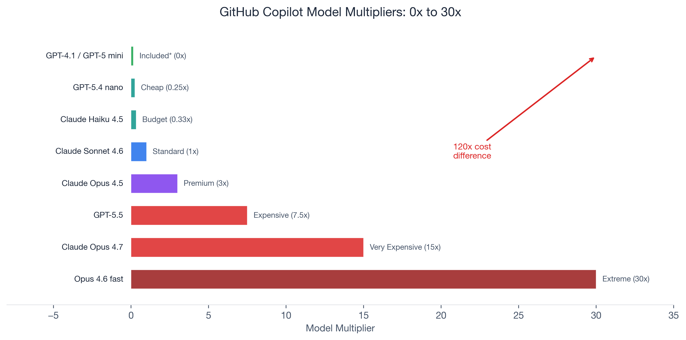
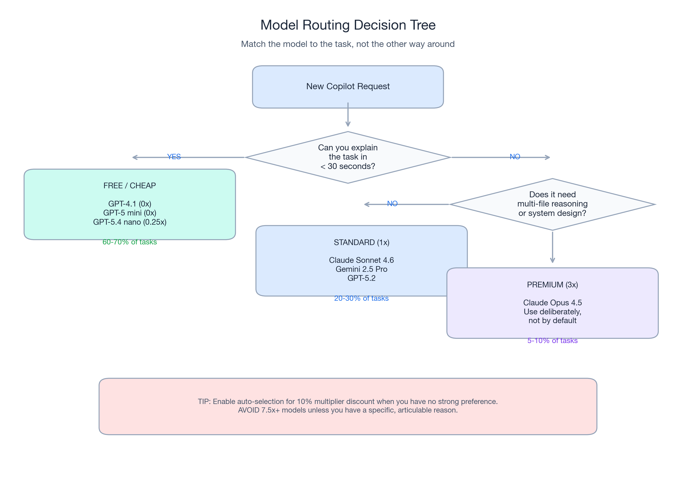
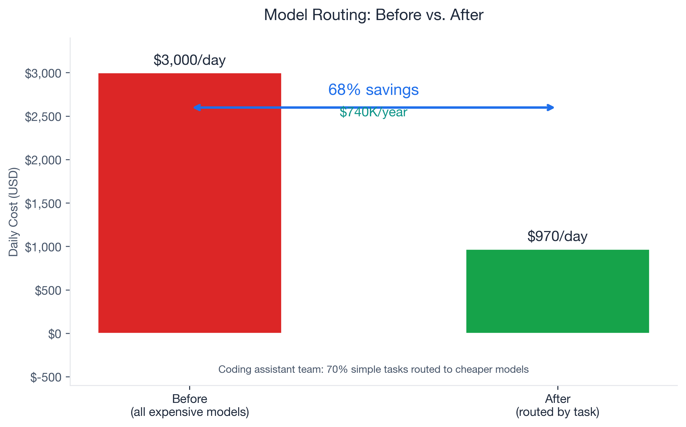

# The 120x Problem: Why Your AI Code Assistant Costs Are About to Change

*Part 1 of 3 in the "Optimizing AI Code Assistant Costs" series*

---

## The Bill Nobody Expected

Last month, I watched a senior engineer on a customer's team burn through an entire month of GitHub Copilot credits in three days. Not because they were doing anything wrong — they were using agent mode for a multi-file refactoring, which happened to route to Claude Opus 4.6 in fast mode. Each request consumed 30x their base credit allocation.

Three days. One month of credits. Gone.

Starting **June 1, 2026**, this becomes everyone's problem. GitHub Copilot is moving from a flat premium-request system to usage-based billing, where every interaction has a visible price tag determined by which model processes your request. A quick inline chat question and a multi-hour autonomous coding session will no longer cost the same amount.

The cheapest available model — GPT-5.4 nano at 0.25x — and the most expensive — Claude Opus 4.6 fast mode at 30x — represent a **120x cost difference** for the same interaction pattern. That is not a typo. The model you pick (or the model that gets picked for you) can swing a single request's cost by two orders of magnitude.

The good news: a team I worked with applied model routing to their coding workflow and dropped from **$3,000/day to $970/day** — a 68% reduction that annualized to **$740,000 in savings**. They did not sacrifice output quality. They just stopped using expensive models for tasks that did not need them.

This post is Part 1 of a three-part series. Today, I will cover the new billing model and the single highest-impact optimization: **model routing**. In Part 2, I will tackle caching and context management. Part 3 covers team governance and the complete playbook.

If you read nothing else: **switch your default model to the lowest-cost option available — currently GPT-4.1 (included at 0x on paid plans). For 60-70% of your daily coding tasks, you will not notice the difference.** Even if included models change, routing to 0.25x models still saves dramatically.

---

## How Usage-Based Billing Actually Works

Before June 1, GitHub Copilot billing was straightforward. You had a fixed number of premium requests per month — 50 on Free, more on paid plans — and every model request cost the same: one premium request. Whether you asked for a one-line variable rename or a multi-file architecture review, the price was identical.

That model is gone.

Under the new system, GitHub Copilot uses **AI Credits** tied to actual token consumption. Each model has a published **multiplier** that scales the credit cost relative to a baseline:

### The Multiplier Table

| Tier | Models | Multiplier | Effective Cost |
|------|--------|------------|----------------|
| **Included*** | GPT-4.1, GPT-4o, GPT-5 mini | 0x | No premium request cost on paid plans |
| **Cheap** | GPT-5.4 nano, Grok Code Fast 1 | 0.25x | 1/4 of baseline |
| **Budget** | Claude Haiku 4.5, GPT-5.4 mini, Gemini 3 Flash | 0.33x | 1/3 of baseline |
| **Standard** | Claude Sonnet 4/4.5/4.6, Gemini 2.5 Pro, GPT-5.2, GPT-5.4 | 1x | Baseline |
| **Premium** | Claude Opus 4.5, Claude Opus 4.6 | 3x | 3x baseline |
| **Expensive** | GPT-5.5 | 7.5x | 7.5x baseline |
| **Very Expensive** | Claude Opus 4.7 | 15x | 15x baseline |
| **Extreme** | Claude Opus 4.6 fast mode | 30x | 30x baseline |

*\*Included models are subject to change. GitHub explicitly notes that "the models included with Copilot plans are subject to change" and "model multipliers and costs are subject to change." Under usage-based billing (June 1), fallback to included models when credits are exhausted will no longer be available. Plan your routing strategy to work at the 0.25x tier as a floor, not 0x.*

Let those numbers sink in. A single request to Claude Opus 4.6 fast mode costs the same as **120 requests** to GPT-5.4 nano. Or, put differently: every time you run an Opus fast-mode query instead of using a cheap model, you are choosing to spend 120x more credits for that interaction.

### What the Plans Actually Give You

The monthly subscription prices have not changed, but now they translate directly to credit budgets:

| Plan | Monthly Price | Credits | Promotional (Jun-Aug 2026) |
|------|--------------|---------|---------------------------|
| **Pro** | $10/month | $10 in credits | — |
| **Pro+** | $39/month | $39 in credits | — |
| **Business** | $19/user/month | $19 in credits | $30/month |
| **Enterprise** | $39/user/month | $39 in credits | $70/month |

Code completions and Next Edit suggestions remain free on all plans. The credit system applies to chat, inline chat, agent mode, and any interaction that invokes a model beyond basic completions.

One genuinely useful addition: **auto-selection mode** gives you a 10% discount on the model multiplier. Let Copilot choose the model for a given request, and you pay 10% less than if you had selected it manually. For teams that do not have strong model preferences per task type, this is free savings.

### Why This Changes Everything

Under the old system, a developer who asked 50 questions a day consumed 50 premium requests regardless of model or complexity. Under the new system, that same developer might consume a few cents in credits (using the cheapest models for most tasks) or $200 in credits (using Opus for everything). The variance is enormous, and it depends entirely on behavior.

This is the core insight: **cost optimization for AI code assistants is now an engineering discipline, not a budgeting exercise**. The same skills we apply to cloud infrastructure — right-sizing, routing, caching — now apply to the AI tools we use every hour.

---

## Pillar 1: Model Routing — Use Cheap Models for Cheap Work

Model routing is the single highest-impact optimization you can make. The idea is simple: match the model to the task complexity. Most coding requests do not need a 30x reasoning model.

### The Task Taxonomy

Working with multiple teams, I have seen a consistent pattern in how AI code assistant requests break down by complexity:

**60-70% are simple tasks:**
- Variable and function renaming
- Boilerplate generation (test scaffolding, CRUD endpoints, configuration files)
- Docstring and comment writing
- Import fixing and dependency resolution
- Linting explanations and quick formatting fixes
- One-line code explanations

**20-30% are moderate tasks:**
- Code review suggestions
- Refactoring within a single file
- Debugging assistance (reading stack traces, suggesting fixes)
- Architecture questions about a specific component
- Writing unit tests with edge case coverage

**5-10% are complex tasks:**
- Multi-file refactoring across a codebase
- System design and architecture decisions
- Novel algorithm implementation
- Agent mode sessions (autonomous multi-step coding)
- Security audit and vulnerability analysis

The critical finding comes from **Apple's ML Research team**: reasoning models (the expensive ones) burn thousands of extra tokens on simple tasks with **zero quality improvement**. A standard model produces identical output for a variable rename whether it costs 0x or 30x. The reasoning tokens are simply wasted.

### Matching Models to Tasks

Here is the routing policy I recommend based on the multiplier table and task taxonomy:

**Simple tasks (60-70% of requests) → Included or Cheap models:**
- GPT-4.1 (currently 0x on paid plans) — your default for everyday chat
- GPT-5 mini (currently 0x) — fast, included, good for completions
- GPT-5.4 nano (0.25x) — your floor if included models change

**Moderate tasks (20-30%) → Standard models:**
- Claude Sonnet 4.6 (1x) — strong for code review and refactoring
- Gemini 2.5 Pro (1x) — good for architecture questions
- GPT-5.2 (1x) — balanced performance

**Complex tasks (5-10%) → Premium models (use deliberately):**
- Claude Opus 4.5 (3x) — multi-file refactoring, system design
- GPT-5.5 (7.5x) — only for the most demanding reasoning tasks
- Claude Opus 4.6/4.7 (15-30x) — almost never justified in day-to-day coding

The practical rule: **if the task takes you less than 30 seconds to explain, use the cheapest available model.** If it takes 30 seconds to 2 minutes, use a 1x model. If you are writing a paragraph-long prompt describing a complex multi-step operation, consider a 3x model.

### The Numbers Behind Routing

The case for model routing is not theoretical. Multiple independent benchmarks confirm the savings:

**RouteLLM (LMSYS, 2024):** An open-source routing framework that achieved **95% of GPT-4 quality** while routing only 14% of requests to GPT-4 (the rest went to cheaper models). The result: **75% cost reduction** compared to sending everything to GPT-4. The framework outperformed commercial alternatives like Martian and Unify AI by 40% on cost efficiency. Critically, the same routers generalized across model pairs — they worked on Claude 3 Opus + Llama 3 8B without retraining.

**Production case study (Towards Data Science, May 2026):** A development team building a coding assistant analyzed their request patterns and found 70% of incoming requests were simple tasks. By routing those to cheaper models, they reduced daily spend from **$3,000 to $970** — a 68% reduction. Annualized: **$740,000 in savings**. The team reported no meaningful degradation in output quality for the routed tasks.

**CascadeFlow:** Achieved **69% savings** with **96% quality retention** versus GPT-5 by cascading through progressively more capable models only when the cheaper model's output did not meet a confidence threshold.

### What This Looks Like in Practice

Here is what I changed in my own workflow after running the numbers:

1. **Default model: GPT-4.1 (currently 0x).** I switched my VS Code Copilot default from Claude Sonnet to GPT-4.1. For inline chat, quick questions, and everyday coding, the quality difference is negligible. The cost difference is dramatic — from 1x down to the included tier. Even if GPT-4.1 moves from 0x to 0.25x in the future, that is still a 4x savings over Sonnet.

2. **Sonnet for code review only.** When I need a thoughtful code review or want to refactor a complex function, I manually switch to Claude Sonnet 4.6 (1x). This is maybe 15-20% of my interactions.

3. **Opus for architecture sessions.** Two or three times a week, I have a deep architecture conversation where I need the model to hold a large mental model of the system. That is when I use Opus (3x). It is a deliberate choice, not a default.

4. **Auto-selection for everything else.** For tasks where I do not have a strong model preference, I use Copilot's auto-selection to get the 10% multiplier discount. It typically picks an appropriate model, and the discount compounds.

The transition took about a day to become habitual. The hardest part was resisting the temptation to use Opus "just in case" — but after a week of tracking, I found that exactly zero of my simple-task results degraded. The free model handled variable renames, docstrings, import fixes, and inline explanations identically. The only place I consistently noticed Opus's advantage was in multi-file refactoring where it needed to reason about cross-module dependencies.

The result: my effective monthly credit consumption dropped by roughly 70%. I am doing the same work, with the same quality, for less than a third of the cost.

### A Note on Quality

The most common objection I hear: "But the expensive models are better." Sometimes, yes. For complex reasoning tasks, Claude Opus genuinely outperforms Sonnet. But Apple's research — and my own experience — shows that for the majority of coding tasks, the quality delta is zero.

Think about it this way: a variable rename is a variable rename. The model either gets it right or it does not. A 30x model does not produce a meaningfully better rename than a free model. It might spend thousands of reasoning tokens deliberating (at your expense), but the output is identical.

This pattern holds across the entire "simple" category. Boilerplate generation, import fixes, docstring writing, linting explanations — the expensive model produces the same text, just at 30-120x the cost. The quality gap only opens up on genuinely complex tasks: multi-step reasoning chains, cross-file architectural decisions, novel algorithm design.

The key mental shift: **do not default to the most expensive model and hope for the best. Default to the cheapest model and upgrade when you actually need to.**

---

## What You Should Do Right Now

You do not need to wait for June 1 to start optimizing. Here are five actions ranked by effort versus impact:

### 1. Switch your default model to the lowest-cost option (5 minutes, immediate savings)

Open VS Code settings, change your Copilot model preference to GPT-4.1. As of this writing, it is included at 0x on all paid plans — though GitHub notes included models are subject to change. Even if it moves to 0.25x, it remains dramatically cheaper than the 1x-30x alternatives. This single change reduces cost on 60-70% of your interactions.

### 2. Enable auto-selection for the 10% discount (1 minute)

When you do not have a strong model preference for a task, let Copilot pick. The 10% multiplier discount is free money.

### 3. Learn when to manually upgrade (ongoing habit)

Develop a sense for which tasks need premium models:
- Simple question? Stay on GPT-4.1 (included tier)
- Needs code review or refactoring? Switch to Sonnet (1x)
- Multi-file architecture or complex reasoning? Switch to Opus (3x)
- Never default to 7.5x+ models unless you have a specific, articulable reason

### 4. Check your current premium request usage (2 minutes)

Go to your GitHub settings and review your premium request consumption patterns before the billing change hits. Identify which interactions consume the most — those are your optimization targets.

### 5. Bookmark the multiplier table (30 seconds)

The [GitHub Copilot model multipliers page](https://docs.github.com/en/copilot/managing-copilot/monitoring-usage-and-entitlements/about-premium-requests) is your cost reference. Know the price of the models you use. Make model selection a conscious choice, not an accident.

---

## What If Included Models Change?

GitHub explicitly states that "the models included with Copilot plans are subject to change" and "model multipliers and costs are subject to change." The billing announcement also notes that fallback to included models when credits are exhausted will no longer be available under the new system.

This means the 0x tier could shrink or disappear. Here is why the routing strategy still works regardless:

**If 0x models move to 0.25x**: The cheapest tier becomes GPT-5.4 nano at 0.25x. The cost spread narrows from 120x (0.25x vs 30x) to... still 120x. The routing math is identical. Your savings from routing 60-70% of simple tasks to 0.25x instead of 1x-30x models is still 68-75%.

**If all models get a floor multiplier**: Even a hypothetical 0.5x floor means routing saves you 60x per request compared to Opus fast mode. The principle — match model to task complexity — does not depend on any specific multiplier value.

**The only scenario where routing does not help**: If GitHub moves to a flat per-interaction fee regardless of model (which would reverse the entire billing change they just announced). This is extremely unlikely.

Build your habits around the routing discipline, not a specific multiplier number. The cheapest model today might not be the cheapest model next month, but there will always be a cheapest model.

---

## Coming Up Next

In **Part 2: "Less Context = Better Code"**, I will cover prompt caching (up to 90% savings on repeated context) and context management (how closing files and structuring conversations can cut token consumption by 30-70% — while simultaneously improving output quality). The counterintuitive finding: less context makes AI code assistants both cheaper AND better.

In **Part 3: "The Team Playbook"**, I will cover budget governance for engineering managers, team-wide model selection guidelines, credit forecasting, and the complete optimization framework that combines all four pillars for 70-90% total savings.

---

*This is Part 1 of 3 in the "Optimizing AI Code Assistant Costs" series. [Part 2: Less Context = Better Code →](#) | [Part 3: The Team Playbook →](#)*

---

## Key Data Points Referenced

| Data Point | Value | Source |
|------------|-------|--------|
| Billing change date | June 1, 2026 | [GitHub Blog](https://github.blog/news-insights/company-news/github-copilot-is-moving-to-usage-based-billing/) |
| Multiplier range | 0.25x to 30x (120x spread) | [GitHub Docs](https://docs.github.com/en/copilot/managing-copilot/monitoring-usage-and-entitlements/about-premium-requests) |
| Free models on paid plans | GPT-4.1, GPT-4o, GPT-5 mini (currently 0x; subject to change) | [GitHub Docs](https://docs.github.com/en/copilot/managing-copilot/monitoring-usage-and-entitlements/about-premium-requests) |
| Auto-selection discount | 10% off multiplier | [GitHub Docs](https://docs.github.com/en/copilot/managing-copilot/monitoring-usage-and-entitlements/about-premium-requests) |
| RouteLLM quality retention | 95% of GPT-4 at 75% lower cost | [LMSYS Blog](https://lmsys.org/blog/2024-07-01-routellm/) |
| Routing case study | $3,000/day → $970/day (68% savings) | [Towards Data Science](https://towardsdatascience.com/inference-scaling-test-time-compute-why-reasoning-models-raise-your-compute-bill/) |
| Annualized routing savings | $740,000/year | [Towards Data Science](https://towardsdatascience.com/inference-scaling-test-time-compute-why-reasoning-models-raise-your-compute-bill/) |
| Simple task percentage | 60-70% of coding requests | [Towards Data Science](https://towardsdatascience.com/inference-scaling-test-time-compute-why-reasoning-models-raise-your-compute-bill/) |
| Apple ML finding | Reasoning models: no quality gain on simple tasks | Apple ML Research |
| CascadeFlow savings | 69% savings, 96% quality retention | [Towards Data Science](https://towardsdatascience.com/agentic-ai-how-to-save-on-tokens/) |
| Promotional credits (Business) | $30/month, June-August 2026 | [GitHub Blog](https://github.blog/news-insights/company-news/github-copilot-is-moving-to-usage-based-billing/) |
| Promotional credits (Enterprise) | $70/month, June-August 2026 | [GitHub Blog](https://github.blog/news-insights/company-news/github-copilot-is-moving-to-usage-based-billing/) |
