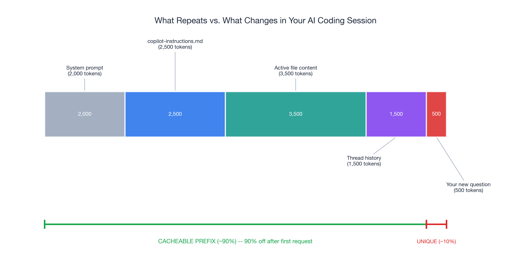
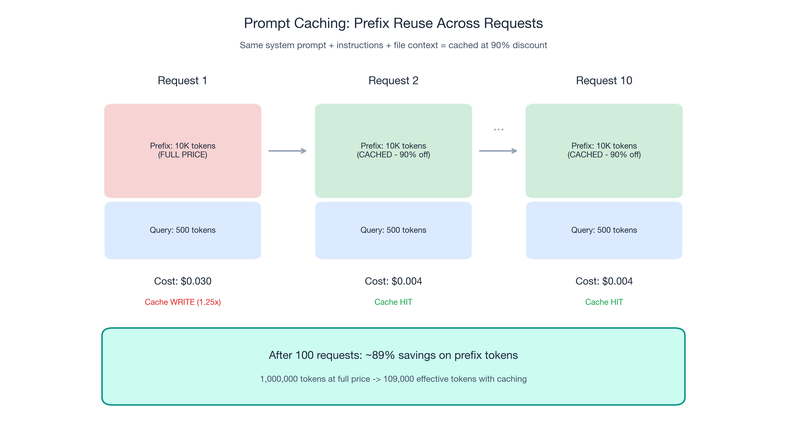
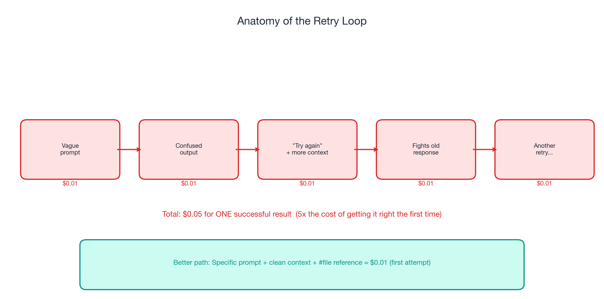
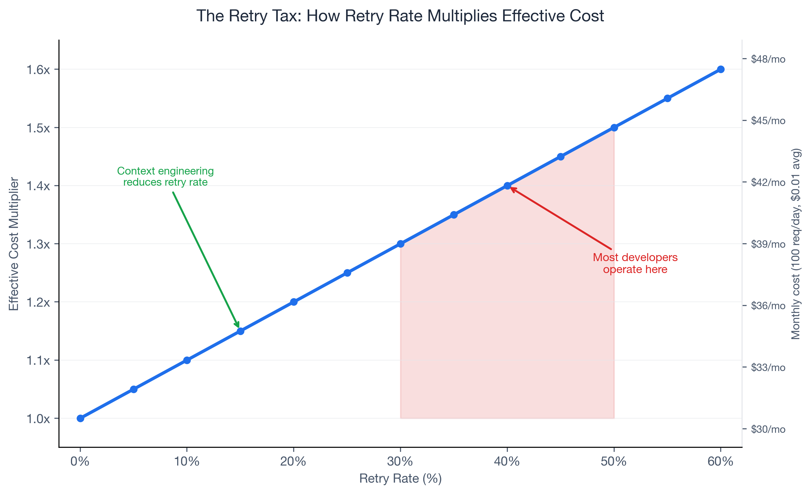
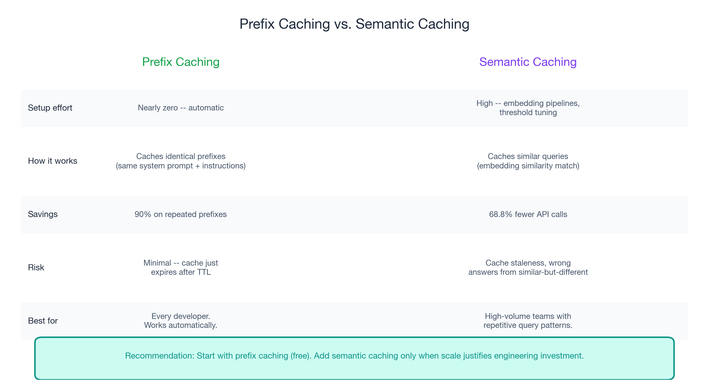

# Invisible Compound Savings: Caching, Workflow Discipline, and the Habits That Add Up

*Part 2 of 3 in the "Engineering Better AI Code Assistant Interactions" series*

*Previously in [Part 1](context-engineering-part-1.md): Five context engineering practices that improve AI code assistant output quality — while spending fewer tokens. The Anthropic data: 85% fewer tokens, accuracy up from 49% to 74%.*

---

## The 90% Discount You Are Not Using

OpenAI and Anthropic both offer a 90% discount on cached input tokens. If you have never heard of AI code assistant prompt caching, you are not alone — and you are paying full price for repeated context every single time.

Here is what happens under the hood. Every time you send a prompt to an AI model, the input includes a system prompt, your project instructions, relevant file content, and your actual question. In a typical coding session, **roughly 90% of that input is identical across requests**. Your copilot-instructions file does not change between prompts. Your system-level context is the same. The active file you are editing is the same. Only your specific question varies.

Without caching, the provider charges full price for all of those tokens on every request. With caching, the provider recognizes the repeated prefix and charges a fraction of the cost — **90% less** — for the tokens it has already processed.

In Part 1, I covered context engineering: giving AI better input to get better output. The five practices — single-task focus, thread hygiene, targeted references, front-loaded intent, and stable instructions — reduce noise and improve first-attempt accuracy. This post covers the structural layer that sits on top of clean context: caching that clean context so you do not pay repeatedly for it, and workflow discipline that prevents the good habits from eroding.

The savings here are invisible. You will not feel them in a single prompt. But they compound across every request in every session, every day. For a developer making 100+ AI interactions per day, the cumulative effect is substantial.

---

## How Prompt Caching Works for AI Code Assistants: Same Prefix, Fraction of the Cost

Prompt caching is straightforward. When consecutive prompts share a common prefix — the same system prompt, the same instruction files, the same contextual setup — the provider caches those tokens on first processing. Subsequent requests that match the cached prefix get charged dramatically less.

The mechanics differ slightly by provider, but the economics are consistent:

- **OpenAI**: Cached input tokens at **90% off** the base input price. Caching happens automatically when requests share a prefix.
- **Anthropic**: Cached reads at **90% off**. The first-pass cache write costs 1.25x the base input price. The write cost is amortized across all subsequent reads.
- **TTL (time-to-live)**: Typically **5-10 minutes**. Each matching request resets the TTL. A steady coding session keeps the cache warm indefinitely.

### Why this matters for AI code assistants

Your AI code assistant interactions have a natural caching structure. Consider what stays constant across prompts in a working session:

1. **System prompt**: The provider's system instructions for the code assistant (always identical)
2. **Your copilot-instructions.md**: Project context, tech stack, conventions (stable across sessions)
3. **Active file content**: The file you are editing (stable across related prompts)
4. **Thread history**: Previous messages in the current conversation thread (accumulated, not changing)

Only your new question and the model's new response vary. Everything above it is a cacheable prefix.

### The math

Suppose your stable prefix is 10,000 tokens — a reasonable estimate for system prompt + copilot-instructions + active file context. Over 100 requests in a day:

| | Full price | With caching |
|---|-----------|-------------|
| **Prefix tokens processed** | 10,000 x 100 = 1,000,000 | 10,000 (first request) + 10,000 x 99 x 0.1 = 109,000 |
| **Effective prefix cost** | 100% | ~10.9% of full price |
| **Savings** | — | **~89%** on prefix tokens |

By request 10, the prefix is essentially free. By request 100, you have saved roughly 890,000 tokens worth of billing on prefix context alone. (Note: Anthropic charges 1.25x for the initial cache write, which slightly increases the first request cost but is amortized across all subsequent cached reads. OpenAI caches automatically with no write surcharge.)

### Maximize cache hits

**Keep your copilot-instructions file stable.** If you edit it mid-session, the prefix changes, the cache invalidates, and the next request pays full price for a new cache write. Write your instructions file once, update it when your stack changes — not per task.

**Group related questions in the same thread.** Each message in a thread extends the shared prefix. Switching threads resets the prefix. If you are working through a multi-step feature, stay in one thread rather than starting fresh for each question.

**Structure context with stable elements first.** System prompt at the top, project instructions next, then file content, then your specific query. This ordering maximizes the prefix length that remains constant across requests.

**Avoid unnecessary context churn.** Adding and removing files from your context repeatedly invalidates portions of the cache. If you are going to reference a file, keep it in scope until you are done with that line of work.

A critical connection to Part 1: the five context engineering practices *enable* better caching. When you close irrelevant files, you shrink the prefix to only relevant content — content that stays stable across related prompts. When you maintain a clean copilot-instructions file, that file becomes a consistent, cacheable prefix. **Clean context is cacheable context.**

---

## The Retry Tax: Reduce AI Coding Retries to Cut Costs

Caching reduces the cost of good requests. Workflow discipline reduces the number of bad requests. The combination is multiplicative.

Here is a cost you are probably not tracking: **the retry tax**. If 40% of your AI code assistant requests need a follow-up clarification or correction, your effective token spend is 1.4x your baseline. At a 50% retry rate, it is 1.5x. Retries are the most expensive form of wasted tokens because they represent full-price requests that produced zero usable output.

GitHub's official guidance puts it simply: "garbage in, garbage out." A vague prompt produces a vague answer, which triggers a retry with more context, which now fights the original wrong answer still sitting in the chat history. Each retry compounds the problem: more tokens consumed, more stale context accumulated, more conflicting signals for the model.

### Five disciplines that reduce retries

**1. One task per prompt.** Do not ask the model to "refactor the auth module and also add logging and update the tests." Each sub-task competes for the model's attention. Split into three requests. Each gets cleaner context and more accurate results. The total token cost of three focused requests is often less than one unfocused request plus two retries.

**2. Diagnose before retrying.** If the first response is wrong, resist the urge to type "try again" or "that's not what I meant." Instead, ask: Was the context insufficient? Was the prompt ambiguous? Did the model have conflicting signals from open files? Fix the root cause. A targeted follow-up ("the function needs to return a Promise, not a callback") costs fewer tokens and produces better results than a blind retry.

**3. Use structured commit messages and PR descriptions.** These become context for future AI interactions. When Copilot parses your git history for context, clean commit messages ("add cursor-based pagination to /users endpoint") provide better signal than "fix stuff" or "WIP." This pays forward: better metadata today means better AI output tomorrow.

**4. Maintain clean project structure.** AI tools read file trees for context. A well-organized codebase with meaningful directory names and consistent file patterns produces better AI suggestions than a flat directory with 200 files. When the model can infer architecture from structure, it needs fewer explicit instructions from you.

**5. Measure cost per successful task, not cost per request.** A $0.01 request that requires three retries costs $0.04 total and produces one successful result. A $0.02 request that succeeds on the first attempt costs half as much for the same outcome. The retry tax makes cheap requests expensive. First-attempt accuracy, driven by the context engineering practices from Part 1, is the most effective cost optimization.

### Quantifying the retry tax

| Retry rate | Effective cost multiplier | Monthly impact (100 requests/day, $0.01 avg) |
|-----------|--------------------------|----------------------------------------------|
| 0% | 1.0x | $30.00 |
| 20% | 1.2x | $36.00 |
| 30% | 1.3x | $39.00 |
| 40% | 1.4x | $42.00 (+40%) |
| 50% | 1.5x | $45.00 (+50%) |
| 60% | 1.6x | $48.00 (+60%) |

Most developers operate in the 30-50% retry range without realizing it. Every vague prompt, every "try again," every follow-up that adds context you should have included originally — that is the retry tax. And unlike caching, which requires zero effort after setup, retry elimination compounds only if you build the discipline into your workflow.

The good news: the five context engineering practices from Part 1 directly reduce retry rates. Close irrelevant files and you remove conflicting signals. Start fresh threads and you eliminate stale context. Use targeted `#file` references and the model gets exactly what it needs. Front-load intent and the model understands your goal immediately. Each practice reduces the probability of a retry, and the effects stack.

Anthropic's data illustrates this indirectly. Their Programmatic Tool Calling optimization eliminated unnecessary inference passes — the model equivalent of retries — reducing tokens from 43,588 to 27,297 (37%) while *improving* accuracy from 25.6% to 28.5%. Fewer passes. Better results.

---

## Beyond Prefix Caching: Semantic Caching

For teams running high-volume AI workflows, there is a more aggressive caching strategy: **semantic caching**. Instead of caching identical prefixes, semantic caching stores responses to semantically similar queries and returns cached results when a new query is close enough to a previous one.

Redis claims up to **68.8% fewer API calls** and **40-50% latency improvement** for Q&A-style use cases. The appeal is obvious: if 100 developers on your team ask similar questions about the same codebase, why pay for 100 separate inference calls when the first answer covers them all?

The honest trade-off: semantic caching requires significant engineering investment. You need to build embedding pipelines, manage cache invalidation (when does a cached answer become stale?), and tune similarity thresholds (how similar is "similar enough"?). The TDS analysis on this is direct: "caching is risky at scale and needs careful implementation."

### When semantic caching makes sense

- **Repetitive team patterns**: Onboarding questions about the same codebase, standard code review comments, boilerplate generation requests that follow established templates
- **High-volume Q&A**: Internal developer platforms where many users ask variations of the same questions
- **Cost threshold**: When your AI API spend exceeds a level that justifies dedicated engineering effort

### When it does not

- **Novel code generation**: Every request is unique enough that cache hits are rare
- **Debugging sessions**: Context-dependent problems where cached answers are actively harmful
- **Architecture discussions**: High-stakes decisions where you want fresh reasoning every time

The contrast with prefix caching is stark. Prefix caching is nearly free — it happens automatically when your prompts share structure. Semantic caching is an engineering investment with real maintenance overhead. For most individual developers and small teams, prefix caching combined with the workflow disciplines above delivers the majority of available savings without the complexity.

---

## Set and Forget: Your Part 2 Action Plan

The optimizations in this post share a property: once set up, they compound silently across every AI interaction you have. No ongoing effort. No per-prompt decisions. Just structural habits that accumulate savings.

**1. Create or stabilize your copilot-instructions file.**
If you built one in Part 1, keep it stable. Do not edit it mid-session. Every edit invalidates the cache and resets the prefix cost. Update it when your tech stack changes, not when your current task changes.

**2. Adopt the "one thread per task" habit.**
This serves double duty: it maximizes cache hits by maintaining a consistent prefix *and* it prevents stale context from degrading output quality. Switch tasks, switch threads. The two-second cost of opening a new thread saves tokens on every subsequent request.

**3. Before retrying any prompt, diagnose the root cause.**
Was the context wrong? Was the prompt ambiguous? Fix the input, do not retry blindly. Every avoided retry saves full-price tokens that would have produced zero value.

**4. Structure prompts with stable context first, specific query last.**
This is caching-friendly by design. Your copilot-instructions, file references, and thread history form a stable prefix. Your specific question goes last. The model processes the cached prefix quickly and focuses fresh compute on your actual question.

None of these require advanced tooling, engineering investment, or permission from your team lead. They are habits. The first time you apply them, the savings are small. By the end of the week, they have compounded across hundreds of interactions. By the end of the month, the cumulative effect is substantial — and you never had to think about it.

---

## Coming Up Next

The context is clean (Part 1). The clean context is cached and your workflow prevents waste (Part 2). One question remains: **which model processes it?**

In **Part 3: "The 120x Spread"**, I cover the multiplier table — from GPT-5.4 nano at 0.25x to Claude Opus 4.6 fast mode at 30x. Not "use cheap models" but "understand when premium models genuinely help and when 60-70% of your tasks do not need them." The task taxonomy, auto-selection, team governance, and the complete three-layer playbook that brings the entire series together.

---

*This is Part 2 of 3 in the "Engineering Better AI Code Assistant Interactions" series. [<-- Part 1: Context Engineering](context-engineering-part-1.md) | [Part 3: The 120x Spread -->](ai-code-assistant-cost-part-3.md)*

---

## Key Data Points Referenced

| Data Point | Value | Source |
|------------|-------|--------|
| Prompt caching discount (OpenAI) | 90% off cached input tokens | [OpenAI Pricing](https://openai.com/api/pricing/) |
| Prompt caching discount (Anthropic) | 90% off reads, 1.25x on first write | [Anthropic Docs](https://docs.anthropic.com/en/docs/build-with-claude/prompt-caching) |
| Cache TTL | 5-10 minutes typical | [TDS](https://towardsdatascience.com/agentic-ai-how-to-save-on-tokens/) |
| Semantic caching API call reduction | Up to 68.8% fewer calls | [Redis](https://redis.io/solutions/semantic-caching/) |
| Semantic caching latency improvement | 40-50% | [Redis](https://redis.io/solutions/semantic-caching/) |
| Retry tax at 40% retry rate | 1.4x effective cost | Calculated |
| Retry tax at 50% retry rate | 1.5x effective cost | Calculated |
| Programmatic Tool Calling token reduction | 37% (43,588 -> 27,297) | [Anthropic Engineering](https://www.anthropic.com/engineering/advanced-tool-use) |
| Programmatic Tool Calling accuracy improvement | 25.6% -> 28.5% | [Anthropic Engineering](https://www.anthropic.com/engineering/advanced-tool-use) |
| Context junk percentage | 30-70% of typical context | [TDS](https://towardsdatascience.com/agentic-ai-how-to-save-on-tokens/) |
| GitHub official guidance | "Garbage in, garbage out" | [GitHub Blog](https://github.blog/developer-skills/github/how-to-use-github-copilot-in-your-ide-tips-tricks-and-best-practices/) |
| `[VOLATILE]` Billing change date | June 1, 2026 | [GitHub Blog](https://github.blog/news-insights/company-news/github-copilot-is-moving-to-usage-based-billing/) |
