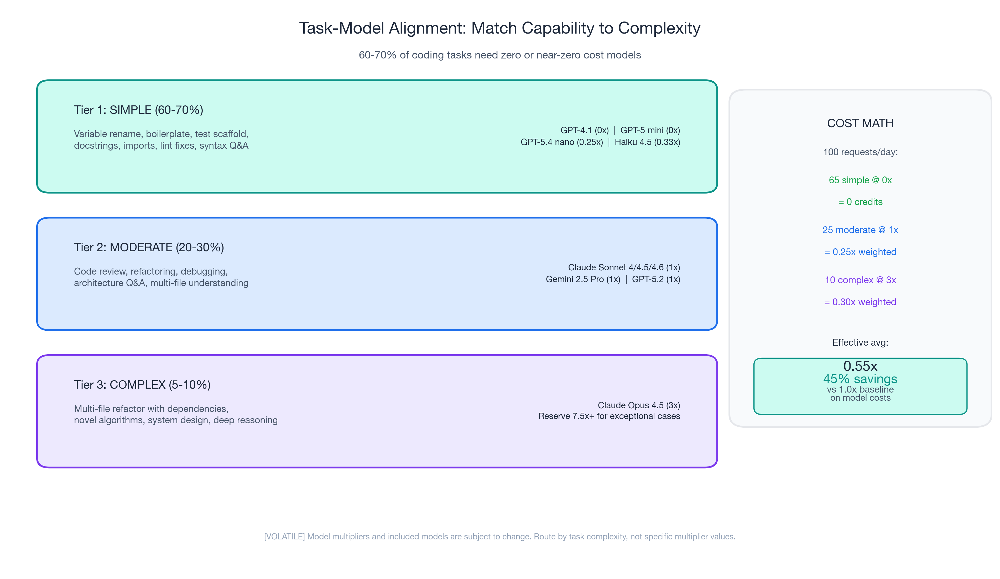
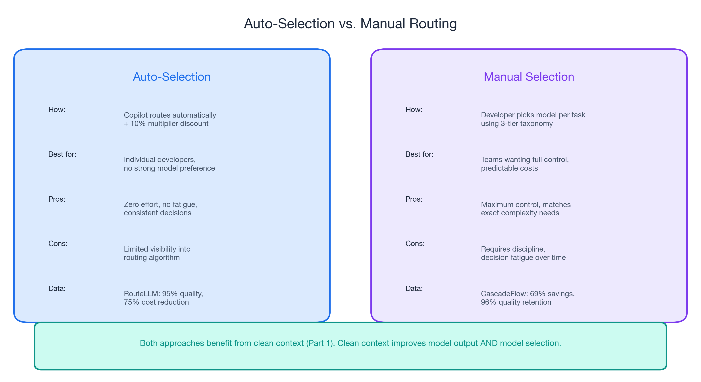
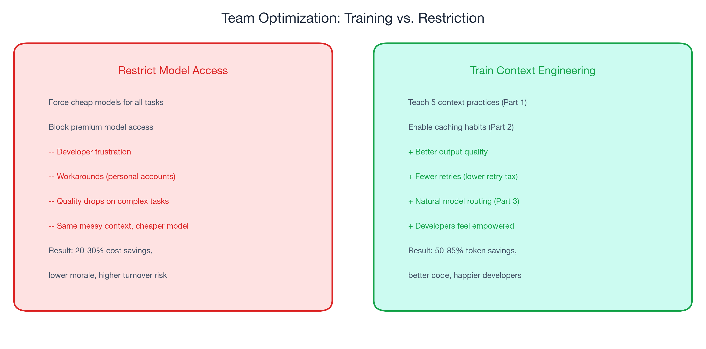
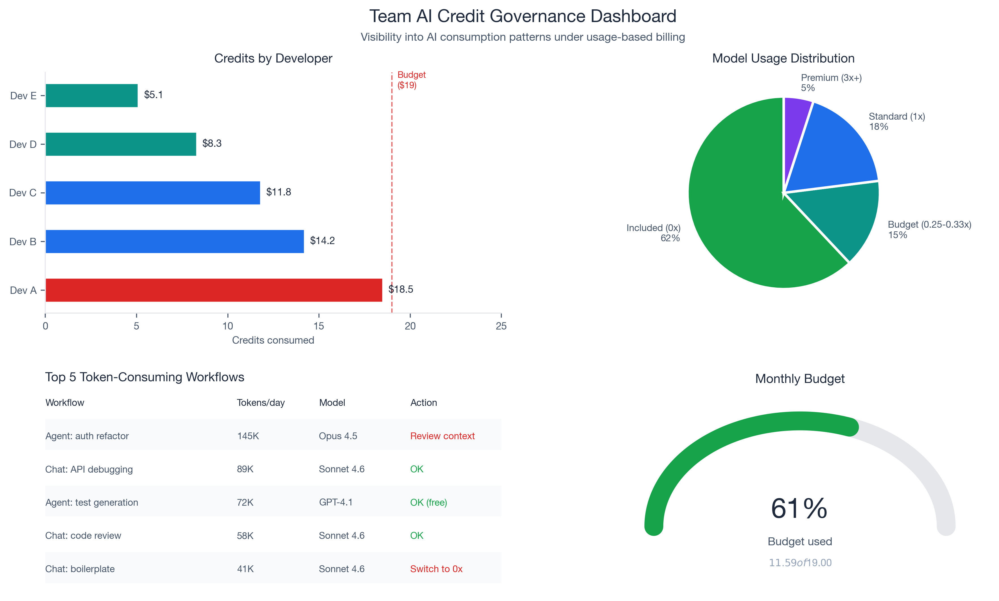
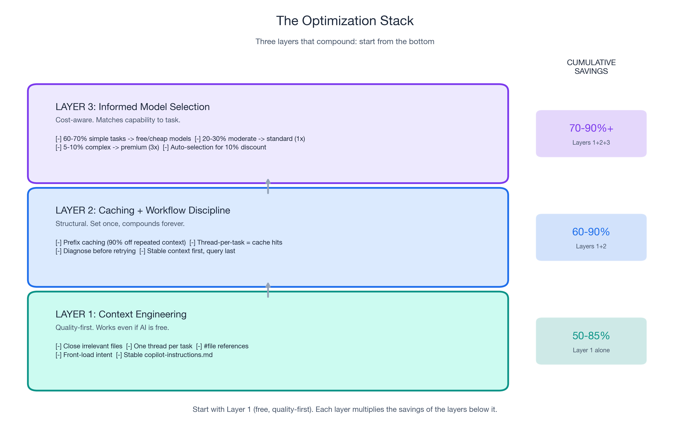

# The 120x Spread: Understanding What You Pay For and When It Matters

*Part 3 of 3 in the "Engineering Better AI Code Assistant Interactions" series*

*Previously: [Part 1](context-engineering-part-1.md) covered context engineering — five practices that improve output quality while cutting tokens by 50-85%. [Part 2](ai-code-assistant-cost-part-2.md) covered prompt caching (90% discount on repeated context) and workflow discipline (eliminating the retry tax).*

---

## Not All Tokens Are Priced Equal: Understanding GitHub Copilot Model Multipliers

`[VOLATILE]` Under GitHub Copilot's usage-based billing (effective June 1, 2026), every model carries a multiplier that determines how many credits a request consumes. GPT-5.4 nano costs 0.25x. Claude Opus 4.6 fast mode costs 30x. That is a **120x cost difference** for the same interaction pattern.

But this is not a "use cheap models" story. This is a "understand when expensive models add genuine value" story.

Apple ML Research found that reasoning models burn thousands of extra tokens on simple tasks — with **zero quality improvement**. Standard models actually provided better accuracy on low-complexity items. The expensive model is not always the better choice, even if money is no object.

In Part 1, you learned to give AI better input (context engineering). In Part 2, you learned to avoid paying repeatedly for that input (caching) and to stop wasting tokens on retries (workflow discipline). This post teaches you the third layer: **match the model to the task** to optimize AI code assistant output.

The context is clean. The clean context is cached. Now, which model processes it?

---

## Matching Model Capability to Task Complexity

Not every coding task requires the same level of AI capability. The research and production data converge on a three-tier taxonomy.

### Tier 1: Simple tasks (60-70% of daily interactions)

Variable renaming. Boilerplate generation. Test scaffolding. Docstring writing. Import fixing. Linting explanations. Simple chat questions about syntax or API usage.

These tasks require pattern matching and recall, not multi-step reasoning. Premium models add no measurable value here. Apple ML Research found that standard models provide better accuracy on low-complexity items without the token overhead of reasoning chains.

`[VOLATILE]` **Recommended models**: Included models (GPT-4.1, GPT-4o, GPT-5 mini at 0x on paid plans) or budget models (GPT-5.4 nano at 0.25x, Claude Haiku 4.5 at 0.33x). Even if included models change — and GitHub's documentation notes they are subject to change — budget-tier models will remain dramatically cheaper than premium.

The key insight: **60-70% of your daily AI interactions can use free or near-free models with no loss in output quality.** This is not a compromise. The data shows these models perform equally well on simple tasks. Using a 30x model for variable renaming is like hiring a senior architect to move a button 3 pixels to the left.

### Tier 2: Moderate tasks (20-30% of daily interactions)

Code review with contextual understanding. Refactoring suggestions that span multiple functions. Debugging assistance that requires reading stack traces and correlating them with code. Architecture questions. Multi-file understanding where the model needs to reason about relationships between components.

These tasks benefit from stronger reasoning but do not require frontier capability. The 1x multiplier tier offers the best quality-per-credit ratio for this workload.

`[VOLATILE]` **Recommended models**: Standard models (Claude Sonnet 4/4.5/4.6, Gemini 2.5 Pro, GPT-5.2 — all at 1x).

### Tier 3: Complex tasks (5-10% of daily interactions)

Multi-file refactoring with complex dependency chains. Novel algorithm implementation where no obvious pattern exists. System design with constraint satisfaction across performance, security, and maintainability. Deep architectural reasoning where the model must hold multiple competing concerns in context simultaneously.

These are the only tasks where premium models demonstrably outperform standard models. Use them deliberately.

`[VOLATILE]` **Recommended models**: Premium models (Claude Opus 4.5 at 3x) for genuinely complex work. Reserve the 7.5x+ tier (GPT-5.5) and above for exceptional cases where you have a specific, articulable reason.

### The cost math

If a developer makes 100 AI requests per day and routes by task complexity:

| Tier | % of requests | Multiplier | Weighted cost |
|------|--------------|------------|---------------|
| Simple (Tier 1) | 65% | 0x (included) | 0 |
| Moderate (Tier 2) | 25% | 1x | 0.25x |
| Complex (Tier 3) | 10% | 3x | 0.30x |
| **Effective average** | | | **0.55x** |

Compared to using a 1x model for everything, routing by task complexity cuts model costs by **45%** — while using a *more expensive* model for the hardest tasks. You are not downgrading. You are matching capability to need.

RouteLLM demonstrated this at scale: **95% of GPT-4 quality using only 14% GPT-4 calls**. CascadeFlow achieved **69% savings with 96% quality retention**. The production case study from TDS showed a coding team dropping from **$3,000/day to $970/day (68% reduction, $740K/year annualized)** through routing alone.

The router does not sacrifice quality. It eliminates waste.

---

## Let the Router Do the Work

For developers who do not want to manually switch models for every request, `[VOLATILE]` Copilot's auto model selection offers a **10% multiplier discount** and algorithmically routes tasks to appropriate models.

The research supports routing over manual selection for most developers. RouteLLM's matrix factorization router achieved 95% quality at 75% cost reduction — better than most humans would achieve switching models manually, because the router makes the decision instantly on every request without fatigue or habit bias.

CascadeFlow took a different approach — trying a cheaper model first and escalating only if confidence is low — and delivered **69% savings with 96% quality retention**. Both strategies converge on the same principle: let the system match complexity to capability instead of paying premium rates by default.

Honest caveat: there is limited public data on Copilot's specific auto-selection algorithm. The 10% discount is a financial incentive, but the real value depends on how well the router matches task complexity to model capability. For teams that want maximum control, manual model selection using the task taxonomy above is more predictable. For most individual developers, auto-selection with the 10% discount is the pragmatic default.

The combination of auto-selection and the context engineering practices from Part 1 is particularly powerful. When your context is clean, the router gets better signal about what you are asking — which means better routing decisions. Clean context does not just improve model output. It improves model *selection*.

---

## Budget Visibility for Engineering Managers: GitHub Copilot Usage-Based Billing Governance

If you manage a team of 5-20 developers on GitHub Copilot Business or Enterprise, the billing change introduces governance tools that did not exist under the flat-rate model.

### New capabilities under usage-based billing

`[VOLATILE]` The new billing model provides:

- **Pooled usage** across organizations — credits can be shared rather than siloed per user
- **Budget controls** at enterprise, cost center, and user levels — set spending limits before they are hit
- **Usage visibility** — see which developers, projects, and models consume the most credits

This is the first time engineering managers have had granular visibility into AI tool consumption patterns. Under flat-rate billing, a developer who made 300 requests per day and one who made 30 looked identical on the bill. Under usage-based billing, the cost difference is visible — and so are the optimization opportunities.

### Recommended team standards

**1. Establish default model guidelines by task type.** Document your team's task taxonomy (simple/moderate/complex) and recommended models for each tier. Add this to your team wiki or, better yet, to your `.github/copilot-instructions.md` — where it serves as both human reference and AI context.

**2. Set budget alerts before June 1.** `[VOLATILE]` Do not wait for the first bill. Configure alerts at 50%, 75%, and 90% of your team's credit allocation. Business plans include $19 in credits per user (with $30/month promotional credits June through August). Enterprise plans include $39 per user (with $70/month promotional credits June through August). Set alerts relative to your expected usage, not the promotional ceiling.

**3. Review top-consuming projects monthly.** Identify which repositories and workflows generate the most tokens. Often, the highest consumption comes from agent-mode sessions (multi-step autonomous coding), which are valuable but expensive. Ensure these are running with clean context (Part 1) and caching-friendly structure (Part 2).

**4. Invest in context engineering training, not model restrictions.** The managers who restrict model access will create frustration and workarounds. The managers who teach context engineering will get the same cost reduction — or better — with happier developers.

Consider the math: a team of 10 developers where each applies context engineering (50-85% token reduction from Part 1) and caching (up to 90% on repeated prefixes from Part 2) will spend dramatically less than a team of 10 developers restricted to cheap models but writing vague prompts with 15 files open.

`[VOLATILE]` If 70% of your team's tasks use included models (0x) with proper context engineering and caching, the effective monthly cost per developer drops well below the credit allocation — even without promotional pricing.

**The framing matters.** This is "investing in developer effectiveness," not "policing AI usage." The goal is developers who produce better code with AI assistance, not developers who use less AI.

---

## The Complete Playbook: Three Layers, One Page

This is the synthesis of the entire series. Three layers of optimization that stack multiplicatively.

### Layer 1: Context Engineering (Part 1)

Five practices. Quality improvement is the primary benefit. Token reduction: **50-85%**.

- Close irrelevant files before prompting
- One thread per task
- Use `#file` references for targeted context
- Front-load intent in every prompt
- Maintain a stable copilot-instructions.md

**"Would I do this even if AI were free?"** Yes. Every practice improves output quality independently of cost.

### Layer 2: Caching and Workflow Discipline (Part 2)

Structural savings that compound invisibly. Token reduction on repeated context: **up to 90%**. Retry elimination: **20-50% fewer wasted requests**.

- Stable copilot-instructions enable automatic prefix caching
- One thread per task maximizes cache hits
- Diagnose before retrying (eliminate the retry tax)
- Structure prompts: stable context first, specific query last

**"Would I do this even if AI were free?"** Mostly. Workflow discipline improves quality regardless. Caching mechanics are billing-specific but cost nothing to enable.

### Layer 3: Informed Model Selection (Part 3)

Task-aware routing. Cost reduction through matching: **45-75%** on model costs.

- 60-70% of tasks: free/cheap models (no quality loss)
- 20-30% of tasks: standard models (best quality-per-credit)
- 5-10% of tasks: premium models (deliberate, justified use)
- Auto-selection for 10% discount when you have no strong preference

**"Would I do this even if AI were free?"** This layer is billing-specific. It exists because of the multiplier spread and is the right optimization only after Layers 1 and 2 are in place.

### The combined effect

A developer applying all three layers could achieve **70-90% effective cost reduction** compared to an unoptimized workflow — while getting **better output quality** than someone using expensive models with messy context.

The hierarchy matters. **Start with context engineering** (Layer 1). It has the highest quality impact and costs nothing. **Add caching** (Layer 2). It is structural and automatic once your context habits are right. **Then optimize model selection** (Layer 3). It is the final multiplier, applied to an already-efficient workflow.

Each layer multiplies the savings of the previous layers. Clean context (Layer 1) produces fewer tokens for caching to discount (Layer 2), and the cached, clean context gets routed to the right model (Layer 3). The stack compounds.

---

## Start With Context, Not Cost

The developers who will thrive under usage-based billing are not the ones who switched to the cheapest model. They are the ones who learned to give AI better input.

Context engineering is the skill. Everything else follows.

If you have read all three parts, you have the complete playbook. If you are going to start with just one thing, make it this:

**1. Apply the five context engineering practices from [Part 1](context-engineering-part-1.md) this week.**
Close irrelevant files. One thread per task. Targeted `#file` references. Front-load intent. Create a copilot-instructions file. These five changes take five minutes each and improve every AI interaction you have from that point forward.

**2. Stabilize your copilot-instructions file to enable caching ([Part 2](ai-code-assistant-cost-part-2.md)).**
Write it once. Update it when your stack changes. Let the caching infrastructure do the rest. No ongoing effort required.

**3. Review the task taxonomy and match your default model to your actual task mix.**
If 65% of your requests are simple — and they probably are — you do not need a 1x model as your default. The included models handle simple tasks equally well. Save the premium models for the 5-10% where they make a measurable difference.

The billing change is real. The urgency is valid. But the advice is durable. Better input produces better output whether you pay per token, per request, or nothing at all. Build your workflow around that principle, and the cost takes care of itself.

---

*This is Part 3 of 3 in the "Engineering Better AI Code Assistant Interactions" series. [<-- Part 1: Context Engineering](context-engineering-part-1.md) | [<-- Part 2: Invisible Compound Savings](ai-code-assistant-cost-part-2.md)*

---

## Key Data Points Referenced

| Data Point | Value | Source |
|------------|-------|--------|
| `[VOLATILE]` Model multiplier range | 0.25x to 30x (120x spread) | [GitHub Docs](https://docs.github.com/en/copilot/managing-copilot/monitoring-usage-and-entitlements/about-premium-requests) |
| `[VOLATILE]` Included models (0x) | GPT-4.1, GPT-4o, GPT-5 mini (on paid plans) | [GitHub Docs](https://docs.github.com/en/copilot/managing-copilot/monitoring-usage-and-entitlements/about-premium-requests) |
| `[VOLATILE]` Auto-selection discount | 10% off multiplier | [GitHub Docs](https://docs.github.com/en/copilot/managing-copilot/monitoring-usage-and-entitlements/about-premium-requests) |
| RouteLLM quality retention | 95% of GPT-4 quality at 75% lower cost | [LMSYS](https://lmsys.org/blog/2024-07-01-routellm/) |
| RouteLLM GPT-4 call percentage | Only 14% of calls needed GPT-4 | [LMSYS](https://lmsys.org/blog/2024-07-01-routellm/) |
| CascadeFlow savings | 69% savings, 96% quality retention | [TDS](https://towardsdatascience.com/agentic-ai-how-to-save-on-tokens/) |
| Production routing case study | $3,000/day -> $970/day (68% reduction) | [TDS](https://towardsdatascience.com/inference-scaling-test-time-compute-why-reasoning-models-raise-your-compute-bill/) |
| Simple task percentage | 60-70% of coding requests | [TDS](https://towardsdatascience.com/inference-scaling-test-time-compute-why-reasoning-models-raise-your-compute-bill/) |
| Apple ML Research | Reasoning models: no gain on simple tasks | [TDS](https://towardsdatascience.com/inference-scaling-test-time-compute-why-reasoning-models-raise-your-compute-bill/) |
| `[VOLATILE]` Business plan credits | $19/user ($30/mo promotional Jun-Aug) | [GitHub Blog](https://github.blog/news-insights/company-news/github-copilot-is-moving-to-usage-based-billing/) |
| `[VOLATILE]` Enterprise plan credits | $39/user ($70/mo promotional Jun-Aug) | [GitHub Blog](https://github.blog/news-insights/company-news/github-copilot-is-moving-to-usage-based-billing/) |
| `[VOLATILE]` Billing change date | June 1, 2026 | [GitHub Blog](https://github.blog/news-insights/company-news/github-copilot-is-moving-to-usage-based-billing/) |
| Context engineering token reduction | 50-85% (Part 1 data) | [Anthropic Engineering](https://www.anthropic.com/engineering/advanced-tool-use) |
| Prompt caching discount | 90% on repeated prefixes | [OpenAI](https://openai.com/api/pricing/), [Anthropic](https://docs.anthropic.com/en/docs/build-with-claude/prompt-caching) |
