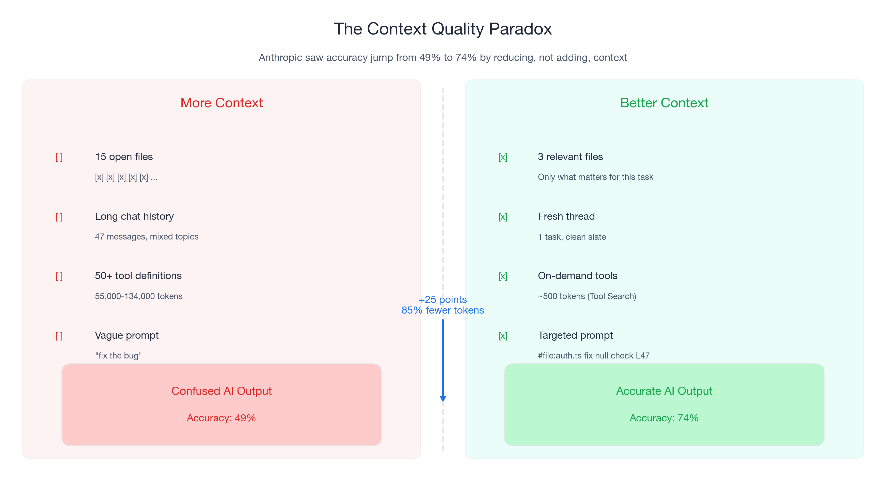
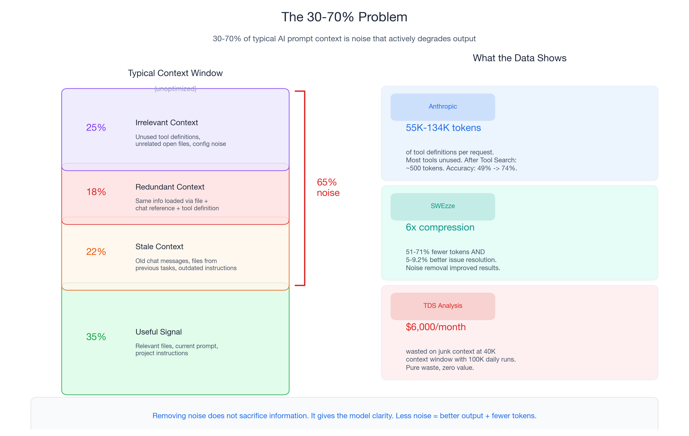
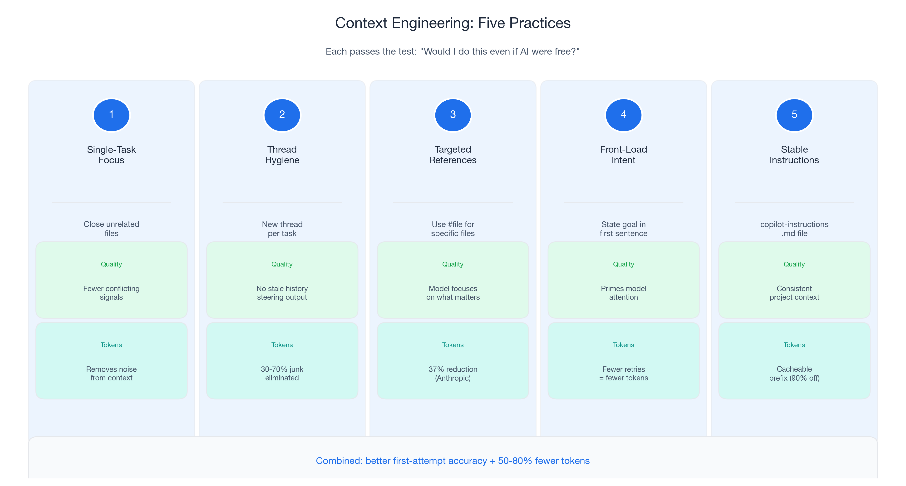
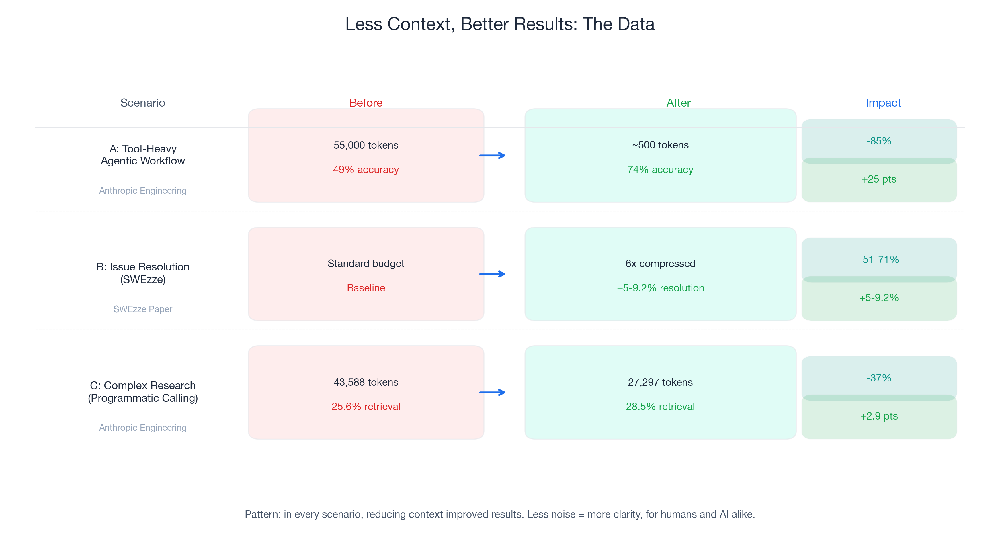

# Spend Fewer Tokens, Get Better Code: A Context Engineering Guide for AI Code Assistants

*Part 1 of 3 in the "Engineering Better AI Code Assistant Interactions" series*

---

## The Counterintuitive Truth About AI Code Assistants

Last November, Anthropic's engineering team ran into a problem. Their tool-use system was loading 50+ MCP tool definitions into every prompt — 55,000 to 134,000 tokens of context before the conversation even started. The model was drowning in tool definitions it would never use in a given request.

Their fix was counterintuitive: instead of adding smarter tool selection logic on top of the existing context, they stripped it out. They built Tool Search, which loads only ~500 tokens initially and fetches relevant tool definitions on demand. The result: **85% fewer tokens AND accuracy improved from 49% to 74%** on Opus 4. On Opus 4.5, accuracy jumped from 79.5% to 88.1%.

Read that again. They removed context and the model got *better*.

This is not an isolated finding. A 2026 paper on SWEzze — a context compression system for software engineering tasks — showed that **6x compression delivered 51-71% fewer tokens AND 5-9.2% better issue resolution rates** on SWE-bench. Less input. Better output.

If you have used an AI code assistant for more than a week, you have experienced this pattern without knowing it. Some sessions, Copilot generates exactly what you need on the first attempt. Other sessions, it produces confused, irrelevant, or hallucinated code. The difference is usually not the model. It is the context. The files you have open. The chat history you are carrying. The specificity of your prompt.

The single highest-leverage skill for AI-assisted development is **context engineering**: the practice of giving AI better input so it produces better output. The quality improvement is the primary goal. The cost savings — and with GitHub Copilot moving to usage-based billing on June 1, 2026, there are real cost savings — are a natural consequence.

This post covers five practices that make your AI code assistant more reliable. Every practice passes a simple test: **would I do this even if AI were free?** The answer is yes for all five. They make you more effective. The token reduction is a bonus.

---

## The 30-70% Problem

Research from Towards Data Science found that **30-70% of typical AI prompt context is noise** — tokens that do not help the model and actively degrade performance. This is not neutral overhead. Junk context introduces conflicting signals that push the model toward hallucination, hedging, and irrelevant output.

In code assistant workflows, context noise falls into three categories:

### Stale context

Open files from a previous task. Old chat messages about a different feature. Instructions you wrote for a problem you solved two hours ago. The model treats all of it as relevant input and tries to reconcile it with your current request. When the stale context conflicts with your actual intent, the model hedges or hallucinates.

### Redundant context

The same information loaded through multiple paths: file content you opened explicitly, the same file referenced in a chat message, and a tool definition that reads the same file. The model processes all three, paying tokens for repeated information that adds no signal.

### Irrelevant context

Tool definitions for tools you will never call in this request. Files that happen to be open because you were browsing earlier. Project configuration files that have nothing to do with the code you are writing. Every irrelevant file consumes tokens and dilutes the model's attention.

Anthropic's engineering data puts a concrete number on this. Before their Tool Search optimization, 50+ MCP tools consumed **55,000-134,000 tokens per request**. Most tools were unused in any given interaction. After optimization: ~500 tokens initial load. The 85% reduction did not remove useful information — it removed noise.

The math translates directly to your daily workflow. If you have 12 files open in VS Code and ask Copilot about one of them, the other 11 are noise. Each one adds context tokens. Each one dilutes the model's focus on the file you actually care about. The SWEzze paper quantified this: **compressing context to remove the noise did not just save tokens — it improved the success rate by 5-9.2%**. The model performed better with less.

This is not a trade-off. It is a free lunch.

---

## Five Practices That Improve Output Quality

Each practice below passes the "would I do this even if AI were free?" test. They are ordered by impact and ease of adoption.

### Practice 1: Single-Task Focus

**What**: Close files unrelated to your current task before prompting.

**Why it works**: Every open file in your editor adds tokens to Copilot's context. More importantly, unrelated files introduce conflicting patterns. If you are working on an API endpoint and have a database migration file open from earlier, the model receives mixed signals about what you are building. GitHub's official guidance is explicit: "Remember to close unneeded files when context switching or moving on to the next task."

**The data**: Anthropic saw accuracy jump 25 percentage points (49% to 74%) by loading only relevant tool definitions instead of everything. The same principle applies to files: fewer, more relevant files produce better suggestions.

**Your action**: Before your next Copilot interaction, close every file tab except the ones directly relevant to your current task. Run a single prompt. Note whether the output is more focused.

### Practice 2: Thread Hygiene

**What**: Start a new chat thread when you switch tasks. One thread per task.

**Why it works**: Chat history accumulates tokens across every message in a thread. If you asked about authentication logic 20 messages ago and now you are working on pagination, those authentication messages are still in context. The model tries to reconcile them with your current request. Old context does not just waste tokens — it actively steers the model toward stale problems.

**The data**: TDS analysis found that removing junk from context (which includes stale conversation history) clears 30-70% of tokens. At a 40K context window with 100K daily runs, that junk costs up to $6,000 per month in wasted inference.

**Your action**: Adopt a simple rule — one thread per task. When you finish a feature and start the next one, open a fresh thread. It takes two seconds and gives the model a clean slate.

### Practice 3: Targeted References

**What**: Use `#file` references to include specific files instead of relying on implicit "everything that is open" context.

**Why it works**: When you type a prompt in Copilot Chat, the model receives context from your open files, your chat history, and any explicit references. By using `#file:path/to/specific-file.ts`, you tell the model exactly which file matters. This is targeted context — high signal, low noise.

**The data**: Anthropic's Programmatic Tool Calling reduced token consumption from 43,588 to 27,297 (37% reduction) while improving knowledge retrieval accuracy from 25.6% to 28.5%. The mechanism is the same: instead of sending all intermediate results to the model, only the relevant output reaches it. Targeted input produces better results.

**Your action**: Instead of asking "fix the bug in the auth module," try: `#file:src/auth/middleware.ts There's a null check missing on the session object at line 47. Add validation before accessing session.user.` The model gets less context but more relevant context.

### Practice 4: Front-Load Intent

**What**: State what you want in the first sentence, then provide details.

**Why it works**: Language models process context sequentially. The first tokens in your prompt prime the model's attention for everything that follows. If you bury your intent after three paragraphs of background, the model is already forming hypotheses before it knows what you want. Leading with intent aligns the model's attention from the start.

**The data**: GitHub's best practices emphasize that "a top-level comment in the file you're working in can help GitHub Copilot understand the overall context of the pieces you will be creating." The same applies to chat: lead with the goal, then provide supporting detail.

**Your action**: Structure prompts as: **intent → context → constraints**. Example: "I need to add cursor-based pagination to the user list endpoint. The current implementation in `#file:src/routes/users.ts` returns all records. Use a default page size of 50. Return a `nextCursor` field in the response." Intent first. Specifics second.

### Practice 5: Stable Instructions

**What**: Maintain a `.github/copilot-instructions.md` file with your project's tech stack, conventions, and constraints.

**Why it works**: Without a copilot-instructions file, you repeat the same context in every prompt: "we use TypeScript," "follow the existing pattern in the codebase," "use Prisma for database access." Each repetition costs tokens and introduces variation (you phrase it slightly differently each time, which can confuse the model). A stable instructions file provides consistent, cacheable project context that the model receives automatically.

**The data**: This practice also enables prompt caching (covered in Part 2). When your instructions file is stable, its tokens form a prefix that providers cache at up to 90% discount. But even without caching, the quality benefit is immediate: the model starts every interaction with accurate project context instead of guessing.

**Your action**: Create `.github/copilot-instructions.md` in your repository with three sections: (1) tech stack and framework versions, (2) coding conventions and patterns your team follows, (3) common constraints or gotchas specific to your project. Keep it under 200 lines. Update it when your stack changes, not per-task.

---

## What Happens When You Engineer Context: The Data

The pattern across multiple independent studies is consistent: reducing context improves results. Here are three concrete scenarios.

### Scenario A: Tool-Heavy Agentic Workflow

| | Before | After |
|---|--------|-------|
| **Setup** | 50+ MCP tools loaded upfront | Tool Search: load on demand |
| **Token consumption** | 55,000+ tokens of tool definitions | ~500 tokens initial load |
| **Accuracy (Opus 4)** | 49% | 74% |
| **Accuracy (Opus 4.5)** | 79.5% | 88.1% |

**Token reduction**: 85%. **Quality improvement**: +25 percentage points (Opus 4). Source: [Anthropic Engineering](https://www.anthropic.com/engineering/advanced-tool-use).

### Scenario B: Issue Resolution with Compressed Context

| | Before | After |
|---|--------|-------|
| **Setup** | Full repository context | SWEzze 6x compression |
| **Token consumption** | Standard budget | 51.8-71.3% fewer tokens |
| **Issue resolution rate** | Baseline | 5-9.2% better |

**Token reduction**: 51-71%. **Quality improvement**: +5-9.2% resolution rate. Source: [SWEzze paper](https://arxiv.org/abs/2603.28119).

### Scenario C: Complex Research Tasks with Programmatic Tool Calling

| | Before | After |
|---|--------|-------|
| **Setup** | Standard tool-calling flow | Programmatic Tool Calling |
| **Token consumption** | 43,588 tokens per task | 27,297 tokens per task |
| **Knowledge retrieval accuracy** | 25.6% | 28.5% |

**Token reduction**: 37%. **Quality improvement**: +2.9 percentage points. Source: [Anthropic Engineering](https://www.anthropic.com/engineering/advanced-tool-use).

The pattern is unambiguous: **in every scenario, less context produced better results**. The model is not losing information when you remove noise. It is gaining clarity. This is the same principle as writing clean code — a 500-line function with 200 lines of dead code is harder to understand than a clean 300-line function, for humans and for AI models alike.

---

## June 1, 2026: Context Quality Gets a Price Tag

Everything above is worth doing regardless of how you are billed. But the timing matters.

Starting June 1, 2026, GitHub Copilot moves from a premium-request system to usage-based billing. Credits are consumed based on token usage — input tokens, output tokens, and cached tokens — at published rates per model. Plan pricing stays the same (Pro $10/month, Business $19/user, Enterprise $39/user), with promotional credits for Business ($30/month) and Enterprise ($70/month) during June through August.

What changes: **every token of junk context now has a visible cost**. The 30-70% of noise tokens is no longer abstract waste. It shows up on the bill. A developer who applies the five practices from this post will consume fewer tokens per interaction, get better output, and spend fewer credits.

What does not change: the advice in this post is valuable whether you pay per token, per request, or nothing at all. Context engineering improves output quality under any billing model. The June 1 change creates a financial incentive to invest in a skill that was already worth having.

A note on volatility: model multipliers, included models (currently GPT-4.1 and GPT-5 mini at 0x on paid plans), and promotional credits are subject to change — GitHub's documentation says so explicitly. Build your workflow around context quality, which is durable, not around specific multiplier values, which are not. The billing model may evolve. The principle that better input produces better output will not.

---

## Your First Week: Five Changes, Five Minutes Each

Every action below is ranked by quality-improvement impact, not cost savings. None of them cost money to implement. None require changing your model. None sacrifice capability.

**1. Close irrelevant files before prompting** (quality impact: high)
Reduce conflicting signals. The model focuses on what matters.

**2. Start new threads when switching tasks** (quality impact: high)
Eliminate stale context. Each task gets a clean slate.

**3. Use `#file` references for targeted context** (quality impact: high)
Focus the model's attention on specific files instead of everything open.

**4. Create a `.github/copilot-instructions.md`** (quality impact: medium, compounds over time)
Stable project context that eliminates repetitive explanations and enables caching.

**5. Front-load intent in every prompt** (quality impact: medium)
State what you want first, then provide details. Prime the model's attention.

These five practices will make your AI code assistant noticeably more reliable within a week. You will get better first-attempt output, fewer retries, and less frustration. The token reduction — and the cost savings that come with it under the new billing model — follows naturally.

---

## Coming Up Next

In **Part 2: "Invisible Compound Savings"**, I cover prompt caching (up to 90% savings on repeated context with zero quality trade-off) and workflow discipline (the retry tax and how to eliminate it). Once your context is clean, caching that clean context is the next lever.

In **Part 3: "The 120x Spread"**, I cover model selection — not "use cheap models" but "understand when premium models genuinely help and when they don't." The multiplier table, auto-selection, and team governance go here.

---

*This is Part 1 of 3 in the "Engineering Better AI Code Assistant Interactions" series. [Part 2: Invisible Compound Savings →](#) | [Part 3: The 120x Spread →](#)*

---

## Key Data Points Referenced

| Data Point | Value | Source |
|------------|-------|--------|
| Tool Search token reduction | 85% (55K → ~500 tokens initial) | [Anthropic Engineering](https://www.anthropic.com/engineering/advanced-tool-use) |
| Tool Search accuracy improvement (Opus 4) | 49% → 74% | [Anthropic Engineering](https://www.anthropic.com/engineering/advanced-tool-use) |
| Tool Search accuracy improvement (Opus 4.5) | 79.5% → 88.1% | [Anthropic Engineering](https://www.anthropic.com/engineering/advanced-tool-use) |
| SWEzze compression ratio | 6x compression | [SWEzze paper](https://arxiv.org/abs/2603.28119) |
| SWEzze token reduction | 51.8-71.3% | [SWEzze paper](https://arxiv.org/abs/2603.28119) |
| SWEzze quality improvement | 5-9.2% better issue resolution | [SWEzze paper](https://arxiv.org/abs/2603.28119) |
| Programmatic Tool Calling token reduction | 37% (43,588 → 27,297) | [Anthropic Engineering](https://www.anthropic.com/engineering/advanced-tool-use) |
| Programmatic Tool Calling accuracy improvement | 25.6% → 28.5% knowledge retrieval | [Anthropic Engineering](https://www.anthropic.com/engineering/advanced-tool-use) |
| Context junk percentage | 30-70% of typical context | [TDS](https://towardsdatascience.com/agentic-ai-how-to-save-on-tokens/) |
| Junk context monthly cost (40K window, 100K runs) | Up to $6,000 | [TDS](https://towardsdatascience.com/agentic-ai-how-to-save-on-tokens/) |
| `[VOLATILE]` Billing change date | June 1, 2026 | [GitHub Blog](https://github.blog/news-insights/company-news/github-copilot-is-moving-to-usage-based-billing/) |
| `[VOLATILE]` Plan pricing | Pro $10, Business $19/user, Enterprise $39/user | [GitHub Blog](https://github.blog/news-insights/company-news/github-copilot-is-moving-to-usage-based-billing/) |
| `[VOLATILE]` Promotional credits | Business $30/mo, Enterprise $70/mo (Jun-Aug) | [GitHub Blog](https://github.blog/news-insights/company-news/github-copilot-is-moving-to-usage-based-billing/) |
| GitHub context advice | "Close unneeded files when context switching" | [GitHub Blog](https://github.blog/developer-skills/github/how-to-use-github-copilot-in-your-ide-tips-tricks-and-best-practices/) |
