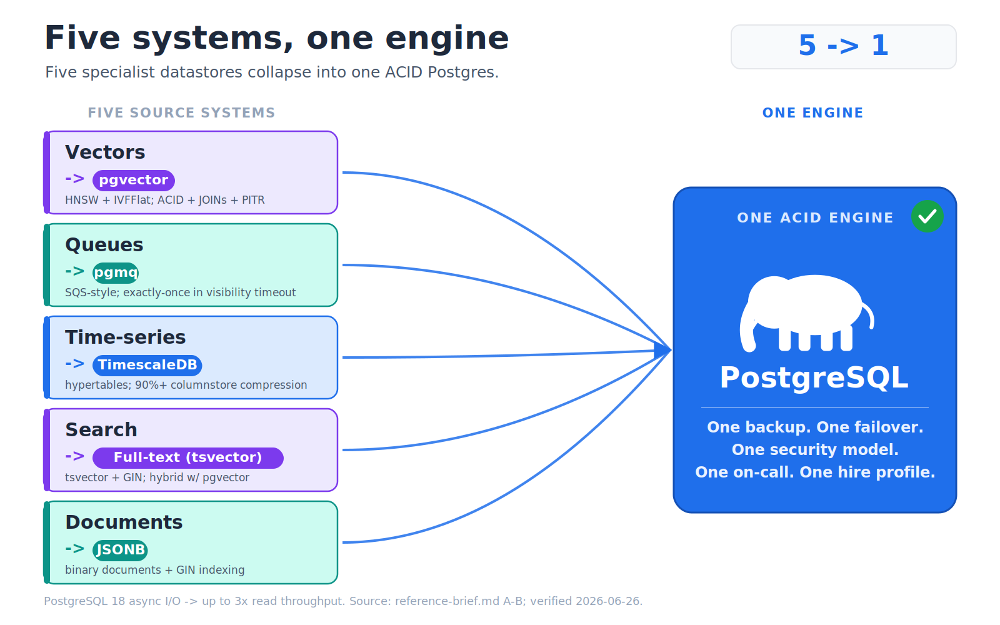
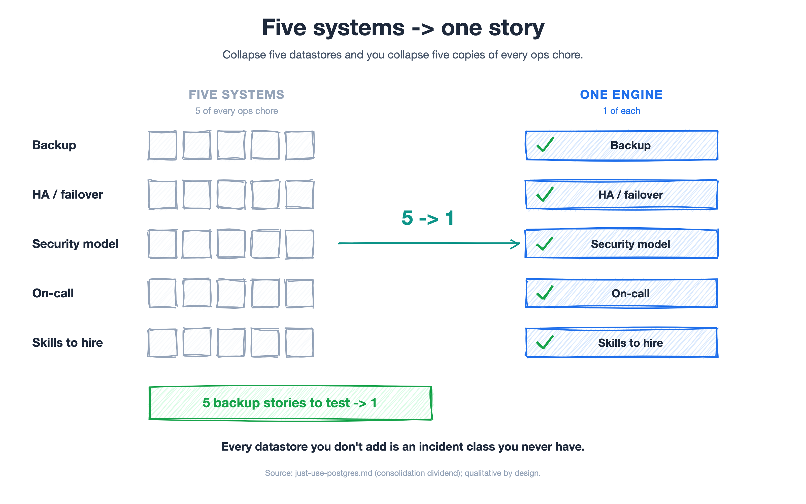
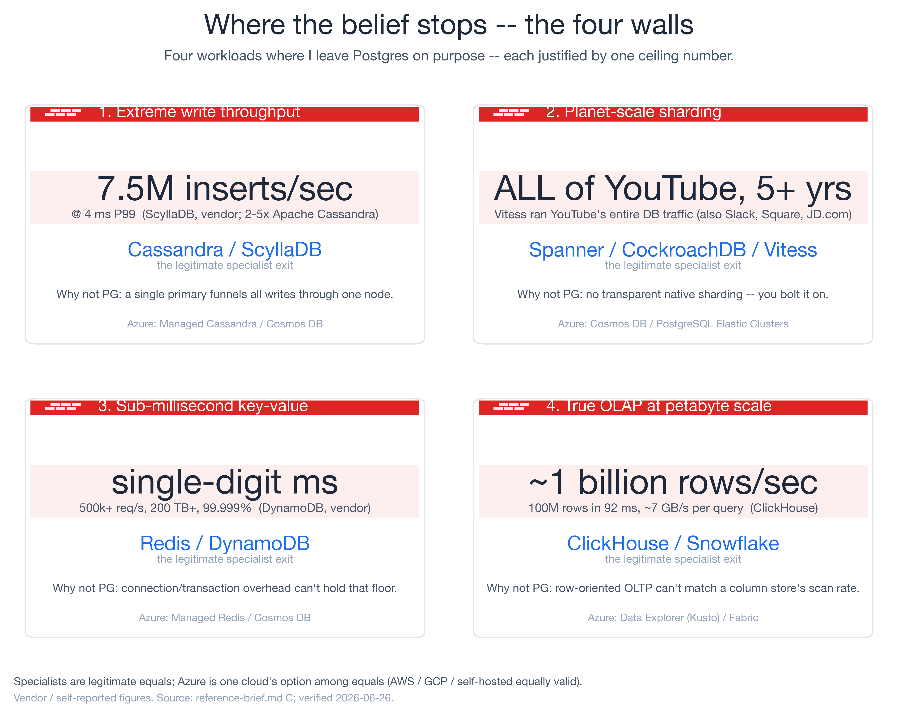
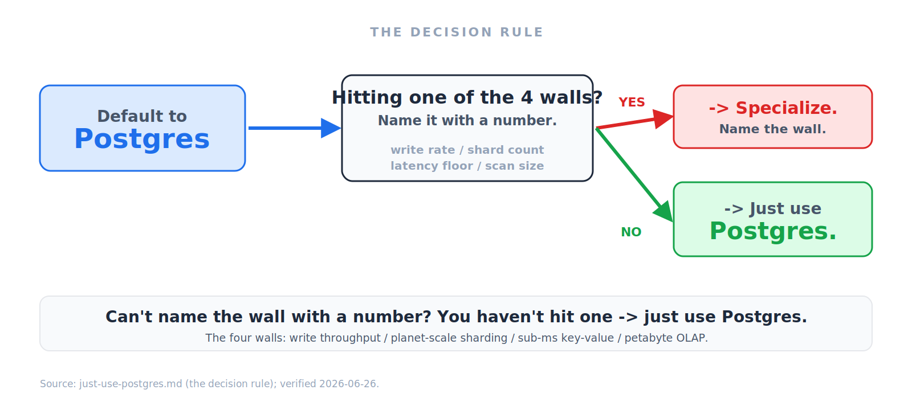

<!-- _class: lead -->

Database Architecture · A decision framework · 2026

# When Not to Use Postgres

## A decision framework for the four walls where one engine isn't enough

One ACID engine now absorbs vectors, time-series, queues, search, and documents. Here is the consolidation case for defaulting to Postgres — and the four specific walls where I still reach for a specialist.

10 slides · first-person field notes

<!-- Topic: Cold open — I open with the meme-turned-default because the room splits instantly into believers and the one architect who just bought a vector database last quarter; my job for the next ten slides is to win the believer's case fairly and then hand that nervous architect four real walls so nobody leaves feeling sold to. -->

---

The anecdote · field notes

# Five datastores, one product

Across years with customers, I've watched **team after team** hit the same knot. One ran **five moving parts** to serve a single product:

- **Postgres** — the relational core
- **Redis** — the hot path
- **Elasticsearch** — search
- **A message queue** — background jobs
- **A cron service** — scheduled work

Five backup stories. Five things to monitor, patch, secure, and get paged about at 2 a.m. **We collapsed all of it into one Postgres** — fewer moving parts, and the cloud bill went down because we stopped paying for four managed services.

<!-- Topic: The origin story — This is the slide that earns the rest, because "we ran five datastores and it hurt" is a sentence every senior engineer has lived and nobody puts on a conference slide; I keep it qualitative on purpose — fewer parts and a smaller bill, no invented percentages — because the moment I fabricate a tidy 40% I lose the one person in the room who has actually read a cloud invoice. -->

---

Why now · the measured default

# "Just use Postgres" stopped being a meme

It is not a half-joke about résumé-driven database sprawl anymore. It is the measured default.

- **48.7%** most-used database, two years running — up from **33% in 2018** *(Stack Overflow 2024)*
- **47.1%** most-admired **and** **74.5%** most-desired — the one people use *and* want next
- **PostgreSQL 18** (Sept 2025) shipped async I/O for **up to 3× read throughput**; PG19 is already in beta

The engine is getting *better* at exactly the workloads that used to push you off it.

<!-- Topic: The data backbone — Three numbers do all the work here: most-used proves adoption, most-desired proves it isn't legacy inertia, and the PG18 async-I/O figure proves the curve is still bending upward; I lead with the survey rather than my own anecdote because a believer who only cites their own war story is indistinguishable from a zealot who got lucky once. -->

---

The consolidation case · the star

# Five systems, one engine

Most teams reaching for a second, third, or fourth datastore are solving a problem **Postgres already handles** — and paying an operational tax to do it.

<!-- Topic: The thesis in one picture — The hero diagram is the whole argument compressed into one frame: five boxes you were going to provision, one engine that already does the job, and an arrow doing the persuading so I don't have to; I let the visual breathe for a beat before talking, because the consolidation case sells itself far better as a picture of things disappearing than as me listing extensions. -->

---

The consolidation case · one engine, five workloads

# The extension does the job you were buying a database for

- **Vectors → pgvector** — similarity search *next to* your rows: HNSW/IVFFlat, plus ACID, JOINs, and point-in-time recovery. No second system to sync.
- **Queues → pgmq** — SQS-style queue where the **job and its data commit in the same transaction**. The "row saved but the job never fired" bug becomes impossible.
- **Time-series → TimescaleDB** — hypertables, continuous aggregates, a columnstore that routinely hits **90%+ compression**.
- **Search → `tsvector` + GIN** — real lexical ranking and phrase queries; fuse with pgvector for hybrid search.
- **Documents → JSONB** — a binary document type with GIN indexing — schemaless where you want it, relational where you need it.

<!-- Topic: The workload tour — Each line names the reflex purchase and then the extension that quietly retires it, and the pgmq same-transaction guarantee is the one I slow down on, because "saved but never fired" is a 2 a.m. pager story everyone in the room has debugged and nobody enjoyed; the through-line is that "next to the data" beats "synced from the data" every single time the sync pipeline breaks, which is always. -->

---

The consolidation dividend · for whoever owns the pager

# Five systems → one ops story

One backup to test. One failover to rehearse. One security model to audit. One on-call rotation. One skill set to hire for. **Every datastore you don't add is a category of incident you never have.**

<!-- Topic: The leader's slide — This is where the CTO leans in, because consolidation stops being a tidiness win and becomes a headcount-and-incident-budget win: five backup rehearsals you no longer run, four vendor invoices you never receive, and one on-call rotation instead of a rota nobody volunteers for; the punchline does the heavy lifting — a system you never add can't page you, and the cheapest incident is the one that was architecturally impossible. -->

---

Where the belief stops · believer, not zealot

# The four walls

1. **Extreme writes → Cassandra / ScyllaDB** — one primary funnels every write; ScyllaDB publishes **7.5M inserts/sec @ 4 ms P99**.
2. **Planet-scale sharding → Vitess / Spanner / CockroachDB** — Vitess ran **all of YouTube's** DB traffic for **5+ years**.
3. **Sub-ms key-value → Redis / DynamoDB** — DynamoDB: **500k+ req/s, 99.999%** availability, single-digit-ms floor.
4. **True OLAP → ClickHouse / Snowflake** — column-store scan of **~1 billion rows/sec** a row store can't match.

<!-- Topic: The honest caveat — These four are not strawmen and I say so out loud, because the fastest way to lose a senior audience is to pretend the tool you love has no ceiling; each wall is a real number with a real specialist behind it — open-source, AWS, GCP, Azure, or self-hosted are all equal-footing paths, and I refuse to default to any one cloud here — and naming the ceiling precisely is exactly what turns "just use Postgres" from a slogan into an engineering position. -->

---

The decision rule · one line

# Name the wall, or you don't have one

**Default to Postgres.** When you hit a wall, name it with a number — write rate, shard count, latency floor, scan size. **If you can't name the number, you don't have the wall yet** — you have an itch to add a system.

<!-- Topic: The portable heuristic — This is the one sentence I want people to steal and repeat in their own design reviews: a wall you can't put a number on is an itch, not a requirement, and "we might need to scale someday" is the most expensive four words in architecture; the number is the whole gate, because write rate, shard count, latency floor, and scan size are falsifiable, whereas "it feels like we'll outgrow Postgres" is just résumé-driven development wearing a lanyard. -->

---

A framework for deciding · for the people who choose

# Default to Postgres, justify the exit

- **Make Postgres the default of record** — new workloads land there unless a named wall is proven. The burden of proof flips to whoever wants a new system.
- **Demand a number, not a vibe** — every proposal must name its wall and the threshold: write rate, shard count, latency floor, scan size.
- **Price the operational tax** — a specialist must beat Postgres by enough to pay for its own backup, failover, security, and on-call overhead.
- **Prove it cheaply** — spend a week consolidating one workload (pgvector / pgmq / TimescaleDB) and measure *before* you buy.

If no one can fill in the number, the wall is hypothetical — the default holds.

<!-- Topic: The decision framework — This is the slide the decision-makers actually take back to their next architecture review, because it converts a believer's war story into a policy they can enforce: default of record, a number or it doesn't ship, and an ops-tax line item so nobody adds a datastore on vibes; I keep the cheap one-week spike in because the fastest way to settle a "but we might need it" argument is to consolidate one workload and let the infra diff make the case for me. -->

---

<!-- _class: lead -->

Before you add the sixth datastore

# Default to Postgres. Specialize on purpose.

Ask the only question that matters: **which of the four walls am I actually hitting, and what is the number?** If you can name it, specialize with confidence. If you can't — just use Postgres.

**Run the audit this week:** for every datastore beyond Postgres, can your team name the wall it clears and the number? The ones that can't are consolidation candidates. Then tell me the call you made — and which wall, if any, forced your hand.

Full consolidation case, the four breakpoints with their numbers, and the default-to-Postgres decision framework in the write-up.

<!-- Topic: The close — I end on a question rather than a victory lap because the durable skill was never "love Postgres," it's "make every database a deliberate decision with a number attached"; the believer's case and the four walls are the same discipline pointed in opposite directions, and the stop condition for the whole talk is identical to the stop condition for the architecture — if you can't name the wall, you're done, just ship it on Postgres. -->
