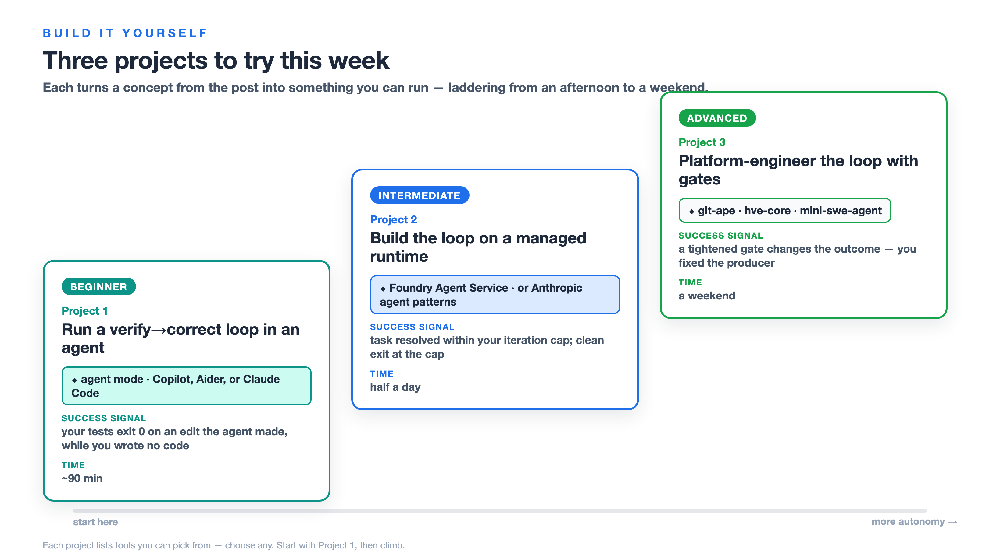

<!-- _class: lead -->

AI-Native Development · 2026

# From Prompts to Loop Engineering

## The workflow shift: prompt → context → harness → loop

The four-era arc of AI-native development — and why the unit of work you own has climbed all the way up to the iteration loop.

12 slides · first-person field notes

<!-- Topic: Cold open — I open by admitting the title is a slow-motion demotion of prompting, which is the fastest way to keep a room of prompt-hoarders listening: tell them the skill they sharpened is the one being automated out from under them, then promise the floor they should be standing on instead. -->

---

The reframe

# You're not getting better at prompting

The skill didn't improve. **It moved.**

Code generation got cheap, so **validation — not generation — is the bottleneck** *(CircleCI via InfoQ, Jun 2026)*. That single inversion pushes the work up the stack.

<!-- Topic: The inversion — Everyone wants a better wording trick, but the honest news is that the meter moved: generation is cheap and review is the chokepoint, so the highest-paid sentence you can write in 2026 is the stop condition, not the system prompt. -->

---

The through-line

# One staircase, four eras

- **Prompt engineering** — the wording of one request
- **Context engineering** — what the model *sees*
- **Harness engineering** — everything *around* the model
- **Loop engineering** — the iteration *cycle* itself

Each step automates the craft below it and pushes you up to govern a **bigger unit of work**.

By the end: know which step you're on, and ship your first real loop this week.

<!-- Topic: Map of the talk — I frame the four buzzwords as one staircase rather than four fads because that reframe is the whole value-add; treating "context engineering" and "harness engineering" as rival trends is how you end up subscribing to four newsletters and learning nothing. -->

---

Era map · the climb

# The four-era staircase

<!-- Topic: The staircase — As the model absorbs more of the work, the place your effort matters rises one floor; the diagram is deliberately a climb and not a Venn, because the point is direction of travel, and the only wrong move is standing on the bottom step polishing sentences while the wins are two floors up. -->

---

Eras 1–3 in fast-forward

# Every floor hits a ceiling

- **Prompt** — perfect phrasing, *still* a confident answer to the wrong problem
- **Context** — a well-fed model *still can't act*: it reads the repo, can't run the test
- **Harness** — mini-SWE-agent resolves **65% of tasks in ~100 lines** *(swebench.com, Jul 2025)* — but a rig still needs a *cycle* to run in

<!-- Topic: Diminishing returns — Each era was real and each one capped out, which is the tell that you are climbing and not just rebranding; the hundred-line rig resolving sixty-five percent is the slide that converts skeptics, because it proves the win was the scaffolding, not a bigger model or a cleverer prompt. -->

---

Definition

# What a loop actually is

Governing the agent's **iteration cycle** so it self-corrects *without a human in the inner loop*. Four levers: a **goal** with a success criterion · the **tools** to iterate · one **feedback signal** · a **stop condition** *(VS Code “the agent loop”, May 2026; Anthropic, Dec 2024)*.

<!-- Topic: The loop primitive — The VS Code team describe the agent loop as "think -> act -> observe -> think again", bounded by a tool-call limit and stop hooks; managed runtimes like Microsoft Foundry ship the same primitive with background-mode polling and a capped iteration count. The part everyone skips is the stop condition: a loop without one isn't autonomy, it's a very expensive way to discover your token budget had no floor. -->

---

The distinction everyone blurs

# Harness vs. loop: nouns vs. verbs

- **Harness = the rig (nouns)** — context assembly + tool exposure + tool execution; tests, type checker, guardrails. VS Code: *"the harness is the product"*; Böckeler: *"everything except the model."*
- **Loop = the cycle (verbs)** — act → observe → verify → decide retry or stop.

**The test:** when you dislike the output, do you fix *the output* (editing) or change *the thing that produced it* (engineering)?

<!-- Topic: Nouns vs verbs — The VS Code team define the harness as context assembly + tool exposure + tool execution and say "the model is the engine; the harness is the car" and "the harness is the product" — they even tune it per model. Böckeler's "everything except the model" corroborates. The one-question diagnostic — fix the output or fix the producer — is the cheapest way to find out whether you're engineering or just editing with extra steps. -->

---

Where the human sits

# Four postures around the loop

- **Outside** — vibe coding; you own only the *why*
- **In** — you gatekeep every line. ⚠ **The trap:** you *become the bottleneck*
- **On** — you build and tune the cycle. *This is loop engineering.*
- **Flywheel** — you direct agents to improve the loop itself

*(Kief Morris, "Humans and Agents in Software Engineering Loops", Mar 2026)*

<!-- Topic: Human posture — Sitting "in the loop" feels like diligence and is actually the bottleneck the instant the agent out-types your reading speed; Morris's map is useful precisely because it lets you name your own posture out loud, and "I gatekeep every line" is a confession, not a virtue. -->

---

Why now

# Validation is the bottleneck

Generation throughput is rising; validation stayed flat. *"By the time conventional CI discovers an issue, the agent has already moved on, losing valuable context"* **(CircleCI via InfoQ, Jun 2026).**

The fix: pull verification **into the inner loop** — CircleCI Chunk Sidecars, Dropbox Nova, Claude Code's iterative validation.

<!-- Topic: The economics flip — For years generation was the slow part and review was a rubber stamp; that inverted, and the moment verification moves inside the loop, loop engineering stops being a blog-post noun and becomes a product category with a pricing page. -->

---

Proof at scale

# The industry numbers + loops you can read

- **Stripe:** **1,300+ PRs/week**, **zero human-written code**, behind **$1T+** in annual payment volume *(InfoQ → Stripe, Mar 2026)*
- **SWE-bench Verified, fixed harness:** **12.47% → 76.8%** — illustrative; benchmark scores are harness-dependent (OpenAI stopped reporting it)
- **Read a real one:** **mini-swe-agent**, **Aider**, or **`Azure/git-ape`** (MIT) — open harness-plus-loops you can read end to end: plan → PR → deploy, with **security/cost gates** as sensors and CI/OIDC as the bounded run

<!-- Topic: Evidence — The proof you can verify yourself: several open harness-plus-loops (mini-swe-agent, Aider, Azure/git-ape) are readable end to end. Stripe proves the pattern survives a trillion dollars of payment volume; SWE-bench is kept as illustration, not scoreboard, because the VS Code team note scores increasingly reflect the harness, which is why OpenAI stopped reporting it. -->

---

Ship this week

# Your first agentic loop

Take one task you currently babysit line-by-line. Give it:

1. A clear **goal** with a success criterion
2. The **tools** to iterate — CLI, test runner, linter
3. One **machine-checkable feedback signal** — tests green, types clean
4. A **stop condition** — max iterations or a definition of done

Then step **on** the loop: next time it's wrong, *fix the loop, not the output.*

<!-- Topic: The shippable habit — The entire shift from editing to engineering fits in one stubborn habit: when the agent hands you something wrong, resist the hand-fix and change the cycle that produced it; this very pipeline ran through that loop to write the talk, so the checklist isn't aspirational, it's the receipt. -->

---

Build it yourself

# 3 projects to try this week

- **Beginner — run a verify→correct loop in an agent** (Copilot, Aider, or Claude Code). Success: your tests exit 0 on an agent-made edit. *(~90 min)* · `code.visualstudio.com/docs/agents`
- **Intermediate — build the loop on a managed runtime** (Foundry or Anthropic patterns). Success: task resolved within your iteration cap; clean exit at the cap. *(half a day)* · `learn.microsoft.com · Foundry Agent Service`
- **Advanced — platform-engineer the loop with gates** (git-ape, hve-core, or mini-swe-agent): tune a gate and re-run. Success: a tightened gate changes the outcome. *(a weekend)* · `github.com/Azure/git-ape`

<!-- Topic: Art of the possible — Reading about loops doesn't build the instinct; closing one does. The three starting points ladder by difficulty (agent -> managed runtime -> platform-engineered loop); each lists interchangeable tools, none required. Tell them to do the first one before the next talk. Links to read out: code.visualstudio.com/docs/agents, learn.microsoft.com Foundry Agent Service quickstart, https://github.com/Azure/git-ape. -->

---

<!-- _class: lead -->

Take the next step

# Locate your step. Then climb.

Word, context, rig, or loop — the point where your effort matters keeps rising as models absorb more of the work.

**Right now, that unit is the loop. Start with Project 1 this week.**

Full four-era breakdown + the three build-it-yourself projects, with the Stripe + SWE-bench data and the practitioners who named the arc:
[sendtoshailesh.github.io/content-creation/blog/loop-engineering-ai-native-development.html](https://sendtoshailesh.github.io/content-creation/blog/loop-engineering-ai-native-development.html)

<!-- Topic: The close — I end on a verb, not a victory lap, because the durable skill was never any one era's trick — it's learning to govern whatever the next-larger unit of work turns out to be; today it's the loop, tomorrow it's whatever the model hasn't swallowed yet, and the stop condition is the one piece of homework I refuse to let anyone skip. -->
