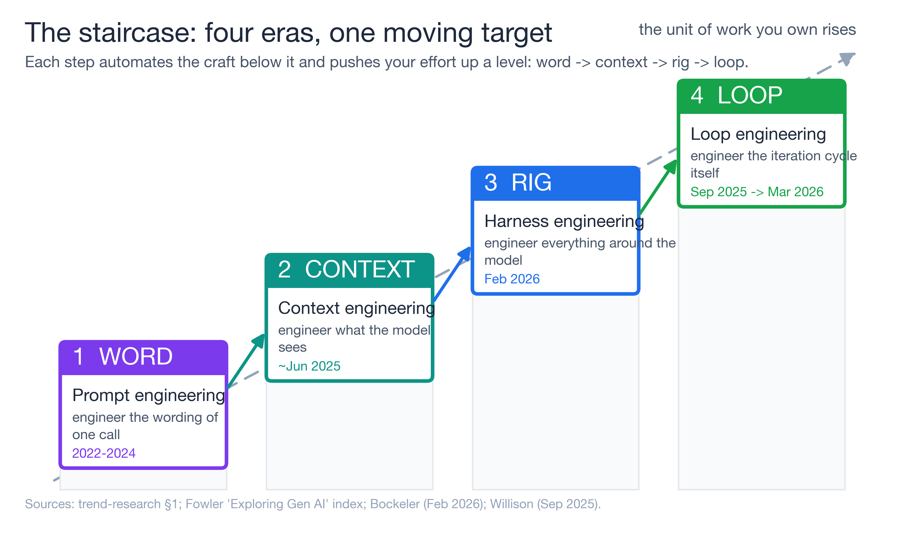
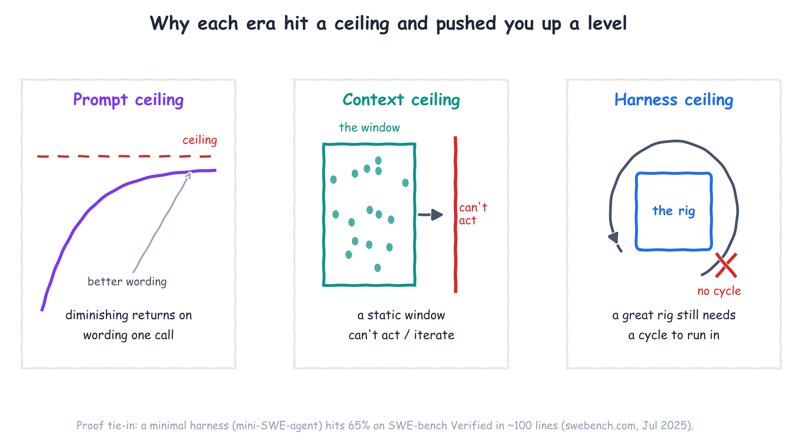
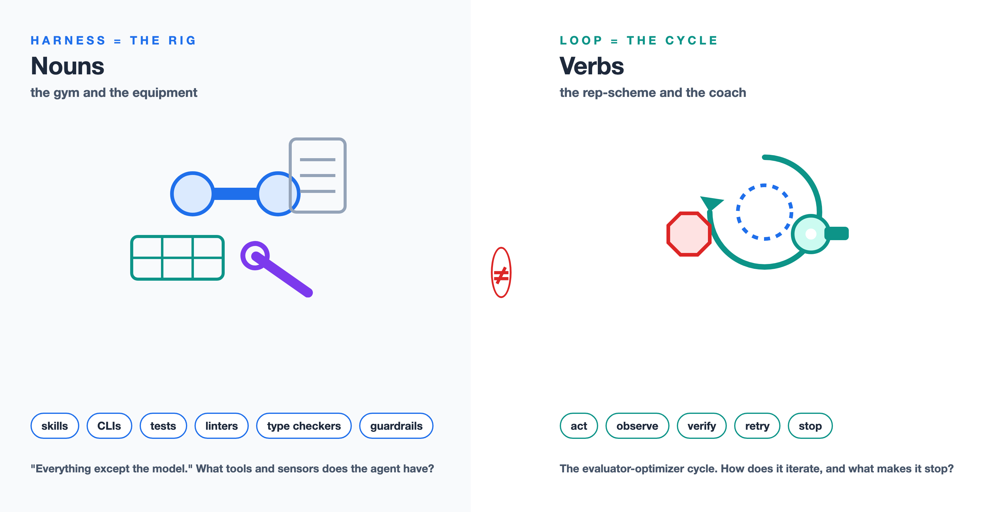
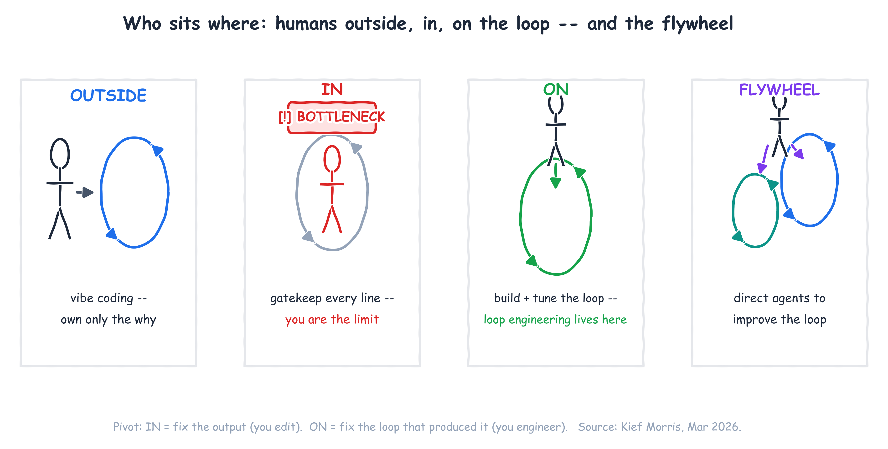
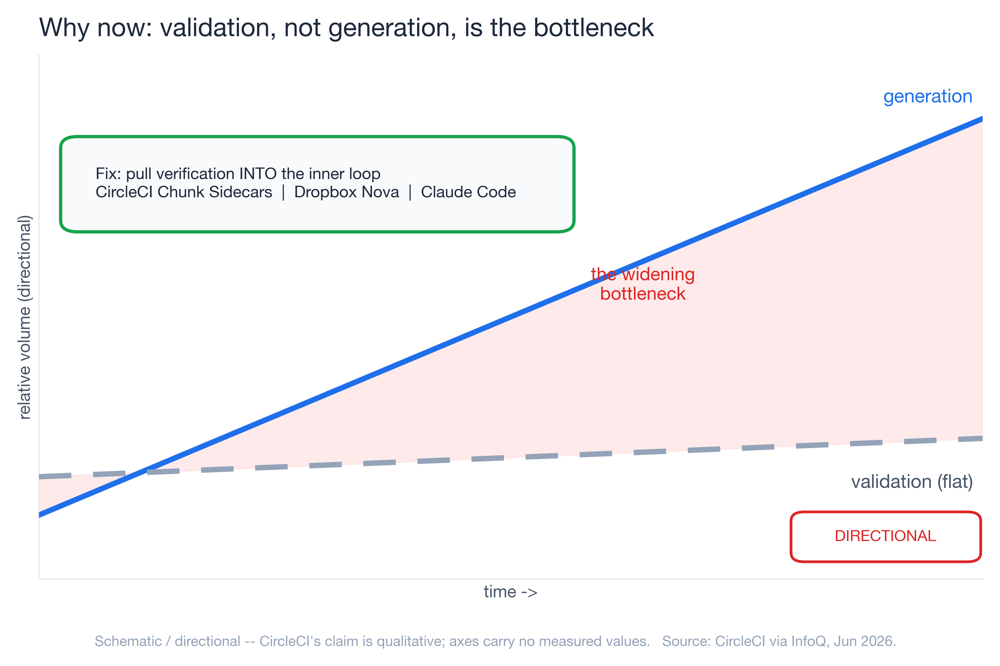
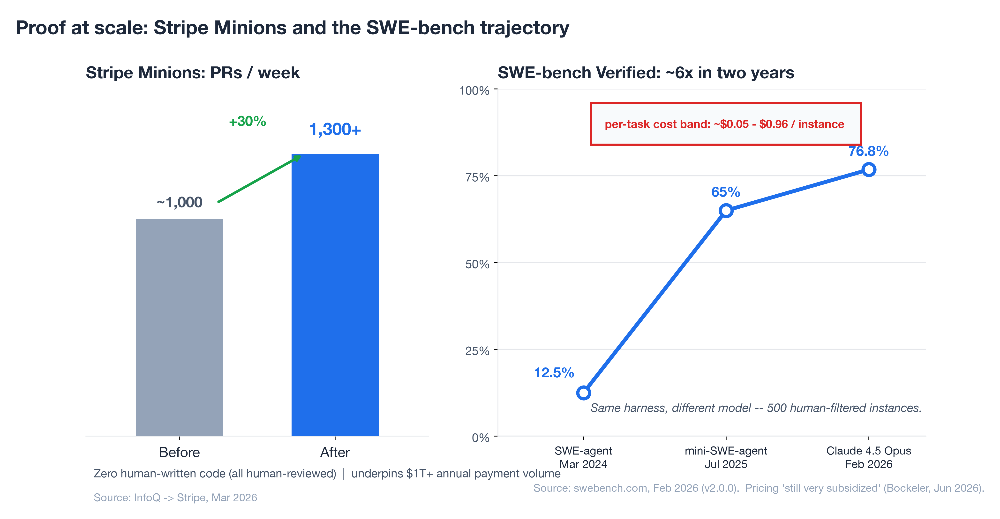
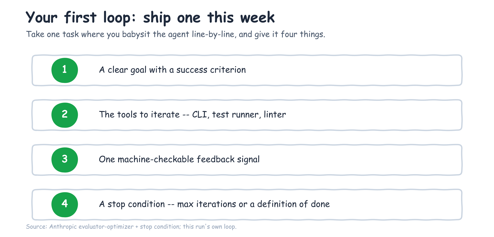

---
seo:
  title: "Loop Engineering: The AI-Native Development Shift"
  description: "Prompt, context, harness, loop engineering: the four-era arc of AI-native development, and why in 2026 the unit of work you own is the iteration loop."
  slug: "loop-engineering-ai-native-development"
  keywords:
    primary: "loop engineering"
    secondary:
      - "harness engineering"
      - "AI-native development"
      - "agentic loops"
      - "context engineering"
      - "prompt engineering"
---

# From Prompts to Loop Engineering: The Workflow Shift in AI-Native Development

*The four-era arc of AI-native development — prompt, context, harness, loop engineering — and why, in 2026, the unit of work you own has moved all the way up to the iteration loop.*

You're not getting better at prompting. I know that sounds backwards, because most of us have spent the last two years collecting prompt tricks like trading cards — "act as a senior engineer," few-shot examples, chain-of-thought, the whole drawer of them. And they worked, for a while. But here is what I keep seeing when I sit with teams shipping real software with agents: the people getting the most out of these tools are not the ones with the cleverest wording. They're the ones who stopped optimizing the sentence and started optimizing everything around it.

The skill didn't get better. The skill moved. And the reason it keeps moving is the quiet inversion underneath all of this: code generation has gotten cheap, so *validation* — not generation — is now the bottleneck (CircleCI via InfoQ, Jun 2026). That single fact is what pushes the work up the stack, and it's why this post walks the whole arc instead of treating each new buzzword as a separate fad.

Prompt engineering, context engineering, harness engineering, loop engineering — these are not four trends competing for your attention. They're one staircase. Each step automates the craft of the step below it and pushes you up to govern a bigger unit of work. By the end you'll know which step you're standing on, and how to ship your first real loop this week.

## The staircase: four eras of AI-native development, one moving target

Here's the pattern that makes the four eras click into one picture. **As the model absorbs more of the work, the place where your effort actually matters moves up a level.** You used to engineer a word. Then you engineered the context. Then the rig the agent runs inside. Now, increasingly, the loop the agent runs.

| Era | What you engineer | What you're actually doing | Representative moment |
|-----|-------------------|----------------------------|------------------------|
| Prompt engineering | The wording of one request | Crafting the input to a single LLM call | ChatGPT / Copilot autocomplete (2022–2024) |
| Context engineering | What the model *sees* | Curating conventions, architecture, skills, lazy-loaded files | Term gained traction ~June 2025 (per Böckeler) |
| Harness engineering | Everything *around* the model | Building the rig: skills, CLIs, scripts, MCP, linters, tests, guardrails | OpenAI harness-engineering work (as cited by Böckeler) + Böckeler memo (Feb 2026) |
| Loop engineering | The control loop *itself* | Designing plan → act → observe → verify → correct, with stop conditions | Willison "Designing agentic loops" (Sep 2025); Morris (Mar 2026) |

The practitioners naming this arc are saying the same thing in different words. The InfoQ/Thoughtworks podcast that maps the year is literally titled *"From MCP and Vibe Coding to Harness Engineering: How AI Native Engineering Evolved in One Year"* (Jun 2026). Simon Willison narrates his own version of the climb — "vibe coding" to "vibe engineering" to, in his Feb 2026 update, "agentic engineering." Different vocabularies, one direction of travel: up.

The useful thing about seeing it as a staircase is that it tells you where to spend your next hour. If you're still tuning sentences, the next floor up is waiting and it's where the wins are.

## Eras 1–3: prompt, context, and harness engineering in fast-forward

Let me run the first three steps quickly, because the interesting argument lives at the top — but you can't appreciate the top step without watching the ground shift underneath it.

**Step one — the prompt, and its ceiling.** Prompt engineering was real and it mattered. The ceiling showed up fast: there's only so much you can fix by rewording a single request when the model can't see your codebase, your conventions, or what you tried five minutes ago. You can phrase the question perfectly and still get a confident answer to the wrong problem, because the model is missing the room it's standing in.

**Step two — the context, and its ceiling.** So the effort moved to what the model sees. Context engineering — coding conventions, architecture docs, lazy-loaded skills, progressive disclosure, the slow death of stuffing everything through MCP — got the right information into the window at the right time (Böckeler, "Context Engineering for Coding Agents," Feb 2026). This was a genuine step up. But a well-fed model still can't *act*. It can read your repo and still have no way to run the tests, see the type error, and try again. Curating the input hits its own ceiling the moment the work requires iteration.

**Step three — the rig.** This is where it gets concrete. Harness engineering is building everything the agent operates inside: the skills and CLIs it calls, the scripts and language servers, the linters and type checkers and test suites that tell it whether it just made things better or worse. Birgitta Böckeler's definition is the cleanest I've found — a harness is *"everything except the model"* (Böckeler, "Harness Engineering — first thoughts," Feb 2026). Feed-forward context on one side, feedback sensors on the other.

And here's the number that made me take this step seriously. On SWE-bench Verified — a benchmark of 500 human-filtered real GitHub issues — a minimal harness called mini-SWE-agent resolves **65% of tasks in about 100 lines of Python** (swebench.com, Jul 2025). A hundred lines. Most of the win wasn't a bigger model or a cleverer prompt; it was a small, well-built rig that let the model run, observe, and retry. The rig is doing real work — but a rig still needs a *cycle* to run in, and that cycle is the next floor up.

Stack the three eras and each one hits a wall: rewording hits diminishing returns, a curated context window still can't act, and even a 100-line rig has no cycle to run in. Lining those ceilings up side by side is what makes the climb obvious.

## What loop engineering actually is

Loop engineering is the discipline of designing and governing the agent's **iteration cycle** — plan → act → observe → verify → correct — so it can self-correct *without a human standing in the inner loop*. The unit of work is no longer the word, the window, or even the rig. It's the loop: its goal, its tools, its feedback signal, and the condition that makes it stop.

Simon Willison gives the working definition: an agent is something that "runs tools in a loop to achieve a goal," and his sharp claim is that **"designing agentic loops" is a distinct, new skill** — he points out Claude Code only shipped in February 2025, so this is genuinely fresh ground, not repackaged folklore (Willison, "Designing agentic loops," Sep 2025). The art, he says, is reducing a problem "to a clear goal and a set of tools that can iterate towards that goal" — then letting the agent brute-force its way to a working solution.

Anthropic supplies the primitives. Their **evaluator-optimizer** loop is "one LLM generates while another evaluates and gives feedback in a loop," and — this is the part people skip — it needs a stop condition, "a maximum number of iterations to maintain control" (Anthropic, "Building Effective Agents," Dec 2024). A loop without a stop condition isn't autonomy; it's a way to burn tokens. So the four levers you actually engineer are: a clear goal with a success criterion, the right tools to iterate, one feedback signal the agent can read, and a stop condition that ends the cycle.

## Harness engineering vs. loop engineering: nouns vs. verbs

Now the distinction that took me too long to see clearly, because almost every source blurs it: **the harness and the loop are not the same thing.**

The harness is the *rig* — the equipment. It's nouns. The skills, the CLIs, the test suite, the static analysis, the type checker, the guardrails. Böckeler's later framing describes these elements as guides and sensors — the things that point the agent in a direction and the things that tell it what just happened. That's the gym and the equipment.

The loop is the *cycle* — the verbs. It's what *uses* the rig: act, then observe the sensors, then verify against the goal, then decide whether to retry or stop. Harness engineering asks *"what tools and sensors does the agent have?"* Loop engineering asks *"how does the agent iterate against those sensors, and what makes it stop?"* Mature setups in production are both at once — Stripe's "blueprints" and Anthropic's "Dynamic Workflows" are each a harness *plus* an explicit, code-defined loop with verification and stop logic.

Here's the test that separates them. When you're inside the work and you don't like what the agent produced, do you fix *the output*, or do you change *the thing that produced it*? Fixing the output is editing. Changing the producer — the rig, and the cycle that runs against it — is engineering.

## Who sits where: humans outside, in, and on the loop

Kief Morris gives the clearest map of where a human actually belongs (Morris, "Humans and Agents in Software Engineering Loops," Mar 2026). He splits the work into a **"why loop"** — idea to working software, which humans own because we're the ones who want the outcome — and a **"how loop"** over the interim artefacts: specs, code, tests. The how-loop nests: an **outer** loop on a feature, a **middle** loop on a story, an **inner** loop that generates and tests code.

That gives four postures, and naming yours is the most useful diagnostic in this whole post:

- **Outside the loop** — vibe coding. You own only the why and let the agent run. Fast, until it isn't.
- **In the loop** — you gatekeep every line. This feels responsible, and it's the trap: *you become the bottleneck* the moment the agent can generate faster than you can read.
- **On the loop** — you build and tune the how-loop instead of inspecting every output. This is where loop engineering lives.
- **The agentic flywheel** — you direct agents to improve the loop itself.

The pivot Morris draws is the whole game: when you're *in* the loop and you dislike the output, you fix the artefact; when you're *on* the loop, you change the harness and the cycle that produced it. That shift — from fixing the output to fixing the loop that produces the output — *is* loop engineering.

## Why now: validation, not generation, is the bottleneck

So why has this become the job in 2026 specifically? Because the economics inverted. For years, generating code was the hard, slow part and review was a formality. That flipped. CircleCI's internal data shows feature-branch activity surging while production deployments lag behind — and the reason is blunt: "by the time conventional CI discovers an issue, the AI agent has already moved on, losing valuable context" (CircleCI via InfoQ, Jun 2026). The agent out-runs your pipeline.

The industry's response is to pull verification *into the inner loop* rather than waiting for it downstream — CircleCI's Chunk Sidecars (which they literally call "inner-loop validation"), Dropbox Nova, Claude Code's iterative validation. When verification moves inside the loop, loop engineering stops being a blog-post idea and becomes a product category. OpenAI frames its own hardest problems the same way: as cited by Böckeler, their challenges now "center on designing environments, feedback loops, and control systems" — which is loop engineering by another name.

## Proof at scale: Stripe Minions and the SWE-bench trajectory

Two pieces of evidence anchor this, and they pull in the same direction.

**Stripe Minions** is the before/after case study. Stripe's autonomous coding agents produce **1,300+ pull requests a week** (up from roughly 1,000), with **zero human-written code** — every PR is machine-generated and human-reviewed — underpinning **more than $1 trillion** in annual payment volume (InfoQ → Stripe, Mar 2026). The architecture is exactly the harness-plus-loop pattern: "blueprints" that interweave deterministic code with flexible agent loops, with CI/CD, automated tests, and static analysis acting as the verification harness *before* a human ever looks. This is loop engineering in production, at a scale where being wrong is expensive.

**SWE-bench Verified** is the cleaner natural experiment, because it holds the harness constant. Same 500 instances, same mini-SWE-agent scaffold; you swap the model underneath. Under that fixed rig, the score has climbed from **12.47% (SWE-agent, Mar 2024) to 76.8% (Claude 4.5 Opus, Feb 2026)** — roughly a 6x improvement on identical infrastructure in about two years (swebench.com, Feb 2026). Read it two ways and both land: a stable, well-built rig let every model gain flow through instead of capping it; and because the harness is identical across the table, the rig and the loop are isolated as real, separate variables from the model. It isn't free, either — per-task cost on that leaderboard runs roughly **$0.05 to $0.96 per instance** depending on the model, which is the first sign that the loop has an economics problem worth taking seriously.

## The honest counterweight: agentic loop failure modes, not a victory lap

I don't want to sell you a finished story, because the sources I trust most are the ones that name what still breaks. Self-correcting loops fail in specific, documented ways: **agentic laziness** (the agent declares done too early), **self-preferential bias** (it rates its own work too highly), and **goal drift** (it wanders off the original target) — all named by Anthropic via InfoQ (Jun 2026). Those failure modes are precisely *why* you engineer verification gates and stop conditions instead of trusting the loop to police itself. The defenses are loop patterns too: adversarial verification, fan-out-and-synthesize, classifier routing.

And the economics carry an asterisk. Today's flat-rate and per-token agent pricing is, in Böckeler's words, "still very subsidized" (InfoQ podcast, Jun 2026) — so the $0.05–$0.96 per-task numbers above are a snapshot, not a forecast. Cite them with their dataset date and re-pull before you make a budget decision on them. Loop engineering is a discipline you practice against known failure modes, not a victory lap.

## Your first agentic loop: where to start this week

Here's the shippable part. Take one task where you currently babysit the agent line-by-line — where you're *in* the loop. Give it four things:

1. **A clear goal with a success criterion** the agent can aim at.
2. **The tools to iterate** — the CLI, the test runner, the linter it needs.
3. **One machine-checkable feedback signal** — tests passing, types clean, the linter green.
4. **A stop condition** — a max iteration count or a definition of done — so the loop ends on purpose.

Then step *on* the loop. The next time it produces something wrong, resist fixing the output by hand. Fix the loop that produced it — tighten the success criterion, add a sensor, adjust the stop condition. That single habit is the entire shift from editing to engineering.

If you want a worked example, this content pipeline runs the same pattern on itself: plan → draft → rubber-duck review → fix → re-review, with a deterministic preflight and a tiered critic gate as the verification sensors and an iteration cap as the stop condition. It's an inspectable loop, and writing this post ran through it.

So locate your step on the staircase — word, context, rig, or loop — and take the next one. The point where your effort matters will keep moving up as models absorb more of the work; the durable skill isn't any one era's trick, it's learning to govern whatever the next-larger unit of work turns out to be. Right now, that unit is the loop. Go ship one with a stop condition.
