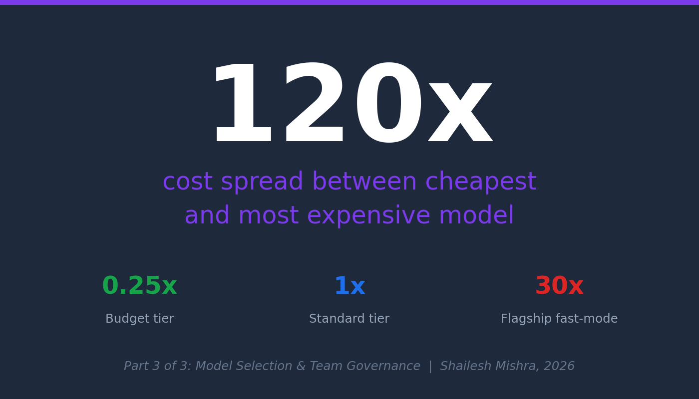
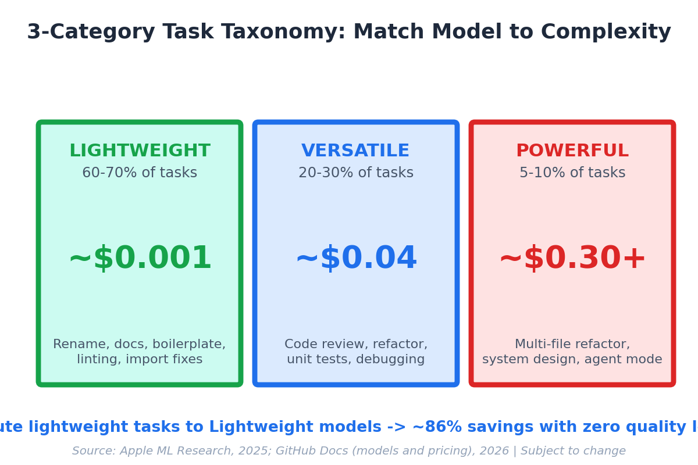
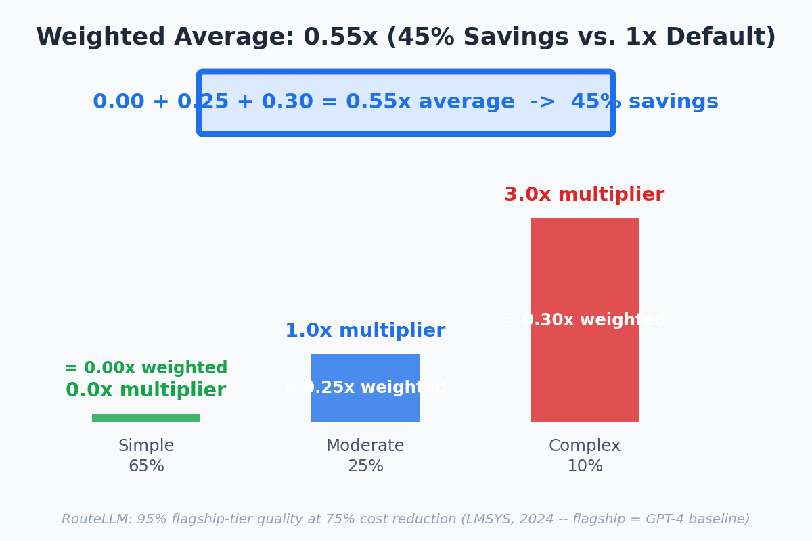

<!-- Medium Post - Part 3 Model Selection (Practitioner Edition) -->
<!-- Canonical: https://sendtoshailesh.github.io/blog/ai-code-assistant-model-selection-part-3.html -->

── START COPY ──

# The 120x Spread: A Developer's Guide to Model Selection (Visual Guide)

GitHub Copilot's cheapest tier costs 0.25x. The most expensive: 30x. That is a 120x spread. [Apple ML Research](https://machinelearning.apple.com/research/illusion-of-thinking) found reasoning models burn extra tokens on simple tasks with zero quality gain — the expensive model is not always better. *(Model lineups will rotate; specific examples in this post are as of May 2026 and the multiplier structure is what matters.)*

The 3-tier routing framework:

Full guide with multiplier table, [RouteLLM](https://lmsys.org/blog/2024-07-01-routellm/) case study, and team governance playbook for AI team leads ->
[https://sendtoshailesh.github.io/blog/ai-code-assistant-model-selection-part-3.html](https://sendtoshailesh.github.io/blog/ai-code-assistant-model-selection-part-3.html)

*Sources (verify directly): [GitHub Copilot billing documentation](https://docs.github.com/en/copilot/managing-copilot/monitoring-usage-and-entitlements/about-premium-requests); [Apple ML Research — The Illusion of Thinking](https://machinelearning.apple.com/research/illusion-of-thinking); [LMSYS RouteLLM (2024)](https://lmsys.org/blog/2024-07-01-routellm/); [CascadeFlow paper (arXiv 2024)](https://arxiv.org/abs/2406.00073); [TDS production case study](https://towardsdatascience.com/inference-scaling-test-time-compute-why-reasoning-models-raise-your-compute-bill/). In RouteLLM's 2024 paper, "GPT-4" refers to the then-current flagship baseline.*

── END COPY ──

---

**Import instructions:** Use Medium's import tool (https://medium.com/p/import) with the GitHub raw URL for this file to preserve image references and set the canonical URL automatically.
