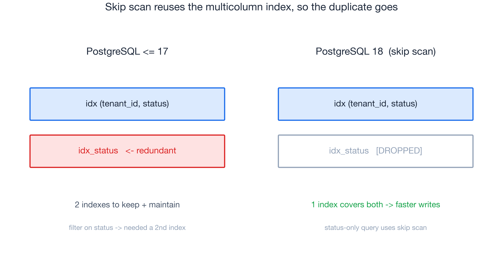
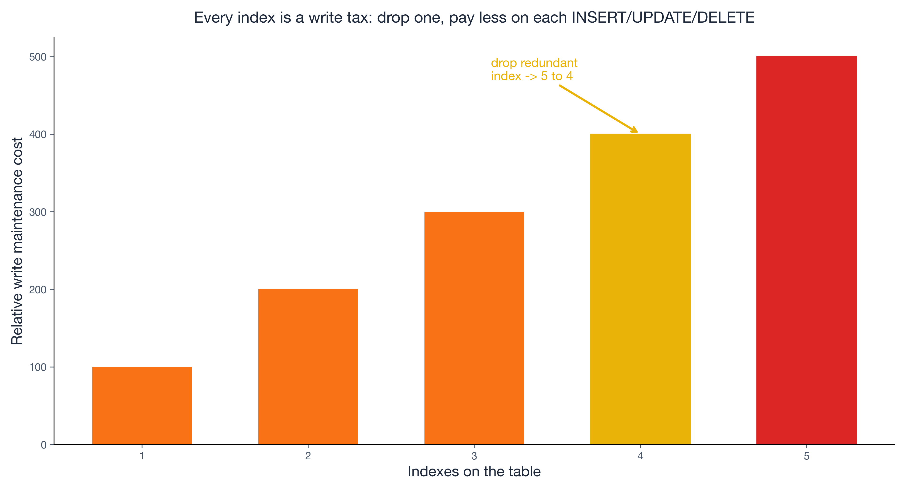
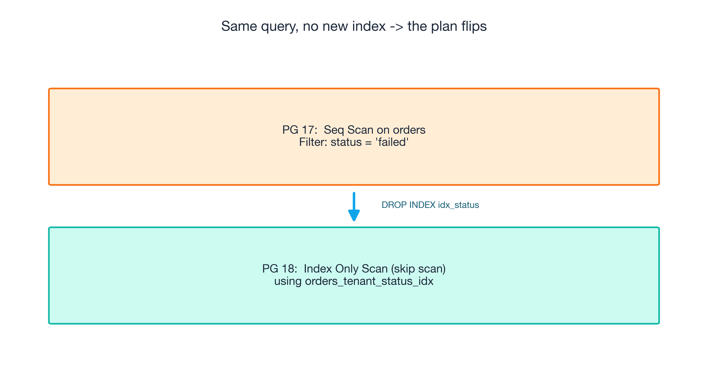

---
seo:
  title: "PostgreSQL 18 Skip Scan: Delete the Redundant Index"
  description: "PostgreSQL 18's B-tree skip scan lets a multicolumn index serve queries on a non-leading column — so the single-column index you only built for the planner can finally be dropped. Faster reads, faster writes, less disk."
  slug: "postgresql-18-skip-scan-redundant-index"
  keywords:
    primary: "postgresql 18 skip scan"
    secondary:
      - "redundant indexes"
      - "b-tree multicolumn index"
      - "write amplification"
      - "database cost optimization"
      - "postgres performance"
---

# PostgreSQL 18 Skip Scan: The Cheapest Win Is the Index You Get to Delete

*PostgreSQL 18 shipped B-tree skip scan. The headline feature is a query that gets faster — but the real prize is the index you can finally drop, which makes every write cheaper too.*

For years, every PostgreSQL practitioner learned the same reflex. You had a multicolumn index — say `(tenant_id, status)` — and a query came in that filtered only on `status`. You checked the plan, saw a sequential scan, sighed, and created a second index on `status` alone. Problem solved. Then you did it again, and again, until your busiest tables carried a small museum of overlapping indexes — each one a tax you pay on every single write.

PostgreSQL 18, released **25 September 2025**, quietly retires that reflex. The feature is called **skip scan**, and on paper it's a planner improvement: a multicolumn B-tree index can now serve queries that omit its leading column ([PostgreSQL 18 release notes](https://www.postgresql.org/docs/current/release-18.html)). But the part worth upgrading for isn't the query that speeds up. It's the redundant index you get to delete — because that single `DROP INDEX` gives you faster reads *and* faster writes *and* less disk, all at once. This is the rare optimization where performance and cost point the same direction.



## The reflex, and what it actually cost

Here's the old world, concretely. Index on `(tenant_id, status)`, and a query the planner couldn't satisfy:

```sql
-- PostgreSQL <= 17
SELECT * FROM orders WHERE status = 'failed';

-- Plan:
Seq Scan on orders  (cost=0.00..23432.00 rows=900 width=64)
  Filter: (status = 'failed')
```

A B-tree is sorted by its leading column first, so without `tenant_id` in the predicate, the planner saw no way in. The fix was muscle memory: `CREATE INDEX idx_status ON orders(status)`. Reads got fast. But you didn't get that for free.

Every index is a write tax. Each `INSERT`, `UPDATE`, and `DELETE` has to maintain *every* index on the table — that's **write amplification**, and it scales with index count, not table count. Add a fifth index and you've added ~25% more index maintenance on every write. The index also costs disk, it costs backup size, and it costs VACUUM time. A "free" read win was actually a permanent write-and-storage bill.



## What skip scan changes

Skip scan teaches the planner a trick people did manually for years: when the leading column has few distinct values, treat the index as a stack of mini-indexes and "skip" across each distinct leading value, doing a normal search inside each. With a handful of tenants, `(tenant_id, status)` can now answer a `status`-only query without you ever naming `tenant_id`:

```sql
-- PostgreSQL 18, no idx_status needed
SELECT * FROM orders WHERE status = 'failed';

-- Plan:
Index Only Scan using orders_tenant_status_idx on orders
  (cost=0.42..312.55 rows=900)   -- skip scan
```

The seq scan is gone, and so is the reason `idx_status` existed. So you drop it. That `DROP INDEX` is the whole point: reads stay fast (now served by the index you already had), writes get faster (one fewer index to maintain), and disk shrinks. The feature is marketed as a read optimization; it's secretly a *cost* optimization.



## How to find indexes you can delete

Don't guess — find redundant indexes whose leading column is also covered, then verify on 18:

```sql
-- candidates: single-col indexes whose column leads a wider index
SELECT s.relname, s.indexrelname, pg_size_pretty(pg_relation_size(s.indexrelid)) AS size,
       s.idx_scan
FROM pg_stat_user_indexes s
ORDER BY pg_relation_size(s.indexrelid) DESC;
```

Then test the candidate against 18: `DROP INDEX CONCURRENTLY` on a replica, re-run `EXPLAIN ANALYZE`, confirm a skip scan and acceptable latency. Each dropped index = its storage reclaimed and its write tax removed.

## Old vs. new, honestly

The win is real but not universal — be honest about the boundary.

| | PostgreSQL ≤ 17 | PostgreSQL 18 |
|---|---|---|
| `status`-only query on `(tenant,status)` | Seq scan → add `idx_status` | Index skip scan, no extra index |
| Indexes to maintain | 2 (redundant) | 1 |
| Write cost / storage | Higher | Lower |
| App change | none | none |

Skip scan shines when the leading column is **low-cardinality** (a few tenants, statuses, regions). With a high-cardinality leading column, skipping across millions of distinct values isn't worth it and the planner won't bother — keep the targeted index there. No data migration, no rewrites; just upgrade and audit.

## Do this
On a replica, list your largest single-column indexes whose column leads a wider index, upgrade to 18, drop one, and watch `EXPLAIN` show the skip scan and your write latency drop. The cheapest performance win in PostgreSQL 18 is the index you get to delete.

## References
- [PostgreSQL 18 Released! — postgresql.org](https://www.postgresql.org/about/news/postgresql-18-released-3142/)
- [Release 18 notes — postgresql.org/docs](https://www.postgresql.org/docs/current/release-18.html)
- [What's New in PostgreSQL 18 — Bytebase](https://www.bytebase.com/blog/what-is-new-in-postgres-18/)
